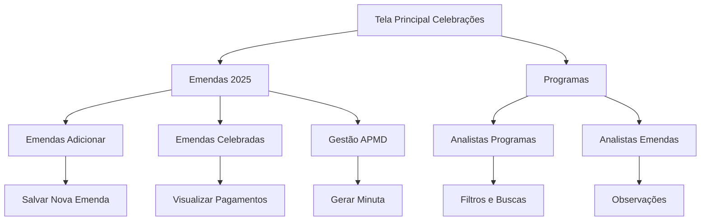

---
title: Documentação Completa - App de Celebrações SEDESE
date: 2025-07-08
description: Guia completo com todas as funcionalidades do App de Celebrações, incluindo fluxos, operações em PowerApps e integração com Power Automate
weight: 5
---------

# 🎯 Sistema de Celebrações - Guia Completo

Este guia apresenta uma documentação completa do sistema de celebrações do DCP, incluindo o gerenciamento de emendas, programas e fluxos de trabalho. O sistema oferece controle total sobre o processo de celebrações, desde a criação inicial até o pagamento final.

## O Que Você Vai Aprender

- Como navegar pelas diferentes telas do sistema
- Como gerenciar emendas e programas
- Como utilizar os filtros e funcionalidades de busca
- Como configurar pagamentos e status
- Como gerar minutas e documentos automáticos
- Melhores práticas para gestão de celebrações

## Visão Geral do Sistema

O sistema de celebrações é dividido em várias telas especializadas que cobrem todo o ciclo de vida das celebrações, desde a criação até o pagamento final. Cada tela tem funcionalidades específicas para diferentes tipos de usuários e processos.

## Passo a Passo das Funcionalidades

  

    <h3>🏠 Passo 1: Tela Principal de Celebrações</h3>
    
A tela principal oferece acesso rápido às principais funcionalidades do sistema de celebrações.

    
<strong>🔗 Navegação para Emendas 2025</strong>

    

      
      Navigate(CelebraçõesEmendas_Celebração_1;ScreenTransition.Cover)
      
    

    
Este comando navega para a tela de emendas 2025 com transição de cobertura, proporcionando uma experiência visual suave.

  

  

    <h3>📋 Passo 2: Tela de Emendas 2025</h3>
    
Esta tela apresenta uma galeria complexa com múltiplos filtros para visualizar e gerenciar emendas.

    
<strong>🔍 Filtros e Buscas Inteligentes</strong>

    

      
      Sort(
        Search(
          Search(
            Search(
              Search(
                Filter(
                  CelebracoesProgramas2025;
                  'Nº PROCESSO SEI' = "Emenda";
                  Not(
                    Or(
                      STATUS = "IOT Registrado no SIGCON";
                      STATUS = "Indicação Cancelada pela SEGOV";
                      STATUS = "Pagamento Realizado";
                      STATUS = "Encaminhado para Pagamento";
                      STATUS = "Pago";
                      STATUS = "Aguardando Pagamento";
                      STATUS = "Aguardando pagamento"
                    )
                  )
                );
                cbSEI2_8.Value;
                SEI
              );
              cbProposta2_8.Value;
              'NÚMERO DA PROPOSTA'
            );
            cbPlano2_13.Value;
            'NÚMERO DO PLANO DE TRABALHO'
          );
          cbPlano2_14.Value;
          NumeroIndicacao
        );
        NumeroIndicacao;
        SortOrder.Ascending
      )
      
    

    
<strong>Como Funciona:</strong>

    <ul>
      <li><strong>Filter:</strong> Filtra apenas emendas que não estão em status finais</li>
      <li><strong>Search (4x):</strong> Permite busca textual em SEI, Proposta, Plano de Trabalho e Indicação</li>
      <li><strong>Sort:</strong> Ordena por número de indicação crescente</li>
    </ul>
  

  

    <h3>🔧 Passo 3: Funcionalidade de Expansão</h3>
    
O sistema oferece uma funcionalidade de expansão/contração para melhor visualização dos dados.

    

      
      Patch(
        variaveisMain;
        LookUp(
          variaveisMain;
          ParentID = ThisItem.ID
        );
        {
          Variable1: If(
            LookUp(
              variaveisMain;
              ParentID = ThisItem.ID;
              Variable1
            );
            false;
            true
          )
        }
      )
      
    

    
<strong>⚙️ Lógica de Funcionamento:</strong>

    <ul>
      <li><strong>Patch:</strong> Atualiza o registro específico em variaveisMain</li>
      <li><strong>LookUp:</strong> Localiza o registro com ParentID correspondente</li>
      <li><strong>Toggle:</strong> Alterna entre true/false para mostrar/ocultar detalhes</li>
    </ul>
  

  

    <h3>💰 Passo 4: Gestão de Pagamentos</h3>
    
O sistema oferece uma interface dedicada para gerenciar informações de pagamento.

    

      
      // Botão para abrir modal de pagamento
      Select(Parent);
      UpdateContext({visPagamento:true})
      
    

    
<strong>💾 Salvamento de Dados de Pagamento:</strong>

    

      
      Patch(
        CelebracoesProgramas2025;
        galProgramas_10.Selected;
        {
          'NÚMERO SIAFI': TextInputCanvas1_9.Value;
          'DATA ENVIO PARA DCF': DatePickerCanvas2.SelectedDate;
          'Nº DO EMPENHO': TextInputCanvas1_1.Value;
          'Nº DA ORDEM DE PAGAMENTO': TextInputCanvas1_2.Value;
          'OP ACATADA': DropdownCanvas3.Selected.Value;
          'DATA DA OP': DatePickerCanvas2_1.SelectedDate
        }
      );
      Reset(TextInputCanvas1);
      Reset(DatePickerCanvas2);
      Reset(TextInputCanvas1_1);
      Reset(TextInputCanvas1_2);
      Reset(DropdownCanvas3);
      Reset(DatePickerCanvas2_1)
      
    

    
Este processo atualiza as informações de pagamento do registro selecionado e limpa os campos para nova entrada.

  

  

    <h3>➕ Passo 5: Adicionar Novas Emendas</h3>
    
A tela de adição permite criar novas emendas com todos os dados necessários.

    

      
      Patch(
        CelebracoesProgramas2025;
        Defaults(CelebracoesProgramas2025);
        {
          'Nº PROCESSO SEI': "Emenda";
          NumeroIndicacao: TextInput1_2.Text;
          'TÉCNICO RESPONSÁVEL CELEBRAÇÃO ': DropdownCanvas1_2.Selected.Value;
          'Grupo de Despesa': TextInput1_9.Text;
          Responsável: TextInput1_10.Text;
          'NÚMERO DA PROPOSTA': TextInput1_11.Text;
          'NÚMERO DO PLANO DE TRABALHO': TextInput1_4.Text;
          'PARCEIRO/ CONVENENTE': TextInput1_5.Text;
          'TIPO DE BENEFICIÁRIO ': TextInput1_6.Text;
          STATUSSIGCON: TextInput1_7.Text;
          SUBSECRETARIA: TextInput1_8.Text;
          Ação: TextInput1_12.Text;
          ValorIndicação: Value(TextInput1_13.Text);
          'Tipo de Recurso': DropdownCanvas1_4.Selected.Value;
          Genero: TextInput1_15.Text;
          'TIPO DE INSTRUMENTO ': TextInput1_16.Text;
          STATUS: "Indicação aprovada - Aguardando envio de e-mail";
          SEI: TextInput1.Text;
          MUNICÍPIO: TextInput1_106.Text;
          Parlamentar: If(DropdownCanvas1_4.Selected.Value = "Emenda Impositiva";TextInput1_10.Text;"")
        }
      );
      Navigate(CelebraçõesEmendas_Celebração_1;ScreenTransition.UnCover);
      Set(var2025;false)
      
    

  

  

    <h3>📊 Passo 6: Emendas Celebradas</h3>
    
Esta tela mostra apenas as emendas que já foram celebradas e estão em processo de pagamento.

    

      
      SortByColumns(
        Search(
          Filter(
            CelebracoesProgramas2025;
            'Nº PROCESSO SEI' = "Emenda";
            Or(
              STATUS = "Pagamento Realizado";
              STATUS = "Encaminhado para Pagamento";
              STATUS = "Pago";
              STATUS = "Aguardando Pagamento";
              STATUS = "Aguardando pagamento"
            )
          );
          cbSEI2_9.Value;
          SEI
        );
        "NumeroIndicacao";
        SortOrder.Ascending
      )
      
    

    
<strong>🎯 Funcionalidade Específica:</strong> Filtra apenas emendas com status de pagamento ativo ou concluído.

  

  

    <h3>👥 Passo 7: Tela de Analistas</h3>
    
Telas especializadas para analistas trabalharem com programas e emendas específicas.

    
<strong>📋 Analistas - Programas:</strong>

    

      
      Sort(
        Search(
          Filter(
            CelebracoesProgramas;
            Lower('TÉCNICO RESPONSÁVEL CELEBRAÇÃO ') = Lower(_varUsuario);
            SEI <> Blank();
            'Nº PROCESSO SEI' = "Programa"
          );
          cbSEI2_1.Value;
          SEI
        );
        PrazoAtual;
        SortOrder.Ascending
      )
      
    

    
<strong>📋 Analistas - Emendas:</strong>

    

      
      Sort(
        Search(
          Filter(
            CelebracoesProgramas2025;
            Lower('TÉCNICO RESPONSÁVEL CELEBRAÇÃO ') = Lower(_varUsuario);
            Not(
              Or(
                STATUS = "IOT Registrado no SIGCON";
                STATUS = "Indicação Cancelada pela SEGOV"
              )
            );
            'Nº PROCESSO SEI' = "Emenda"
          );
          cbSEI2_5.Value;
          SEI
        );
        NumeroIndicacao;
        SortOrder.Ascending
      )
      
    

    
<strong>🔐 Segurança:</strong> Filtra apenas os registros do técnico logado no sistema.

  

  

    <h3>📝 Passo 8: Sistema de Observações</h3>
    
Cada emenda possui um sistema de observações para controle histórico.

    

      
      Sort(
        Filter(
          BaseObservacoesCelebracoes;
          Título = Text(galProgramas_5.Selected.ID)
        );
        DataComentario;
        SortOrder.Descending
      )
      
    

    
Este sistema permite acompanhar o histórico de alterações e comentários de cada emenda.

  

  

    <h3>📄 Passo 9: Geração de Minuta</h3>
    
O sistema possui uma funcionalidade avançada para gerar minutas automáticas.

    

      
      UpdateContext({visMinuta: true});
      Set(currEmendaAnalista; ThisItem);
      Clear(COL_NUMERO_EXTENSO);
      
      // Cálculo complexo do valor por extenso
      With({
        REAL: Index(Split(Text(Value(LookUp(BaseHistoricoConvenio;
          NumeroProposta = currEmendaAnalista.'NÚMERO DA PROPOSTA';
          'Valor Total Contrapartida'
        )) + Value(LookUp(BaseHistoricoConvenio;
          NumeroProposta = currEmendaAnalista.'NÚMERO DA PROPOSTA';
          'Valor Total Concedente'
        )); "#,##0.00"); ","); 1).Value;
        
        CENTAVOS: IfError(Index(Split(Text(Value(LookUp(BaseHistoricoConvenio;
          NumeroProposta = currEmendaAnalista.'NÚMERO DA PROPOSTA';
          'Valor Total Contrapartida'
        )) + Value(LookUp(BaseHistoricoConvenio;
          NumeroProposta = currEmendaAnalista.'NÚMERO DA PROPOSTA';
          'Valor Total Concedente'
        )); "#,##0.00"); ","); 2).Value; 0)
      };
      
      // Coleta valores por extenso
      Collect(COL_NUMERO_EXTENSO; {...})
      )
      
    

    
<strong>🔢 Conversão Numérica:</strong> Converte valores monetários para formato por extenso automaticamente.

  

  

    <h3>🏢 Passo 10: Gestão APMD</h3>
    
Tela especializada para gestão avançada de celebrações pela APMD.

    

      
      SortByColumns(
        Search(
          Filter(
            CelebracoesProgramas2025;
            Not(
              Or(
                STATUS = "IOT Registrado no SIGCON";
                STATUS = "Indicação Cancelada pela SEGOV";
                STATUS = "3ª Análise realizada. Solicitada documentação pendente";
                STATUS = "2ª Análise realizada. Solicitada documentação pendente";
                STATUS = "Encaminhado para finalística para Manifestação";
                STATUS = "Aguardando Andamento do Técnico da DCP";
                STATUS = "1ª Análise realizada. Solicitada documentação pendente";
                STATUS = "Análise Técnica";
                STATUS = "E-mail de orientação enviado - Aguardando envio de Proposta de Plano de Trabalho"
              )
            );
            !IsBlank(SEI)
          );
          cbSEI2_11.Value;
          SEI
        );
        "field_5";
        SortOrder.Ascending
      )
      
    

    
<strong>🎛️ Filtros Avançados:</strong> Remove processos em análise e mostra apenas os prontos para gestão.

  

## 💡 Dicas e Melhores Práticas

  

    <h3>🔍 Otimização de Filtros</h3>
    
Use os filtros combinados para encontrar rapidamente os registros desejados. O sistema permite busca textual simultânea em múltiplos campos, tornando a localização muito mais eficiente.

  

  
  

    <h3>💾 Salvamento Automático</h3>
    
Após cada operação de salvamento, os campos são automaticamente resetados. Isso evita erros de duplicação e prepara o sistema para nova entrada de dados.

  

  
  

    <h3>🔐 Segurança por Usuário</h3>
    
As telas de analistas filtram automaticamente apenas os registros do técnico logado (_varUsuario). Isso garante que cada usuário veja apenas suas responsabilidades.

  

  
  

    <h3>📋 Status Inteligente</h3>
    
O sistema diferencia automaticamente entre emendas em processo e celebradas através dos status. Use essa informação para organizar melhor o fluxo de trabalho.

  

  
  

    <h3>📄 Geração de Documentos</h3>
    
A funcionalidade de minuta utiliza cálculos complexos para converter valores monetários em formato por extenso. Verifique sempre os valores antes de gerar documentos oficiais.

  

## 📊 Resumo das Funcionalidades

| Tela | Funcionalidade Principal | Usuário Alvo |
|---|---|---|
| **Celebrações DCP** | Navegação principal | Todos |
| **Emendas 2025** | Visualização e gestão de emendas | Gestores |
| **Emendas Adicionar** | Criação de novas emendas | Analistas |
| **Emendas Celebradas** | Acompanhamento de pagamentos | Gestores |
| **Analistas Programas** | Gestão de programas individuais | Analistas |
| **Analistas Emendas** | Gestão de emendas individuais | Analistas |
| **Gestão APMD** | Supervisão avançada | APMD |

## 🔄 Fluxo de Trabalho Recomendado

  

    <h4>1. Criação 📝</h4>
    
Adicione novas emendas através da tela "Emendas Adicionar"

  

  
  

    <h4>2. Análise 🔍</h4>
    
Analistas trabalham em suas telas específicas com filtros por usuário

  

  
  

    <h4>3. Documentação 📄</h4>
    
Gere minutas e adicione observações conforme necessário

  

  
  

    <h4>4. Celebração 🎯</h4>
    
Mova emendas para status celebrado quando concluídas

  

  
  

    <h4>5. Pagamento 💰</h4>
    
Acompanhe o processo de pagamento até conclusão

  

## O Que Vem a Seguir?

Com o sistema de celebrações dominado, você terá controle total sobre o ciclo de vida das emendas e programas. Este conhecimento permite gerenciar eficientemente desde a criação até o pagamento final, garantindo transparência e controle em todo o processo.

  <a href="../permissoes/" class="prev-link">← Passo anterior: Configurar Permissões</a>
  <a href="../integracao/" class="next-link">Próximo passo: Integração com Sistemas →</a>

