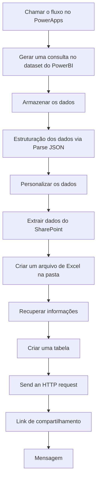

## 🏠 Tela Inicial


### Principais Elementos

| Elemento | Descrição |
|---------|-----------|
| ✨ **Tutorial Interativo** | Guia dinâmico que ensina o usuário a utilizar o aplicativo passo a passo |
| 📋 **Fluxo de Registro de Informação** | Redireciona para documento no SharePoint em nova aba, mantendo o aplicativo aberto |
| ▶️ **Iniciar Preenchimento** | Direciona o usuário para a tela de iniciativas |

## 📋 Tela de Iniciativas


### Elementos de Interface

#### 🔄 Botão Programa
```powerapps
If(
    varGestor;
    Distinct(
        BaseProgramasAcoes;
        Programa
    );
    Distinct(
        Filter(
            BaseProgramasAcoes;
            Programa in programasPermitidos
        );
        Programa
    )
)
```

> Este código gera uma lista única de programas, eliminando duplicatas que possam existir na tabela BaseProgramasAcoes.

#### 🔄 Botão Ação
```powerapps
If(
    varGestor;
    Distinct(
        Filter(
            BaseProgramasAcoes;
            Programa = ComboboxCanvas1.Selected.Value
        );
        Acao
    );
    Distinct(
        Filter(
            BaseProgramasAcoes;
            Programa = ComboboxCanvas1.Selected.Value;
            Acao in acoesPermitidas
        );
        Acao
    )
)
```

> Retorna uma lista filtrada de ações sem repetições, relacionadas ao programa selecionado.

#### ➕ Adicionar Nova Iniciativa
```powerapps
Patch(
    PlanejamentoIntegrado_Iniciativas,
    Defaults(PlanejamentoIntegrado_Iniciativas),
    {
        Título: UsuáriosdoOffice365.MyProfileV2().mail,
        Programa: ComboboxCanvas1_2.Selected.Value,
        Acao: ComboboxCanvas1_3.Selected.Value
    }
);;
Refresh(PlanejamentoIntegrado_Iniciativas)
```

> Cria um novo registro de iniciativa no sistema, com os valores selecionados para Programa e Ação.

#### 💾 Salvar Alterações
```powerapps
Gerar_Relatorio_OBZ_PowerApps.Run(
    """" & Concat(
        Filter(
            BaseProgramasAcoes,
            userMail in Responsavel
        ),
        Left(
            Acao,
            4
        ),
        ""","""
    ) & """",
    userMail
);;
Notify(
    "O seu relatório será enviado em alguns minutos no Teams!",
    NotificationType.Success
)
```

> Salva as modificações e gera um relatório que será enviado posteriormente para o usuário via Teams.

#### 📊 Botão Visão Geral Cenários
```powerapps
Clear(colVisaoGeral);;
ForAll(
    SortByColumns(
        Filter(
            BaseFormularioOBZ_Cenarios,
            Título in Filter(
                BaseFormularioOBZ,
                Acao = varAcao
            ).ProdutoID
        ),
        "Title"
    ),
    Collect(
        colVisaoGeral,
        {
            ID1: Max(
                colVisaoGeral,
                ID1
            ) + 1,
            ProdutoID: ThisRecord.Título,
            Descricao: ThisRecord.Descricao,
            TipoCenario: ThisRecord.TipoCenario,
            ObjetosDeGasto: ThisRecord.ObjetosDeGasto,
            Cenario: ThisRecord.Cenario,
            ID: ThisRecord.ID
        }
    )
);;
UpdateContext({visVisaoGeral: true})
```

> Exibe todos os cenários relacionados à ação selecionada de forma organizada. Limpa dados anteriores, busca cenários vinculados à ação, organiza por título e armazena na coleção para apresentação.

#### 🔍 Botão Detalhar Resultado
```powerapps
Select(Parent);;
Patch(BaseFormularioOBZ;ThisItem;{
    Projeto: TextInputCanvas1.Value,
    Status: Dropdown1.Selected.Value,
    Produto: TextInputCanvas1_1.Value
});;
UpdateContext({visDetalhar:true})
```

> Permite selecionar e atualizar informações de um item específico, salvando as edições e exibindo uma visão detalhada.

#### 💰 Botão Itens de Custo
```powerapps
Select(Parent);;
Set(currIniciativa;ThisItem);;
Patch(
    BaseFormularioOBZ,
    ThisItem,
    {
        Projeto: TextInputCanvas1.Value,
        Status: Dropdown1.Selected.Value,
        Produto: TextInputCanvas1_1.Value
    }
);;
Navigate(
    Screen_ItensDeCusto,
    ScreenTransition.UnCover
)
```

> Seleciona uma iniciativa e navega para a tela de detalhamento de custos, atualizando os dados do item selecionado.

#### 🔄 Botão Definir Cenários
```powerapps
Set(
    currIniciativa,
    ThisItem
);;
Select(Parent);;
Navigate(
    Screen_Cenarios,
    ScreenTransition.UnCover
)
```

> Seleciona uma iniciativa para configurar seus cenários e navega para a tela específica.

#### 🗑️ Excluir Iniciativa
```powerapps
Set(visConfirmacao;true);;
Set(varNotificacao;"ExcluirIniciativa")
```

> Prepara a exclusão de uma iniciativa, exibindo uma mensagem de confirmação antes de proceder com a exclusão.

## 💰 Tela Itens de Custo


### Elementos de Interface

#### ➕ Adicionar Novo Item de Custo
> Permite incluir um novo item de custo associado à iniciativa selecionada.

#### 💾 Salvar Alterações
> Grava todas as modificações realizadas nas iniciativas e dados relacionados.

#### 🔄 Botão Programa
```powerapps
If(
    varGestor,
    Distinct(
        BaseProgramasAcoes,
        Programa
    ),
    Distinct(
        Filter(
            BaseProgramasAcoes,
            Programa in programasPermitidos
        ),
        Programa
    )
)
```

> Exibe uma lista única de programas disponíveis.

#### 🔄 Botão Ação
```powerapps
If(
    varGestor,
    Distinct(
        Filter(
            BaseProgramasAcoes,
            Programa = ComboboxCanvas1.Selected.Value
        ),
        Acao
    ),
    Distinct(
        Filter(
            BaseProgramasAcoes,
            Programa = ComboboxCanvas1.Selected.Value,
            Acao in acoesPermitidas
        ),
        Acao
    )
)
```

> Exibe uma lista filtrada de ações relacionadas ao programa selecionado.

## 📊 Tela Cenarios

 

### Elementos de Interface

#### 👁️ Ver Itens de Custo
```powerapps
UpdateContext({visLoading:true});;
Clear(colVisaoGeral);;
ForAll(
    SortByColumns(
        Filter(
            BaseFormularioOBZ_Cenarios,
            Título in Filter(
                BaseFormularioOBZ,
                Acao = ComboboxCanvas1_1.Selected.Value
            ).ProdutoID
        ),
        "Title"
    ),
    Collect(
        colVisaoGeral,
        {
            ID1: Max(
                colVisaoGeral,
                ID1
            ) + 1,
            ProdutoID: ThisRecord.Título,
            Descricao: ThisRecord.Descricao,
            TipoCenario: ThisRecord.TipoCenario,
            ObjetosDeGasto: ThisRecord.ObjetosDeGasto,
            Cenario: ThisRecord.Cenario,
            ID: ThisRecord.ID
        }
    )
);;
UpdateContext({visVisaoGeral: true});;
UpdateContext({visLoading:false})
```

> Exibe os itens de custo relacionados ao cenário selecionado, organizando os dados para visualização.

#### ➕ Adicionar Cenário
```powerapps
Patch(
    PlanejamentoIntegrado_Cenarios,
    Defaults(PlanejamentoIntegrado_Cenarios),
    {ID_Iniciativa: currIniciativa.ID}
);;
Refresh(PlanejamentoIntegrado_Cenarios)
```

> Cria um novo cenário vinculado à iniciativa atual.

## 🔄 Fluxo Power Automate




O fluxo Power Automate integrado ao aplicativo segue as seguintes etapas:

<div class="flow-steps">
  <div class="step">
    <h3>📥 Início</h3>
    <p>Chamada via PowerApps com parâmetros de Ações e Usuários</p>
  </div>
  <div class="step">
    <h3>🔍 Consulta de Dados</h3>
    <p>Execução de query para obtenção das informações necessárias</p>
  </div>
  <div class="step">
    <h3>⚙️ Processamento</h3>
    <p>Estruturação dos dados via Parse JSON</p>
  </div>
  <div class="step">
    <h3>📄 Geração de Relatório</h3>
    <p>Criação do relatório OBZ</p>
  </div>
  <div class="step">
    <h3>📤 Entrega</h3>
    <p>Envio do relatório para o usuário via Teams</p>
  </div>
</div>

## 📝 Considerações de Uso

<div class="tips">
  <div class="tip">
    <h3>🎯 Objetivo</h3>
    <p>O aplicativo foi desenvolvido para simplificar o processo de planejamento integrado</p>
  </div>
  <div class="tip">
    <h3>👤 Perfis</h3>
    <p>As permissões são controladas por perfil de usuário (gestor/não gestor)</p>
  </div>
  <div class="tip">
    <h3>💾 Armazenamento</h3>
    <p>Os dados são integrados com SharePoint para persistência</p>
  </div>
  <div class="tip">
    <h3>📊 Relatórios</h3>
    <p>O sistema oferece funcionalidades de relatórios automatizados</p>
  </div>
</div>

<style>
.flow-steps {
  display: flex;
  flex-direction: column;
  gap: 10px;
  margin: 20px 0;
}

.step {
  background-color: #f8f9fa;
  border-left: 4px solid #0078d4;
  padding: 10px 15px;
  border-radius: 0 5px 5px 0;
}

.step h3 {
  margin-top: 0;
  color: #0078d4;
}

.tips {
  display: grid;
  grid-template-columns: repeat(auto-fit, minmax(250px, 1fr));
  gap: 20px;
  margin: 20px 0;
}

.tip {
  background-color: #f0f7ff;
  border-radius: 8px;
  padding: 15px;
  box-shadow: 0 2px 5px rgba(0,0,0,0.1);
}

.tip h3 {
  margin-top: 0;
  color: #0078d4;
}

@media (max-width: 768px) {
  .tips {
    grid-template-columns: 1fr;
  }
}
</style>