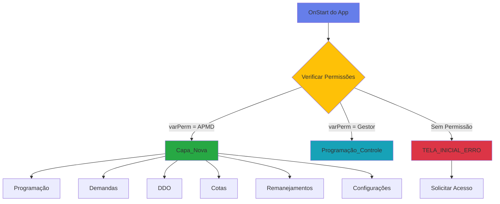

<div class="module-header">
  <h1>🏠 Módulo: Navegação Principal</h1>
  <p class="module-description">
    Sistema central de navegação e controle de acesso do aplicativo Gestão Orçamentária SEDESE
  </p>
</div>

## 📋 Visão Geral do Módulo

<div class="info-box">
  <h3>ℹ️ Sobre este Módulo</h3>
  <ul>
    <li><strong>Função Principal:</strong> Gerenciar acesso e navegação inicial do sistema</li>
    <li><strong>Telas:</strong> 2 telas</li>
    <li><strong>Controle de Acesso:</strong> Baseado em perfil e permissões</li>
    <li><strong>Primeira Execução:</strong> OnStart do App</li>
  </ul>
</div>

---

## 🏠 Tela: Capa_Nova

<div class="screen-header">
  <h3>Tela Inicial - Hub de Navegação</h3>
  <p><strong>Tipo:</strong> Tela de Navegação Principal</p>
  <p><strong>Acesso:</strong> Usuários com perfil APMD</p>
</div>

### 📊 Estatísticas da Tela

<div class="stats-grid">
  <div class="stat-card">
    <div class="stat-number">34</div>
    <div class="stat-label">Controles Totais</div>
  </div>
  
  <div class="stat-card">
    <div class="stat-number">5</div>
    <div class="stat-label">Containers de Navegação</div>
  </div>
  
  <div class="stat-card">
    <div class="stat-number">13</div>
    <div class="stat-label">Botões</div>
  </div>
</div>

### ⚙️ Inicialização do App (OnStart)

Quando o aplicativo é iniciado, ANTES de qualquer tela ser exibida, o sistema executa:
```javascript
// 1. Define perfil padrão
Set(varPerfil, "APMD");

// 2. Busca permissões do usuário logado
Set(_varPermissao, 
    LookUp(
        PermissoesSistemaAPMD,
        Usuario.Email = UsuáriosdoOffice365.MyProfileV2().mail,
        Permissoes
    )
);

// 3. Cria collections de navegação
ClearCollect(colNavMenu3,
    [
        { Label: "Geral", Screen: Demandas_Novo },
        { Label: "Inativos", Screen: Demandas_Orcamentarias_Inativos }
    ]
);

ClearCollect(colNavMenu4,
    [
        { Label: "Pendentes", Screen: Cotas_Pendentes },
        { Label: "Concluídos", Screen: Cotas_Concluídas },
        { Label: "Solicitações", Screen: Cotas_Solicitacoes }
    ]
);

ClearCollect(colNavMenu5,
    [
        { Label: "Programação Pendente", Screen: Remanejamento_Novo_Controle },
        { Label: "Demandas Pendentes", Screen: Remanejamento_Novo_Controle },
        { Label: "Concluídos", Screen: Remanejamento_Novo_Concluidos }
    ]
);

ClearCollect(colNavMenu6,
    [
        { Label: "Programação", Screen: Remanejamento_Novo_Programação },
        { Label: "Demandas", Screen: Remanejamento_Novo_Demandas }
    ]
);

ClearCollect(colNavMenu7,
    [
        { Label: "Geral", Screen: Programação_Controle },
        { Label: "Solicitações", Screen: Programacao_Solicitacoes }
    ]
);

// 4. Cria collection de imagens de loading
ClearCollect(colImagensLoading,
    [
        { ID: 1, Imagem: 'loading-screen-cat' },
        { ID: 2, Imagem: 'taylor swift' },
        { ID: 3, Imagem: 'Friends tv show meme' },
        { ID: 4, Imagem: 'Cameron Tucker_Eric Stonestreet & Mitchell Pritchett_Jesse Tyler Ferguson' },
        { ID: 5, Imagem: 'download (1)' },
        { ID: 6, Imagem: dog }
    ]
);
```

<div class="info-box">
  <h4>🎯 Função das Collections</h4>
  <p>Estas collections são <strong>globais</strong> e alimentam os componentes <code>TabList</code> em todas as telas do aplicativo, criando um sistema de navegação por abas consistente.</p>
</div>

### 🚦 Determinação da Tela Inicial
```javascript
StartScreen = Switch(
    varPerm, 
    "APMD", Capa_Nova,
    "Gestor", Programação_Controle,
    TELA_INCIAL_ERRO
)
```

### 🎨 Containers de Navegação Principais

<div class="navigation-grid">
  
  <div class="nav-container">
    <h4>📊 ContainerProgramação</h4>
    <p><strong>Botão:</strong> ButtonAcessarProgramacao</p>
    <p><strong>Ícone:</strong> SVG_38</p>
    <p><strong>Textos:</strong> TextProgramacao, TextCanvas15_8</p>
    <p><strong>Destino:</strong> Programação_Controle</p>
    <div class="nav-action">
      <strong>OnSelect:</strong>
      <pre><code>Navigate(Programação_Controle, ScreenTransition.Fade)</code></pre>
    </div>
  </div>

  <div class="nav-container">
    <h4>📝 ContainerDemandas</h4>
    <p><strong>Botão:</strong> ButtonAcessarDemandas</p>
    <p><strong>Ícone:</strong> SVG_39</p>
    <p><strong>Textos:</strong> TextDemandas, TextCanvas15_9</p>
    <p><strong>Destino:</strong> Demandas_Novo</p>
    <div class="nav-action">
      <strong>OnSelect:</strong>
      <pre><code>Navigate(Demandas_Novo, ScreenTransition.Fade)</code></pre>
    </div>
  </div>

  <div class="nav-container">
    <h4>📋 ContainerDDO</h4>
    <p><strong>Botão:</strong> ButtonAcessarDDO</p>
    <p><strong>Ícone:</strong> SVG_40</p>
    <p><strong>Textos:</strong> TextDDO, TextCanvas15_10</p>
    <p><strong>Destino:</strong> DDO_Controle_1</p>
    <div class="nav-action">
      <strong>OnSelect:</strong>
      <pre><code>Navigate(DDO_Controle_1, ScreenTransition.Fade)</code></pre>
    </div>
  </div>

  <div class="nav-container">
    <h4>💰 ContainerCotas</h4>
    <p><strong>Botão:</strong> ButtonAcessarCotas</p>
    <p><strong>Ícone:</strong> SVG_41</p>
    <p><strong>Textos:</strong> TextCotas, TextCanvas15_12</p>
    <p><strong>Destino:</strong> Cotas</p>
    <div class="nav-action">
      <strong>OnSelect:</strong>
      <pre><code>Navigate(Cotas, ScreenTransition.Fade)</code></pre>
    </div>
  </div>

  <div class="nav-container">
    <h4>🔄 ContainerTransferencias</h4>
    <p><strong>Botão:</strong> ButtonAcessarTransferencias</p>
    <p><strong>Ícone:</strong> SVG_42</p>
    <p><strong>Textos:</strong> TextTransferencias, TextCanvas15_14</p>
    <p><strong>Destino:</strong> Remanejamento_Novo_Controle</p>
    <div class="nav-action">
      <strong>OnSelect:</strong>
      <pre><code>Set(varCurrentNav5, First(colNavMenu5));
Navigate(Remanejamento_Novo_Controle, ScreenTransition.Fade)</code></pre>
    </div>
  </div>

</div>

### 🛠️ Botões de Ação Adicionais

<div class="table-container">

| Controle | Função | OnSelect |
|----------|--------|----------|
| ButtonConfiguracoes | Abrir configurações de personalização | `Navigate(Configuracoes_Cores)` |
| ButtonVersao | Exibir informações de versão | `Set(varShowVersion, true)` |
| ButtonCanvas15_11 | Ação canvas 1 | (não especificado) |
| ButtonCanvas15_12 | Ação canvas 2 | (não especificado) |
| ButtonCanvas27_2 | Ação canvas 3 | (não especificado) |
| ButtonCanvas27_3 | Ação canvas 4 | (não especificado) |

</div>

### 🎨 Elementos Visuais

- **Rectangle6:** Container principal de fundo
- **Rectangle6_40:** Elemento decorativo
- **Image3:** Imagem de fundo
- **ImageGestaoOrcamentaria:** Logo do sistema
- **TextDesenvolvido:** Informações de desenvolvimento
- **TextCanvas15_3, TextCanvas15_4:** Textos informativos

---

## ❌ Tela: TELA_INCIAL_ERRO

<div class="screen-header error">
  <h3>Tela de Erro - Acesso Negado</h3>
  <p><strong>Tipo:</strong> Tela de Erro</p>
  <p><strong>Acesso:</strong> Usuários sem permissões</p>
</div>

### 📊 Estatísticas da Tela

<div class="stats-grid">
  <div class="stat-card error">
    <div class="stat-number">2</div>
    <div class="stat-label">Controles Totais</div>
  </div>
</div>

### 🎯 Componentes

<div class="error-screen">
  <div class="error-component">
    <h4>🔴 HomeMenuBkg_18</h4>
    <p><strong>Tipo:</strong> Rectangle</p>
    <p><strong>Função:</strong> Fundo da mensagem de erro</p>
    <p><strong>Fill:</strong> Cor de aviso (vermelho/amarelo)</p>
  </div>

  <div class="error-component">
    <h4>⚠️ TextCanvas2</h4>
    <p><strong>Tipo:</strong> TextCanvas</p>
    <p><strong>Função:</strong> Mensagem de erro ao usuário</p>
    <p><strong>Text:</strong></p>
    <pre><code>"Você não possui permissões para acessar este sistema. 
Entre em contato com o administrador."</code></pre>
  </div>
</div>

### 🔒 Lógica de Acesso

<div class="warning-box">
  <h4>🚨 Quando esta tela é exibida?</h4>
  <p>Esta tela aparece quando:</p>
  <ul>
    <li>O usuário não está cadastrado em <code>PermissoesSistemaAPMD</code></li>
    <li>A variável <code>varPerm</code> não corresponde a "APMD" ou "Gestor"</li>
    <li>O e-mail do usuário não é encontrado no sistema</li>
  </ul>
  <p><strong>Solução:</strong> O usuário deve solicitar acesso ao administrador do sistema para ser adicionado à lista de permissões.</p>
</div>

---

## 🔗 Fluxo de Navegação do Módulo


---

## 📚 Variáveis Globais Criadas

<div class="table-container">

| Variável | Tipo | Criada em | Função |
|----------|------|-----------|--------|
| varPerfil | Text | OnStart | Define perfil padrão ("APMD") |
| _varPermissao | Text | OnStart | Armazena permissão do usuário logado |
| colNavMenu3 | Table | OnStart | Navegação do módulo Demandas |
| colNavMenu4 | Table | OnStart | Navegação do módulo Cotas |
| colNavMenu5 | Table | OnStart | Navegação do módulo Remanejamento (Controle) |
| colNavMenu6 | Table | OnStart | Navegação do módulo Remanejamento (Execução) |
| colNavMenu7 | Table | OnStart | Navegação do módulo Programação |
| colImagensLoading | Table | OnStart | Imagens para telas de loading |

</div>

---

## 💡 Dicas de Uso

<div class="tips-grid">
  
  <div class="tip-card">
    <h4>🎯 Perfis de Acesso</h4>
    <p>O sistema diferencia dois perfis principais:</p>
    <ul>
      <li><strong>APMD:</strong> Acesso completo, inicia em Capa_Nova</li>
      <li><strong>Gestor:</strong> Foco em programação, inicia em Programação_Controle</li>
    </ul>
  </div>

  <div class="tip-card">
    <h4>🔄 Collections Globais</h4>
    <p>As collections <code>colNavMenu*</code> são usadas em componentes TabList em todo o app. Modificá-las afeta a navegação em múltiplas telas.</p>
  </div>

  <div class="tip-card">
    <h4>🎨 Personalização</h4>
    <p>Use o botão "Configurações" na Capa_Nova para personalizar cores do sistema através de <code>GestaoOrcamentaria_Configuracoes</code>.</p>
  </div>

  <div class="tip-card">
    <h4>🖼️ Imagens de Loading</h4>
    <p>A collection <code>colImagensLoading</code> fornece variedade visual durante operações demoradas, tornando a espera mais agradável.</p>
  </div>

</div>

---

## ⚠️ Considerações Importantes

<div class="warning-section">
  
  <div class="warning-item">
    <h4>🔐 Segurança de Acesso</h4>
    <p>O controle de acesso é feito APENAS no frontend. Para segurança adicional, considere aplicar permissões também no SharePoint nas listas de dados.</p>
  </div>

  <div class="warning-item">
    <h4>📧 Identificação por E-mail</h4>
    <p>O sistema usa <code>UsuáriosdoOffice365.MyProfileV2().mail</code> para identificação. Certifique-se de que os e-mails em <code>PermissoesSistemaAPMD</code> estão corretos.</p>
  </div>

  <div class="warning-item">
    <h4>🔄 Atualização de Permissões</h4>
    <p>Mudanças na lista de permissões só são aplicadas após o usuário fechar e reabrir o aplicativo (novo OnStart).</p>
  </div>

</div>

---

## 📊 Fontes de Dados Utilizadas

<div class="table-container">

| Fonte de Dados | Tipo | Função no Módulo |
|----------------|------|------------------|
| PermissoesSistemaAPMD | SharePoint List | Controle de acesso e permissões |
| UsuáriosdoOffice365 | Office 365 Connector | Identificação do usuário logado |
| GestaoOrcamentaria_Configuracoes | SharePoint List | Configurações personalizadas por usuário |

</div>

---

<div class="navigation-links">
  <a href="../" class="prev-link">← Voltar para Índice</a>
  <a href="../programacao/" class="next-link">Próximo Módulo: Programação Orçamentária →</a>
</div>

<style>
/* Module Header */
.module-header {
  background: linear-gradient(135deg, #667eea 0%, #764ba2 100%);
  color: white;
  padding: 40px;
  border-radius: 15px;
  margin-bottom: 40px;
  box-shadow: 0 10px 30px rgba(102, 126, 234, 0.3);
}

.module-header h1 {
  margin: 0 0 15px 0;
  font-size: 2.5em;
}

.module-description {
  font-size: 1.2em;
  opacity: 0.95;
  margin: 0;
}

/* Screen Header */
.screen-header {
  background: linear-gradient(135deg, #e7f3ff 0%, #cfe7ff 100%);
  border-left: 5px solid #2196F3;
  padding: 25px;
  margin: 30px 0;
  border-radius: 10px;
  box-shadow: 0 3px 12px rgba(33, 150, 243, 0.15);
}

.screen-header.error {
  background: linear-gradient(135deg, #ffe7e7 0%, #ffcfcf 100%);
  border-left-color: #dc3545;
}

.screen-header h3 {
  margin: 0 0 10px 0;
  color: #1976d2;
  font-size: 1.8em;
}

.screen-header.error h3 {
  color: #c82333;
}

/* Info Box */
.info-box {
  background: linear-gradient(135deg, #e7f3ff 0%, #cfe7ff 100%);
  border-left: 5px solid #2196F3;
  padding: 25px;
  margin: 30px 0;
  border-radius: 10px;
  box-shadow: 0 3px 12px rgba(33, 150, 243, 0.15);
}

.info-box h3, .info-box h4 {
  margin-top: 0;
  color: #1976d2;
}

.info-box ul {
  margin: 15px 0 0 0;
  padding-left: 20px;
}

/* Stats Grid */
.stats-grid {
  display: grid;
  grid-template-columns: repeat(auto-fit, minmax(150px, 1fr));
  gap: 20px;
  margin: 30px 0;
}

.stat-card {
  background: linear-gradient(135deg, #667eea 0%, #764ba2 100%);
  color: white;
  padding: 30px;
  border-radius: 12px;
  text-align: center;
  box-shadow: 0 5px 15px rgba(102, 126, 234, 0.3);
  transition: transform 0.3s;
}

.stat-card.error {
  background: linear-gradient(135deg, #dc3545 0%, #c82333 100%);
}

.stat-card:hover {
  transform: scale(1.05);
}

.stat-number {
  font-size: 3em;
  font-weight: bold;
  line-height: 1;
}

.stat-label {
  font-size: 0.95em;
  margin-top: 10px;
  opacity: 0.95;
}

/* Navigation Grid */
.navigation-grid {
  display: grid;
  grid-template-columns: repeat(auto-fit, minmax(300px, 1fr));
  gap: 25px;
  margin: 30px 0;
}

.nav-container {
  background: white;
  border: 2px solid #e0e0e0;
  border-radius: 12px;
  padding: 25px;
  transition: all 0.3s ease;
  box-shadow: 0 3px 10px rgba(0,0,0,0.08);
}

.nav-container:hover {
  border-color: #667eea;
  transform: translateY(-5px);
  box-shadow: 0 8px 20px rgba(102, 126, 234, 0.2);
}

.nav-container h4 {
  margin-top: 0;
  color: #667eea;
  font-size: 1.3em;
}

.nav-action {
  background: #f8f9fa;
  padding: 15px;
  border-radius: 8px;
  margin-top: 15px;
  border-left: 3px solid #667eea;
}

.nav-action pre {
  margin: 8px 0 0 0;
}

.nav-action code {
  display: block;
  background: #282c34;
  color: #abb2bf;
  padding: 12px;
  border-radius: 5px;
  font-size: 0.9em;
  overflow-x: auto;
}

/* Error Screen */
.error-screen {
  display: grid;
  grid-template-columns: repeat(auto-fit, minmax(280px, 1fr));
  gap: 20px;
  margin: 30px 0;
}

.error-component {
  background: linear-gradient(135deg, #ffe7e7 0%, #ffcfcf 100%);
  border: 2px solid #dc3545;
  border-radius: 12px;
  padding: 25px;
  box-shadow: 0 3px 10px rgba(220, 53, 69, 0.15);
}

.error-component h4 {
  margin-top: 0;
  color: #c82333;
  font-size: 1.2em;
}

.error-component pre {
  margin: 10px 0 0 0;
}

.error-component code {
  display: block;
  background: #f8d7da;
  color: #721c24;
  padding: 15px;
  border-radius: 5px;
  border-left: 3px solid #dc3545;
}

/* Tables */
.table-container {
  overflow-x: auto;
  margin: 25px 0;
  border-radius: 10px;
  box-shadow: 0 3px 10px rgba(0,0,0,0.1);
}

table {
  width: 100%;
  border-collapse: collapse;
  background: white;
}

th {
  background: #667eea;
  color: white;
  padding: 15px;
  text-align: left;
  font-weight: 600;
  text-transform: uppercase;
  font-size: 0.9em;
}

td {
  padding: 15px;
  border-bottom: 1px solid #e9ecef;
}

tr:hover {
  background: #f8f9fa;
}

/* Tips Grid */
.tips-grid {
  display: grid;
  grid-template-columns: repeat(auto-fit, minmax(280px, 1fr));
  gap: 25px;
  margin: 30px 0;
}

.tip-card {
  background: #f0f7ff;
  border-radius: 12px;
  padding: 25px;
  box-shadow: 0 3px 15px rgba(0,0,0,0.08);
  border: 2px solid #e6f0ff;
  transition: all 0.3s;
}

.tip-card:hover {
  box-shadow: 0 5px 20px rgba(0,0,0,0.12);
  transform: translateY(-5px);
  border-color: #667eea;
}

.tip-card h4 {
  margin-top: 0;
  color: #667eea;
  font-size: 1.1em;
}

.tip-card ul {
  margin: 10px 0 0 0;
  padding-left: 20px;
}

/* Warning Section */
.warning-box, .warning-section {
  background: linear-gradient(135deg, #fff3cd 0%, #ffe9a6 100%);
  border-left: 5px solid #ffc107;
  padding: 25px;
  margin: 30px 0;
  border-radius: 10px;
  box-shadow: 0 3px 12px rgba(255, 193, 7, 0.15);
}

.warning-box h4, .warning-section h3 {
  margin-top: 0;
  color: #f57c00;
}

.warning-item {
  background: white;
  padding: 20px;
  margin: 15px 0;
  border-radius: 8px;
  border-left: 3px solid #ffc107;
}

.warning-item h4 {
  margin-top: 0;
  color: #f57c00;
}

/* Code Blocks */
code {
  background: #f4f4f4;
  padding: 3px 8px;
  border-radius: 4px;
  font-family: 'Courier New', Consolas, monospace;
  color: #d63384;
  font-size: 0.9em;
}

pre {
  background: #282c34;
  color: #abb2bf;
  padding: 20px;
  border-radius: 8px;
  overflow-x: auto;
  margin: 20px 0;
}

pre code {
  background: none;
  color: inherit;
  padding: 0;
}

/* Navigation Links */
.navigation-links {
  display: flex;
  justify-content: space-between;
  margin-top: 50px;
  padding-top: 25px;
  border-top: 2px solid #eaeaea;
  gap: 20px;
}

.navigation-links a {
  text-decoration: none;
  color: #667eea;
  padding: 12px 25px;
  border-radius: 8px;
  background: linear-gradient(135deg, #f0f7ff 0%, #e6f0ff 100%);
  transition: all 0.3s ease;
  font-weight: 600;
  flex: 1;
  text-align: center;
}

.navigation-links a:hover {
  background: linear-gradient(135deg, #667eea 0%, #764ba2 100%);
  color: white;
  transform: translateY(-3px);
  box-shadow: 0 5px 15px rgba(102, 126, 234, 0.3);
}

/* Responsividade */
@media (max-width: 768px) {
  .module-header {
    padding: 25px;
  }
  
  .module-header h1 {
    font-size: 1.8em;
  }
  
  .navigation-grid,
  .stats-grid,
  .tips-grid,
  .error-screen {
    grid-template-columns: 1fr;
  }
  
  .navigation-links {
    flex-direction: column;
  }
  
  .stat-number {
    font-size: 2.5em;
  }
}
</style>