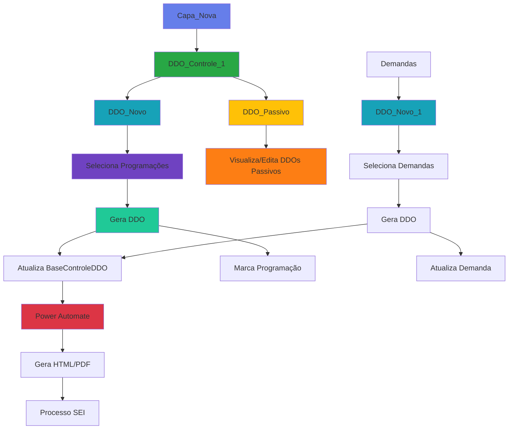

<div class="module-header">
  <h1>📋 Módulo: DDO - Documentos de Descentralização Orçamentária</h1>
  <p class="module-description">
    Sistema completo de gestão de DDOs com funcionalidades de solicitação, controle, geração de documentos e acompanhamento de status
  </p>
</div>

## 📋 Visão Geral do Módulo

<div class="info-box">
  <h3>ℹ️ Sobre este Módulo</h3>
  <ul>
    <li><strong>Função Principal:</strong> Gerenciar todo o ciclo de vida dos DDOs</li>
    <li><strong>Telas:</strong> 4 telas</li>
    <li><strong>Tipos de DDO:</strong> Novo (Programação), Novo (Demanda), Passivo</li>
    <li><strong>Integração:</strong> SEI (Sistema Eletrônico de Informações)</li>
  </ul>
</div>

## 🗂️ Telas do Módulo

<div class="screens-grid">
  <div class="screen-card primary">
    <h4>🎯 DDO_Controle_1</h4>
    <p>Controle e acompanhamento geral</p>
  </div>
  <div class="screen-card success">
    <h4>➕ DDO_Novo</h4>
    <p>Solicitar DDO (origem: programação)</p>
  </div>
  <div class="screen-card info">
    <h4>➕ DDO_Novo_1</h4>
    <p>Solicitar DDO (origem: demanda)</p>
  </div>
  <div class="screen-card warning">
    <h4>📊 DDO_Passivo</h4>
    <p>DDOs passivos e histórico</p>
  </div>
</div>

---

## 🎯 Tela: DDO_Controle_1

<div class="screen-header">
  <h3>Controle Geral de DDOs</h3>
  <p><strong>Tipo:</strong> Tela de Controle e Listagem</p>
  <p><strong>Acesso:</strong> APMD e Gestores</p>
</div>

### 📊 Estatísticas da Tela

<div class="stats-grid">
  <div class="stat-card">
    <div class="stat-number">30+</div>
    <div class="stat-label">Controles Totais</div>
  </div>
  <div class="stat-card">
    <div class="stat-number">1</div>
    <div class="stat-label">Gallery Principal</div>
  </div>
  <div class="stat-card">
    <div class="stat-number">4</div>
    <div class="stat-label">Filtros de Busca</div>
  </div>
</div>

### 🎯 Gallery_ControleDDO

<div class="gallery-info">
  <h4>📋 Gallery Principal</h4>
  <p><strong>Template:</strong> a416f0ee-80e6-4045-8071-082efbc05963</p>
  <p><strong>Items:</strong> BaseControleDDO_PorObjeto</p>
</div>

#### Colunas Exibidas

<div class="table-container">

| Controle | Campo | Descrição |
|----------|-------|-----------|
| ID_Destino_DDO | ID Destino | ID da programação/demanda destino |
| Objeto_DDO | Objeto | Nome/descrição do objeto |
| ObjetosAssociados_DDO | Objetos Associados | Lista de objetos vinculados |
| Sei_DDO | SEI | Número do processo SEI |
| TextID_Destino_DDO | ID Destino (Text) | Versão texto do ID |
| TextOBJAssociados_DDO | Objetos (Text) | Texto dos objetos associados |
| TextObjeto_DDO | Objeto (Text) | Texto do objeto principal |
| TextSEI_DDO | SEI (Text) | Texto do número SEI |

</div>

### 🔍 Sistema de Filtros

<div class="table-container">

| Controle | Tipo | Campo Filtrado |
|----------|------|----------------|
| scObjeto_11 | TextInputCanvas | Objeto do DDO |
| scObjeto_DDO | TextInputCanvas | Objeto (alternativo) |
| scSiafiEntrada_8 | TextInputCanvas | SIAFI Entrada |
| ButtonCanvas30_1 | ButtonCanvas | Aplicar filtros |

</div>

**Lógica de Filtro da Gallery:**
```javascript
Filter(
    BaseControleDDO_PorObjeto,
    If(!IsBlank(scObjeto_DDO.Text),
        StartsWith(Objeto, scObjeto_DDO.Text),
        true
    ),
    If(!IsBlank(scSiafiEntrada_8.Text),
        'SIAFI Entrada' = scSiafiEntrada_8.Text,
        true
    )
)
```

### 🎬 Botões de Ação

<div class="actions-grid">
  
  <div class="action-card success">
    <h4>➕ Button_AdicionarNovo</h4>
    <p><strong>Função:</strong> Solicitar novo DDO (origem: programação)</p>
    <p><strong>OnSelect:</strong></p>
    <pre><code>Navigate(DDO_Novo, ScreenTransition.Fade)</code></pre>
  </div>

  <div class="action-card success">
    <h4>➕ Button_AdicionarPassivo</h4>
    <p><strong>Função:</strong> Acessar DDOs passivos</p>
    <p><strong>OnSelect:</strong></p>
    <pre><code>Navigate(DDO_Passivo, ScreenTransition.Fade)</code></pre>
  </div>

</div>

---

## ➕ Tela: DDO_Novo

<div class="screen-header">
  <h3>Solicitar DDO - Origem: Programação</h3>
  <p><strong>Tipo:</strong> Seleção e Solicitação</p>
  <p><strong>Origem dos Dados:</strong> PlanejamentoGeral2025</p>
</div>

### 📊 Estatísticas da Tela

<div class="stats-grid">
  <div class="stat-card">
    <div class="stat-number">60+</div>
    <div class="stat-label">Controles Totais</div>
  </div>
  <div class="stat-card">
    <div class="stat-number">1</div>
    <div class="stat-label">Gallery de Seleção</div>
  </div>
  <div class="stat-card">
    <div class="stat-number">10+</div>
    <div class="stat-label">Filtros</div>
  </div>
</div>

### ⚙️ Evento OnVisible
```javascript
ClearCollect(
    colBaseDDO,
    Filter(
        PlanejamentoGeral2025,
        Status = "Ativo",
        IsBlank('DDO Gerado') || 'DDO Gerado' = false
    )
)
```

### 🎯 Gallery4_3 - Seleção de Programações

<div class="gallery-info">
  <h4>📋 Gallery de Seleção</h4>
  <p><strong>Template:</strong> galleryTemplate4_3</p>
  <p><strong>Items:</strong> colBaseDDO (filtrada)</p>
</div>

**Componentes da Gallery:**
```javascript
// CheckboxCanvas1 - Seleção
OnCheck: Collect(colDDO, ThisItem)
OnUncheck: Remove(colDDO, LookUp(colDDO, ID = ThisItem.ID))

// Campos exibidos
TextCanvas4_112: ThisItem.ID
TextCanvas4_21: ThisItem.Ação
TextCanvas4_22: ThisItem.'E.I.'
TextCanvas4_23: ThisItem.Objeto
TextCanvas4_24: ThisItem.'U.A'
TextCanvas4_25: Text(ThisItem.Replanejado, "R$ #,##0.00")
TextCanvas4_60: ThisItem.'SIAFI entrada'
TextCanvas4_63: ThisItem.Status
```

### 🔍 Filtros Disponíveis

<div class="filters-grid">
  
  <div class="filter-item">
    <h5>🔢 scID</h5>
    <p><strong>Items:</strong> Distinct(colBaseDDO, ID)</p>
    <p><strong>OnChange:</strong></p>
    <pre><code>Set(searchIDelecionado, Self.Selected.Result);
Set(searchIDValor, Self.Selected.Result)</code></pre>
  </div>

  <div class="filter-item">
    <h5>📊 scEI_1</h5>
    <p><strong>Items:</strong> Distinct(colBaseDDO, 'E.I.')</p>
  </div>

  <div class="filter-item">
    <h5>💰 scFonte_1</h5>
    <p><strong>Items:</strong> Distinct(colBaseDDO, Fonte)</p>
  </div>

  <div class="filter-item">
    <h5>📋 scGrupo_1</h5>
    <p><strong>Items:</strong> Distinct(colBaseDDO, Grupo)</p>
  </div>

  <div class="filter-item">
    <h5>🎯 scObjeto_1</h5>
    <p><strong>Type:</strong> TextInputCanvas</p>
  </div>

  <div class="filter-item">
    <h5>🏢 scProcedencia_1</h5>
    <p><strong>Items:</strong> Distinct(colBaseDDO, Procedência)</p>
  </div>

  <div class="filter-item">
    <h5>🔢 scSiafiEntrada_1</h5>
    <p><strong>Type:</strong> TextInputCanvas</p>
  </div>

  <div class="filter-item">
    <h5>🔢 scSiafiSaida_1</h5>
    <p><strong>Type:</strong> TextInputCanvas</p>
  </div>

</div>

### 📝 Campos do Formulário

<div class="form-grid">
  
  <div class="form-field">
    <h5>📄 TextInputCanvas7 - Número SEI</h5>
    <p><strong>Hint:</strong> "Digite o número do processo SEI"</p>
    <p><strong>Obrigatório:</strong> ✅ Sim</p>
  </div>

  <div class="form-field">
    <h5>📋 TextInputCanvas7_1 - Observações</h5>
    <p><strong>Mode:</strong> MultiLine</p>
    <p><strong>Obrigatório:</strong> ❌ Não</p>
  </div>

  <div class="form-field">
    <h5>🎯 textModalidade</h5>
    <p><strong>Hint:</strong> "Modalidade do DDO"</p>
  </div>

  <div class="form-field">
    <h5>💰 TextInputCanvas6 - Valor Total</h5>
    <p><strong>Default:</strong></p>
    <pre><code>Text(Sum(colDDO, Replanejado), "R$ #,##0.00")</code></pre>
    <p><strong>DisplayMode:</strong> View</p>
  </div>

  <div class="form-field">
    <h5>📊 TextInputCanvas6_2 - Quantidade</h5>
    <p><strong>Default:</strong></p>
    <pre><code>Text(CountRows(colDDO))</code></pre>
    <p><strong>DisplayMode:</strong> View</p>
  </div>

</div>

### ✅ CheckboxCanvas3 - Selecionar Todos
```javascript
Default: false

OnCheck:
    ClearCollect(colDDO, Gallery4_3.AllItems)

OnUncheck:
    Clear(colDDO)
```

### 🎬 Ações Principais

<div class="actions-grid">
  
  <div class="action-card success">
    <h4>💾 ButtonCanvas10 - Gerar DDO</h4>
    <p><strong>OnSelect:</strong></p>
    <pre><code>If(
    CountRows(colDDO) = 0,
    Notify("Selecione ao menos um item", NotificationType.Warning);
    Exit(),
    IsBlank(TextInputCanvas7.Text),
    Notify("Informe o número do processo SEI", NotificationType.Warning);
    Exit()
);

UpdateContext({visLoading: true});
Set(varImagem, First(Shuffle(colImagensLoading)).Imagem);

ForAll(
    colDDO,
    Patch(
        BaseControleDDO,
        Defaults(BaseControleDDO),
        {
            'ID Programação': ThisRecord.ID,
            Objeto: ThisRecord.Objeto,
            'Número SEI': TextInputCanvas7.Text,
            Modalidade: textModalidade.Text,
            Observações: TextInputCanvas7_1.Text,
            'Valor Total': ThisRecord.Replanejado,
            Status: "Pendente",
            'Data Criação': Now(),
            'Criado Por': UsuáriosdoOffice365.MyProfileV2().mail,
            Ação: ThisRecord.Ação,
            'E.I.': ThisRecord.'E.I.',
            'U.A': ThisRecord.'U.A',
            Fonte: ThisRecord.Fonte,
            Grupo: ThisRecord.Grupo,
            Procedência: ThisRecord.Procedência,
            'SIAFI Entrada': ThisRecord.'SIAFI entrada',
            'SIAFI Saída': ThisRecord.'SIAFI saida'
        }
    );
    
    Patch(
        PlanejamentoGeral2025,
        LookUp(PlanejamentoGeral2025, ID = ThisRecord.ID),
        {
            'DDO Gerado': true,
            'Data DDO': Now()
        }
    )
);

Clear(colDDO);
Reset(CheckboxCanvas3);
Reset(TextInputCanvas7);
Reset(TextInputCanvas7_1);
Reset(textModalidade);

Set(Timer3.Start, true);
UpdateContext({visLoading: false});
Notify("DDO(s) gerado(s) com sucesso!", NotificationType.Success)</code></pre>
  </div>

  <div class="action-card">
    <h4>📄 ButtonCanvas10_2 - Gerar HTML/PDF</h4>
    <p><strong>OnSelect:</strong></p>
    <pre><code>If(
    CountRows(colDDO) = 0,
    Notify("Selecione itens para gerar o documento", NotificationType.Warning);
    Exit()
);

Set(varlinkSEI, TextInputCanvas7.Text);

'Teste_DDO_Html'.Run(
    JSON(colDDO),
    varlinkSEI,
    textModalidade.Text,
    TextInputCanvas7_1.Text
);

Notify("Documento sendo gerado...", NotificationType.Information)</code></pre>
  </div>

</div>

### ⏱️ Timer3
```javascript
Duration: 3000
AutoStart: false

OnTimerEnd:
    UpdateContext({visLoading: false})
```

---

## ➕ Tela: DDO_Novo_1

<div class="screen-header">
  <h3>Solicitar DDO - Origem: Demanda</h3>
  <p><strong>Tipo:</strong> Seleção e Solicitação</p>
  <p><strong>Origem dos Dados:</strong> BaseDemandasOrcamentarias2025</p>
</div>

### 📊 Estatísticas da Tela

<div class="stats-grid">
  <div class="stat-card">
    <div class="stat-number">70+</div>
    <div class="stat-label">Controles Totais</div>
  </div>
  <div class="stat-card">
    <div class="stat-number">1</div>
    <div class="stat-label">Gallery de Seleção</div>
  </div>
  <div class="stat-card">
    <div class="stat-number">12+</div>
    <div class="stat-label">Filtros</div>
  </div>
</div>

### ⚙️ Evento OnVisible
```javascript
ClearCollect(
    colBaseDDO,
    Filter(
        BaseDemandasOrcamentarias2025,
        Status = "Ativo",
        IsBlank('DDO Gerado') || 'DDO Gerado' = false
    )
)
```

### 🎯 Gallery_SolicitarDDO

<div class="gallery-info">
  <h4>📋 Gallery de Seleção</h4>
  <p><strong>Template:</strong> 36367dcc-ea5b-4ae5-a3d3-a274dbbebf4b</p>
  <p><strong>Items:</strong> colBaseDDO (filtrada)</p>
</div>

**Componentes:**
```javascript
// Checkbox_Gallery_SolicitarDDO
OnCheck: Collect(colDDO, ThisItem)
OnUncheck: Remove(colDDO, LookUp(colDDO, ID = ThisItem.ID))

// Campos exibidos
Text_AcaoDDO: ThisItem.Ação
Text_EI_DDO: ThisItem.'E.I.'
Text_ID_DDO: ThisItem.ID
Text_ObjetoDDO: ThisItem.Título
Text_ValorLOA: Text(ThisItem.'Valor LOA', "R$ #,##0.00")
Text_ValorNaoComprometido: Text(
    ThisItem.'Valor LOA' - ThisItem.'Valor Comprometido',
    "R$ #,##0.00"
)

// Text_Valor_SolicitarDDO - Campo editável
Value: Text(ThisItem.'Valor Disponível', "R$ #,##0.00")
Format: Currency
```

### 🔍 Filtros Disponíveis

<div class="table-container">

| Controle | Items/Fonte |
|----------|-------------|
| scID_1 | Distinct(colBaseDDO, ID) |
| sc_EI3 | Distinct(colBaseDDO, 'E.I.') |
| scFonte_6 | Distinct(colBaseDDO, Fonte) |
| scGrupo_16 | Distinct(colBaseDDO, Grupo) |
| scObjeto_8 | TextInputCanvas (busca texto) |
| scProcedencia_6 | Distinct(colBaseDDO, Procedência) |
| scSiafiEntrada_7 | TextInputCanvas |
| scSiafiSaida_5 | TextInputCanvas |
| sc_Acao3 | Distinct(colBaseDDO, Ação) |

</div>

**OnChange dos Filtros:**
```javascript
// sc_EI3.OnChange
Set(searchIDelecionado, Self.Selected);
Set(searchIDValor, Self.Selected.Result);
```

### 📝 Formulário

<div class="form-grid">
  
  <div class="form-field">
    <h5>📄 TextInput_SEI_DDO</h5>
    <p><strong>Obrigatório:</strong> ✅ Sim</p>
  </div>

  <div class="form-field">
    <h5>📝 TextInput_Objeto_DDO</h5>
    <p><strong>Mode:</strong> MultiLine</p>
  </div>

  <div class="form-field">
    <h5>💰 TextCanvas_ValorTotal_DDO</h5>
    <p><strong>Text:</strong></p>
    <pre><code>"Valor Total: " & Text(
    Sum(colDDO, Value(Text_Valor_SolicitarDDO.Text)),
    "R$ #,##0.00"
)</code></pre>
  </div>

  <div class="form-field">
    <h5>📊 TextCanvas6_5</h5>
    <p><strong>Text:</strong></p>
    <pre><code>"Total de Itens: " & CountRows(colDDO)</code></pre>
  </div>

</div>

### 🎬 Ações Principais

<div class="actions-grid">
  
  <div class="action-card success">
    <h4>💾 Button_GerarDDO</h4>
    <p><strong>OnSelect:</strong></p>
    <pre><code>If(
    CountRows(colDDO) = 0,
    Notify("Selecione ao menos uma demanda", NotificationType.Warning);
    Exit(),
    IsBlank(TextInput_SEI_DDO.Text),
    Notify("Informe o número do processo SEI", NotificationType.Warning);
    Exit()
);

UpdateContext({visLoading: true});
Set(varImagem, First(Shuffle(colImagensLoading)).Imagem);

ForAll(
    colDDO,
    Patch(
        BaseControleDDO,
        Defaults(BaseControleDDO),
        {
            'ID Demanda': ThisRecord.ID,
            Objeto: ThisRecord.Título,
            'Número SEI': TextInput_SEI_DDO.Text,
            'Valor Solicitado': Value(
                LookUp(
                    Gallery_SolicitarDDO.AllItems,
                    ID = ThisRecord.ID
                ).Text_Valor_SolicitarDDO.Text
            ),
            Status: "Pendente Demanda",
            'Data Criação': Now(),
            'Criado Por': UsuáriosdoOffice365.MyProfileV2().mail,
            Ação: ThisRecord.Ação,
            'E.I.': ThisRecord.'E.I.',
            'U.A': ThisRecord.'U.A',
            Fonte: ThisRecord.Fonte,
            Grupo: ThisRecord.Grupo,
            Procedência: ThisRecord.Procedência
        }
    );
    
    Patch(
        BaseDemandasOrcamentarias2025,
        ThisRecord,
        {
            'DDO Gerado': true,
            'Data DDO': Now(),
            'Valor Comprometido': ThisRecord.'Valor Comprometido' + 
                Value(
                    LookUp(
                        Gallery_SolicitarDDO.AllItems,
                        ID = ThisRecord.ID
                    ).Text_Valor_SolicitarDDO.Text
                )
        }
    )
);

Clear(colDDO);
Reset(CheckboxCanvas3_2);
Reset(TextInput_SEI_DDO);

Set(Timer3_1.Start, true);
UpdateContext({visLoading: false});
Notify("DDO(s) de demanda gerado(s)!", NotificationType.Success)</code></pre>
  </div>

  <div class="action-card">
    <h4>🧪 ButtonTeste</h4>
    <p><strong>OnSelect:</strong></p>
    <pre><code>Set(varlinkSEI, TextInput_SEI_DDO.Text);

'Teste_DDO_Html'.Run(
    JSON(colDDO),
    varlinkSEI,
    TextInput_Objeto_DDO.Text,
    ""
);

Notify("Teste de geração iniciado", NotificationType.Information)</code></pre>
  </div>

  <div class="action-card">
    <h4>🔄 Button_LimparFiltros3</h4>
    <p><strong>OnSelect:</strong></p>
    <pre><code>Reset(scID_1);
Reset(sc_EI3);
Reset(scFonte_6);
Reset(scGrupo_16);
Reset(scObjeto_8);
Reset(scProcedencia_6);
Reset(scSiafiEntrada_7);
Reset(scSiafiSaida_5);
Reset(sc_Acao3);

ClearCollect(
    colBaseDDO,
    Filter(
        BaseDemandasOrcamentarias2025,
        Status = "Ativo",
        IsBlank('DDO Gerado') || 'DDO Gerado' = false
    )
)</code></pre>
  </div>

</div>

### ✅ CheckboxCanvas3_2 - Selecionar Todos
```javascript
OnCheck: ClearCollect(colDDO, Gallery_SolicitarDDO.AllItems)
OnUncheck: Clear(colDDO)
```

---

## 📊 Tela: DDO_Passivo

<div class="screen-header">
  <h3>DDOs Passivos e Histórico</h3>
  <p><strong>Tipo:</strong> Visualização e Edição</p>
  <p><strong>Função:</strong> Gerenciar DDOs já processados ou passivos</p>
</div>

### 📊 Estatísticas da Tela

<div class="stats-grid">
  <div class="stat-card">
    <div class="stat-number">90+</div>
    <div class="stat-label">Controles Totais</div>
  </div>
  <div class="stat-card">
    <div class="stat-number">1</div>
    <div class="stat-label">Gallery Principal</div>
  </div>
  <div class="stat-card">
    <div class="stat-number">2</div>
    <div class="stat-label">Menus Laterais</div>
  </div>
</div>

### 🎯 Gallery4_5 - DDOs Passivos

<div class="gallery-info">
  <h4>📋 Gallery Principal</h4>
  <p><strong>Template:</strong> galleryTemplate4_5</p>
  <p><strong>Items:</strong></p>
  <pre><code>Filter(
    BaseControleDDO,
    Status = "Passivo" || Status = "Concluído"
)
SortByColumns(Filter(...), "Created", Descending)</code></pre>
</div>

**Componentes da Gallery:**
```javascript
// CheckboxCanvas1_1 - Seleção
OnCheck: Collect(colDDO, ThisItem)
OnUncheck: Remove(colDDO, LookUp(colDDO, ID = ThisItem.ID))

// Campos exibidos
TextCanvas4_32: ThisItem.ID
TextCanvas4_33: ThisItem.Objeto
TextCanvas4_34: ThisItem.'Número SEI'
TextCanvas4_35: ThisItem.Status
TextCanvas4_36: Text(ThisItem.'Valor Total', "R$ #,##0.00")
TextCanvas4_45: Text(ThisItem.Created, "dd/mm/yyyy")

// TextInputCanvas6_3, 6_4, 6_5 - Campos editáveis
Value: valores do ThisItem
```

### 🔍 Filtros

<div class="table-container">

| Controle | Tipo | Items/Fonte |
|----------|------|-------------|
| scEI_2 | ComboboxCanvas | Distinct(BaseControleDDO, 'E.I.') |
| scFonte_2 | ComboboxCanvas | Distinct(BaseControleDDO, Fonte) |
| scGrupo_2 | ComboboxCanvas | Distinct(BaseControleDDO, Grupo) |
| scObjeto_4 | TextInputCanvas | Busca por texto |
| scProcedencia_2 | ComboboxCanvas | Distinct(BaseControleDDO, Procedência) |
| scSiafiEntrada_3 | TextInputCanvas | SIAFI Entrada |
| scSiafiSaida_2 | TextInputCanvas | SIAFI Saída |
| scID_3 | ComboboxCanvas | Distinct(BaseControleDDO, ID) |
| scEI_14 | ComboboxCanvas | Items alternativos |

</div>

### 📋 Modo Detalhamento (visDetalhar)

<div class="container-section">
  <h4>📦 Visibilidade</h4>
  <p><strong>Variável:</strong> visDetalhar</p>
  <p><strong>Ativação:</strong> ButtonCanvas5_4.OnSelect</p>
</div>

**Campos Detalhados Visíveis:**

<div class="detailed-fields">
  
  <div class="field-row">
    <h5>Botões de Campo (Button1_95 a 1_136)</h5>
    <p>15 botões de campo para labels/títulos</p>
  </div>

  <div class="field-row">
    <h5>Dropdowns (DropdownCanvas10_4, 10_5)</h5>
    <p>2 dropdowns para seleção de classificação</p>
  </div>

  <div class="field-row">
    <h5>TextInputs (TextInputCanvas5_16 a 5_22)</h5>
    <p>7 campos de entrada de texto editáveis</p>
  </div>

  <div class="field-row">
    <h5>TextCanvas (TextCanvas4_20, 4_30, 4_31)</h5>
    <p>3 labels informativos</p>
  </div>

</div>

### 📱 Menus Laterais

<div class="menus-grid">
  
  <div class="menu-item">
    <h4>📋 Gallery6_8 - Menu 1</h4>
    <p><strong>Visible:</strong> visMenu</p>
    <p><strong>Items:</strong> Lista de opções</p>
    <p><strong>Template:</strong> galleryTemplate6_8</p>
    <p><strong>Controle:</strong> Button4_3</p>
  </div>

  <div class="menu-item">
    <h4>📋 Gallery8_4 - Menu 2</h4>
    <p><strong>Visible:</strong> visMenu2</p>
    <p><strong>Items:</strong> Submenu de opções</p>
    <p><strong>Template:</strong> galleryTemplate8_4</p>
    <p><strong>Controle:</strong> Button5_3</p>
  </div>

</div>

**Controle de Visibilidade dos Menus:**
```javascript
// AppLogo1_31.OnSelect - Toggle menu principal
UpdateContext({
    visMenu: !visMenu,
    visMenu2: false,
    visMenu3: false,
    visMenu4: false,
    visMenu5: false
})

// Button5_3.OnSelect - Navegar entre menus
UpdateContext({
    visMenu: false,
    visMenu2: !visMenu2
})

// Rectangle5_8.OnSelect - Fechar menus (overlay)
UpdateContext({
    visMenu: false,
    visMenu2: false,
    visMenu3: false,
    visMenu4: false,
    visMenu5: false
})
```

### 🎬 Ações Principais

<div class="actions-grid">
  
  <div class="action-card">
    <h4>👁️ ButtonCanvas5_4 - Detalhar</h4>
    <p><strong>OnSelect:</strong></p>
    <pre><code>UpdateContext({visDetalhar: !visDetalhar})</code></pre>
  </div>

  <div class="action-card success">
    <h4>💾 ButtonCanvas10_1 - Salvar Alterações</h4>
    <p><strong>OnSelect:</strong></p>
    <pre><code>UpdateContext({visLoading: true});
Set(varImagem, First(Shuffle(colImagensLoading)).Imagem);

ForAll(
    Filter(Gallery4_5.AllItems, CheckboxCanvas1_1.Value = true),
    Patch(
        BaseControleDDO,
        ThisRecord,
        {
            // Atualiza campos editados
            Campo1: TextInputCanvas5_16.Text,
            Campo2: TextInputCanvas5_17.Text,
            Campo3: TextInputCanvas5_18.Text,
            Campo4: TextInputCanvas5_19.Text,
            Campo5: TextInputCanvas5_20.Text,
            Campo6: TextInputCanvas5_21.Text,
            Campo7: TextInputCanvas5_22.Text,
            'Última Modificação': Now(),
            'Modificado Por': UsuáriosdoOffice365.MyProfileV2().mail
        }
    )
);

UpdateContext({visLoading: false});
Notify("Alterações salvas!", NotificationType.Success);
Refresh(BaseControleDDO)</code></pre>
  </div>

  <div class="action-card error">
    <h4>🗑️ Button1_129 - Excluir DDO</h4>
    <p><strong>OnSelect:</strong></p>
    <pre><code>If(
    Confirm("Tem certeza que deseja excluir este(s) DDO(s)?"),
    
    Set(varAcao, "Excluir");
    
    ForAll(
        Filter(Gallery4_5.AllItems, CheckboxCanvas1_1.Value = true),
        Remove(BaseControleDDO, ThisRecord)
    );
    
    Notify("DDO(s) excluído(s)", NotificationType.Warning);
    Refresh(BaseControleDDO)
)</code></pre>
  </div>

  <div class="action-card">
    <h4>📊 Button5_3 - Abrir Submenu</h4>
    <p><strong>OnSelect:</strong></p>
    <pre><code>UpdateContext({
    visMenu: false,
    visMenu2: true,
    visMenu3: false,
    visMenu4: false,
    visMenu5: false
})</code></pre>
  </div>

</div>

### 🎨 Elementos Visuais

<div class="visual-elements">
  
  <div class="visual-item">
    <h5>📐 Rectangle5_7</h5>
    <p>Container do modo detalhamento</p>
    <p><strong>Visible:</strong> visDetalhar</p>
  </div>

  <div class="visual-item">
    <h5>📐 Rectangle5_8</h5>
    <p>Overlay dos menus laterais</p>
    <p><strong>Visible:</strong> visMenu || visMenu2 || ...</p>
    <p><strong>OnSelect:</strong> Fecha todos os menus</p>
  </div>

  <div class="visual-item">
    <h5>📐 Rectangle7_12, 7_13</h5>
    <p>Separadores visuais do detalhamento</p>
    <p><strong>Visible:</strong> visDetalhar</p>
  </div>

  <div class="visual-item">
    <h5>🎨 TextCanvas3_6</h5>
    <p>Título do menu lateral</p>
    <p><strong>Visible:</strong> visMenu</p>
  </div>

</div>

---

## 📊 Variáveis Globais do Módulo

<div class="table-container">

| Variável | Tipo | Escopo | Função |
|----------|------|--------|--------|
| colBaseDDO | Table | Global | Dados base para seleção (Programação ou Demanda) |
| colDDO | Table | Global | Itens selecionados para gerar DDO |
| varlinkSEI | Text | Global | Número do processo SEI |
| varImagem | Text | Global | Imagem de loading selecionada |
| varAcao | Text | Global | Ação atual (Excluir, Editar, etc.) |

</div>

### Variáveis de Contexto

<div class="table-container">

| Variável | Tipo | Tela | Função |
|----------|------|------|--------|
| visLoading | Boolean | Todas | Mostra/oculta tela de loading |
| visDetalhar | Boolean | DDO_Passivo | Mostra/oculta campos detalhados |
| visMenu | Boolean | DDO_Passivo | Menu lateral principal |
| visMenu2 | Boolean | DDO_Passivo | Submenu 1 |
| visMenu3 | Boolean | DDO_Passivo | Submenu 2 |
| visMenu4 | Boolean | DDO_Passivo | Submenu 3 |
| visMenu5 | Boolean | DDO_Passivo | Submenu 4 |

</div>

### Variáveis de Filtro

<div class="info-box">
  <h4>🔍 Padrão de Filtros</h4>
  <p>Similar aos outros módulos, com variáveis search* para cada campo filtrável</p>
</div>

---

## 📊 Collections do Módulo

<div class="table-container">

| Collection | Criada em | Função |
|------------|-----------|--------|
| colBaseDDO | OnVisible (DDO_Novo, DDO_Novo_1) | Base de dados disponíveis para DDO |
| colDDO | Durante seleção | Itens selecionados temporariamente |
| colImagensLoading | OnStart (App) | Imagens para loading |

</div>

---

## 📚 Fontes de Dados Utilizadas

<div class="table-container">

| Fonte de Dados | Tipo | Função no Módulo |
|----------------|------|------------------|
| BaseControleDDO | SharePoint List | Registro principal de DDOs |
| BaseControleDDO_PorObjeto | SharePoint List View | Vista agrupada por objeto |
| PlanejamentoGeral2025 | SharePoint List | Fonte para DDOs de programação |
| BaseDemandasOrcamentarias2025 | SharePoint List | Fonte para DDOs de demanda |
| Teste_DDO_Html | Power Automate Flow | Geração de documento HTML/PDF |
| UsuáriosdoOffice365 | Office 365 Connector | Informações do usuário |

</div>

---

## 🔗 Fluxo de Navegação do Módulo


---

## 💡 Dicas de Uso do Módulo

<div class="tips-grid">
  
  <div class="tip-card">
    <h4>📋 Duas Origens de DDO</h4>
    <p>O sistema permite criar DDOs de duas formas:</p>
    <ul>
      <li><strong>DDO_Novo:</strong> A partir de programações já aprovadas</li>
      <li><strong>DDO_Novo_1:</strong> A partir de demandas orçamentárias</li>
    </ul>
    <p>Cada tipo tem seu próprio fluxo e controle de valores.</p>
  </div>

  <div class="tip-card">
    <h4>✅ Seleção Múltipla</h4>
    <p>Use o checkbox "Selecionar Todos" para agilizar a criação de DDOs com múltiplos itens. Isso é especialmente útil para DDOs que agrupam várias programações/demandas relacionadas.</p>
  </div>

  <div class="tip-card">
    <h4>📄 Geração de Documentos</h4>
    <p>O botão "Gerar HTML/PDF" chama um flow do Power Automate que:</p>
    <ul>
      <li>Formata os dados em HTML</li>
      <li>Converte para PDF</li>
      <li>Pode anexar automaticamente ao processo SEI</li>
    </ul>
  </div>

  <div class="tip-card">
    <h4>🔍 Filtros Inteligentes</h4>
    <p>Os filtros são específicos para cada tipo de DDO. Use-os para encontrar rapidamente programações/demandas elegíveis para descentralização.</p>
  </div>

  <div class="tip-card">
    <h4>📊 DDOs Passivos</h4>
    <p>A tela DDO_Passivo mantém histórico completo de todos os DDOs já processados, permitindo consulta e edição quando necessário.</p>
  </div>

  <div class="tip-card">
    <h4>💰 Controle de Valores</h4>
    <p>Em DDOs de demanda, o valor pode ser editado individualmente para cada item. O sistema calcula automaticamente o valor total e atualiza o "Valor Comprometido" da demanda.</p>
  </div>

  <div class="tip-card">
    <h4>🔗 Vínculo com SEI</h4>
    <p>O número SEI é obrigatório e cria o vínculo entre o DDO e o processo no Sistema Eletrônico de Informações.</p>
  </div>

  <div class="tip-card">
    <h4>⏱️ Loading com Variedade</h4>
    <p>As imagens de loading são escolhidas aleatoriamente da collection, tornando a experiência mais agradável durante operações demoradas.</p>
  </div>

</div>

---

## ⚠️ Considerações Importantes

<div class="warning-section">
  
  <div class="warning-item">
    <h4>🔐 Número SEI Obrigatório</h4>
    <p>Não é possível gerar DDO sem informar o número do processo SEI. Este campo é validado antes de qualquer operação.</p>
  </div>

  <div class="warning-item">
    <h4>🔄 Marca Permanente</h4>
    <p>Ao gerar um DDO, a programação/demanda é marcada com <code>'DDO Gerado' = true</code>. Isso impede que o mesmo item seja usado novamente para gerar outro DDO.</p>
  </div>

  <div class="warning-item">
    <h4>💾 Collections Temporárias</h4>
    <p>As collections <code>colBaseDDO</code> e <code>colDDO</code> são recriadas a cada vez que a tela é aberta. Sair da tela sem gerar o DDO limpa toda a seleção.</p>
  </div>

  <div class="warning-item">
    <h4>📄 Power Automate</h4>
    <p>A geração de HTML/PDF depende do flow <code>Teste_DDO_Html</code> estar ativo e configurado corretamente. Verifique o status do flow se a geração falhar.</p>
  </div>

  <div class="warning-item">
    <h4>🗑️ Exclusão de DDOs</h4>
    <p>Excluir um DDO NÃO reverte a marca na programação/demanda original. Se necessário reverter, edite manualmente o campo <code>'DDO Gerado'</code> na lista.</p>
  </div>

  <div class="warning-item">
    <h4>📊 Valores em DDOs de Demanda</h4>
    <p>Ao gerar DDO de demanda, o sistema adiciona o valor ao campo <code>'Valor Comprometido'</code>. Certifique-se de que há saldo disponível antes de gerar.</p>
  </div>

  <div class="warning-item">
    <h4>🎯 Status dos DDOs</h4>
    <p>DDOs de programação recebem status "Pendente", enquanto DDOs de demanda recebem "Pendente Demanda". Isso permite filtrar e acompanhar cada tipo separadamente.</p>
  </div>

</div>

---

## 🔧 Troubleshooting

<div class="troubleshooting-section">
  
  <div class="trouble-item">
    <h4>❓ Problema: Programação não aparece na seleção</h4>
    <p><strong>Causas Possíveis:</strong></p>
    <ul>
      <li>Status diferente de "Ativo"</li>
      <li>Já possui DDO gerado (DDO Gerado = true)</li>
      <li>Filtros muito restritivos aplicados</li>
    </ul>
    <p><strong>Solução:</strong></p>
    <pre><code>// Verificar no SharePoint
Status = "Ativo" E
('DDO Gerado' = false OU IsBlank('DDO Gerado'))</code></pre>
  </div>

  <div class="trouble-item">
    <h4>❓ Problema: Erro ao gerar DDO</h4>
    <p><strong>Verificar:</strong></p>
    <ul>
      <li>Número SEI foi preenchido?</li>
      <li>Há itens selecionados em colDDO?</li>
      <li>Permissões de edição na lista BaseControleDDO?</li>
    </ul>
    <p><strong>Debug:</strong></p>
    <pre><code>// Adicionar label temporário
"SEI: " & TextInputCanvas7.Text & 
" | Itens: " & CountRows(colDDO)</code></pre>
  </div>

  <div class="trouble-item">
    <h4>❓ Problema: Documento HTML não é gerado</h4>
    <p><strong>Verificar:</strong></p>
    <ul>
      <li>Flow 'Teste_DDO_Html' está ativo?</li>
      <li>Flow tem permissões corretas?</li>
      <li>JSON da collection está sendo gerado corretamente?</li>
    </ul>
    <p><strong>Teste:</strong></p>
    <pre><code>// ButtonTeste.OnSelect
Set(varlinkSEI, TextInput_SEI_DDO.Text);
'Teste_DDO_Html'.Run(
    JSON(colDDO),
    varlinkSEI,
    "Teste",
    "Observação teste"
)</code></pre>
  </div>

  <div class="trouble-item">
    <h4>❓ Problema: Menu lateral não abre</h4>
    <p><strong>Causa:</strong> Variáveis de visibilidade não inicializadas</p>
    <p><strong>Solução:</strong></p>
    <pre><code>// No OnVisible da tela
UpdateContext({
    visMenu: false,
    visMenu2: false,
    visMenu3: false,
    visMenu4: false,
    visMenu5: false
})</code></pre>
  </div>

</div>

---

## 📝 Checklist de Implementação

<div class="checklist">
  <h4>✅ Antes de Usar o Módulo</h4>
  <ul>
    <li>☐ Listas SharePoint criadas (BaseControleDDO, BaseControleDDO_PorObjeto)?</li>
    <li>☐ Flow 'Teste_DDO_Html' configurado e ativo?</li>
    <li>☐ Permissões de edição nas listas?</li>
    <li>☐ Campos 'DDO Gerado' e 'Data DDO' existem em PlanejamentoGeral2025?</li>
    <li>☐ Campos 'DDO Gerado', 'Valor Comprometido' existem em BaseDemandasOrcamentarias2025?</li>
    <li>☐ Collection colImagensLoading foi criada no OnStart?</li>
    <li>☐ Conexão Office 365 está ativa?</li>
    <li>☐ Teste de geração de DDO de programação?</li>
    <li>☐ Teste de geração de DDO de demanda?</li>
    <li>☐ Teste de geração de documento HTML/PDF?</li>
    <li>☐ Validação do vínculo com SEI?</li>
    <li>☐ Teste de edição de DDOs passivos?</li>
    <li>☐ Teste de exclusão de DDOs?</li>
  </ul>
</div>

---

## 📈 Fluxo Completo de Geração de DDO

<div class="flow-diagram">
  <h3>🔄 Processo Completo</h3>
  
  <div class="flow-step">
    <h4>1️⃣ Seleção</h4>
    <p>Usuário acessa DDO_Novo ou DDO_Novo_1 e seleciona programações/demandas</p>
  </div>

  <div class="flow-step">
    <h4>2️⃣ Preenchimento</h4>
    <p>Informa número SEI, modalidade e observações</p>
  </div>

  <div class="flow-step">
    <h4>3️⃣ Validação</h4>
    <p>Sistema valida campos obrigatórios e itens selecionados</p>
  </div>

  <div class="flow-step">
    <h4>4️⃣ Gravação</h4>
    <p>Cria registros em BaseControleDDO para cada item selecionado</p>
  </div>

  <div class="flow-step">
    <h4>5️⃣ Atualização</h4>
    <p>Marca programações/demandas como tendo DDO gerado</p>
  </div>

  <div class="flow-step">
    <h4>6️⃣ Documento (Opcional)</h4>
    <p>Gera documento HTML/PDF via Power Automate</p>
  </div>

  <div class="flow-step">
    <h4>7️⃣ SEI (Opcional)</h4>
    <p>Documento pode ser anexado automaticamente ao processo SEI</p>
  </div>

  <div class="flow-step">
    <h4>8️⃣ Acompanhamento</h4>
    <p>DDO aparece em DDO_Controle_1 para acompanhamento</p>
  </div>

  <div class="flow-step">
    <h4>9️⃣ Conclusão</h4>
    <p>Após processado, DDO passa para status "Passivo" ou "Concluído"</p>
  </div>

  <div class="flow-step">
    <h4>🔟 Histórico</h4>
    <p>DDO concluído fica disponível em DDO_Passivo para consulta</p>
  </div>

</div>

---

<div class="navigation-links">
  <a href="../programacao/" class="prev-link">← Módulo anterior: Programação Orçamentária</a>
  <a href="../cotas/" class="next-link">Próximo Módulo: Cotas →</a>
</div>

<style>
.screens-grid {
  display: grid;
  grid-template-columns: repeat(auto-fit, minmax(200px, 1fr));
  gap: 15px;
  margin: 30px 0;
}
.screen-card {
  padding: 20px;
  border-radius: 10px;
  color: white;
  text-align: center;
  box-shadow: 0 3px 10px rgba(0,0,0,0.2);
  transition: transform 0.3s;
}
.screen-card:hover {
  transform: translateY(-5px);
}
.screen-card.primary {
  background: linear-gradient(135deg, #667eea 0%, #764ba2 100%);
}
.screen-card.success {
  background: linear-gradient(135deg, #56ab2f 0%, #a8e063 100%);
}
.screen-card.info {
  background: linear-gradient(135deg, #2196F3 0%, #21CBF3 100%);
}
.screen-card.warning {
  background: linear-gradient(135deg, #f093fb 0%, #f5576c 100%);
}
.screen-card.secondary {
  background: linear-gradient(135deg, #fc4a1a 0%, #f7b733 100%);
}
.screen-card.error {
  background: linear-gradient(135deg, #dc3545 0%, #c82333 100%);
}
.screen-card h4 {
  margin: 0 0 10px 0;
  font-size: 1.1em;
}
.screen-card p {
  margin: 0;
  font-size: 0.9em;
  opacity: 0.95;
}
/* Monthly Planning */
.monthly-planning, .monthly-detailed {
  background: linear-gradient(135deg, #f8f9fa 0%, #e9ecef 100%);
  border-left: 5px solid #28a745;
  padding: 25px;
  margin: 30px 0;
  border-radius: 10px;
}
.monthly-planning h4, .monthly-detailed h4 {
  margin-top: 0;
  color: #28a745;
}
.monthly-fields {
  background: #f0f7ff;
  padding: 20px;
  border-radius: 10px;
  margin: 20px 0;
}
.monthly-fields h4 {
  margin-top: 0;
  color: #2196F3;
}
/* Month Example */
.month-example {
  display: grid;
  grid-template-columns: repeat(auto-fit, minmax(220px, 1fr));
  gap: 15px;
  margin: 25px 0;
}
.field-group {
  background: white;
  border: 2px solid #e0e0e0;
  border-radius: 8px;
  padding: 15px;
}
.field-group h5 {
  margin-top: 0;
  color: #667eea;
  font-size: 1em;
}
.field-group pre {
  margin: 8px 0 0 0;
}
/* Container Section */
.container-section {
  background: linear-gradient(135deg, #e7f3ff 0%, #cfe7ff 100%);
  border-left: 5px solid #2196F3;
  padding: 20px;
  margin: 25px 0;
  border-radius: 8px;
}
.container-section h4 {
  margin-top: 0;
  color: #1976d2;
}
.container-section pre {
  margin: 10px 0 0 0;
}
/* Financial Fields */
.financial-fields {
  display: grid;
  grid-template-columns: repeat(auto-fit, minmax(250px, 1fr));
  gap: 20px;
  margin: 25px 0;
}
.field-item {
  background: white;
  border: 2px solid #e0e0e0;
  border-radius: 8px;
  padding: 15px;
  transition: all 0.3s;
}
.field-item:hover {
  border-color: #28a745;
  box-shadow: 0 3px 10px rgba(40, 181, 69, 0.2);
}
.field-item h5 {
  margin-top: 0;
  color: #28a745;
}
.field-item pre {
  margin: 8px 0 0 0;
}
/* Indicators Grid */
.indicators-grid {
  display: grid;
  grid-template-columns: repeat(auto-fit, minmax(280px, 1fr));
  gap: 20px;
  margin: 25px 0;
}
.indicator-card {
  background: linear-gradient(135deg, #fff3cd 0%, #ffe9a6 100%);
  border-left: 4px solid #ffc107;
  padding: 20px;
  border-radius: 8px;
}
.indicator-card h5 {
  margin-top: 0;
  color: #f57c00;
}
/* Form Grid */
.form-grid {
  display: grid;
  grid-template-columns: repeat(auto-fit, minmax(280px, 1fr));
  gap: 20px;
  margin: 25px 0;
}
.form-field {
  background: white;
  border: 2px solid #e0e0e0;
  border-radius: 10px;
  padding: 20px;
  transition: all 0.3s;
}
.form-field:hover {
  border-color: #667eea;
  box-shadow: 0 3px 10px rgba(102, 126, 234, 0.15);
}
.form-field h5 {
  margin-top: 0;
  color: #667eea;
  font-size: 1.1em;
}
.form-field pre {
  margin: 10px 0 0 0;
}
/* Info Container */
.info-container {
  background: #f8f9fa;
  border-radius: 10px;
  padding: 25px;
  margin: 25px 0;
}
.info-container h4 {
  margin-top: 0;
  color: #495057;
}
.info-labels ul {
  list-style: none;
  padding: 0;
  margin: 15px 0 0 0;
}
.info-labels li {
  background: white;
  padding: 12px;
  margin: 8px 0;
  border-radius: 6px;
  border-left: 3px solid #667eea;
}
/* Totals Container */
.totals-container {
  display: grid;
  grid-template-columns: repeat(auto-fit, minmax(250px, 1fr));
  gap: 20px;
  margin: 30px 0;
}
.total-item {
  background: linear-gradient(135deg, #d4edda 0%, #c3e6cb 100%);
  border-left: 5px solid #28a745;
  padding: 20px;
  border-radius: 10px;
}
.total-item h5 {
  margin-top: 0;
  color: #155724;
}
.total-item pre {
  margin: 10px 0 0 0;
}
/* Modal Section */
.modal-section {
  background: linear-gradient(135deg, #ffe7e7 0%, #ffcfcf 100%);
  border-left: 5px solid #dc3545;
  padding: 25px;
  margin: 30px 0;
  border-radius: 10px;
}
.modal-section h4 {
  margin-top: 0;
  color: #c82333;
}
/* Metrics Grid */
.metrics-grid {
  display: grid;
  grid-template-columns: repeat(auto-fit, minmax(250px, 1fr));
  gap: 20px;
  margin: 30px 0;
}
.metric-card {
  background: white;
  border: 2px solid #e0e0e0;
  border-radius: 12px;
  padding: 25px;
  box-shadow: 0 3px 10px rgba(0,0,0,0.08);
  transition: all 0.3s;
}
.metric-card:hover {
  border-color: #28a745;
  transform: translateY(-3px);
  box-shadow: 0 5px 15px rgba(40, 181, 69, 0.2);
}
.metric-card h4 {
  margin-top: 0;
  color: #28a745;
}
.metric-card pre {
  margin: 10px 0;
}
/* Troubleshooting Section */
.troubleshooting-section {
  margin: 30px 0;
}
.trouble-item {
  background: white;
  border-left: 5px solid #ffc107;
  padding: 25px;
  margin: 20px 0;
  border-radius: 10px;
  box-shadow: 0 3px 10px rgba(0,0,0,0.08);
}
.trouble-item h4 {
  margin-top: 0;
  color: #f57c00;
}
.trouble-item ul {
  margin: 10px 0;
  padding-left: 20px;
}
.trouble-item pre {
  margin: 10px 0 0 0;
}
/* Checklist */
.checklist {
  background: linear-gradient(135deg, #d4edda 0%, #c3e6cb 100%);
  border-left: 5px solid #28a745;
  padding: 30px;
  margin: 30px 0;
  border-radius: 12px;
  box-shadow: 0 5px 15px rgba(40, 181, 69, 0.15);
}
.checklist h4 {
  margin-top: 0;
  color: #155724;
  font-size: 1.3em;
}
.checklist ul {
  list-style: none;
  padding: 0;
  margin: 15px 0 0 0;
}
.checklist li {
  padding: 12px 15px;
  margin: 8px 0;
  background: white;
  border-radius: 6px;
  border-left: 3px solid #28a745;
  font-size: 1.05em;
  transition: all 0.3s;
}
.checklist li:hover {
  transform: translateX(5px);
  box-shadow: 0 2px 8px rgba(40, 181, 69, 0.15);
}
/* Components Grid */
.components-grid {
  display: grid;
  grid-template-columns: repeat(auto-fit, minmax(280px, 1fr));
  gap: 25px;
  margin: 30px 0;
}
.component-card {
  background: white;
  border: 2px solid #e0e0e0;
  border-radius: 12px;
  padding: 25px;
  transition: all 0.3s ease;
  box-shadow: 0 3px 10px rgba(0,0,0,0.08);
}
.component-card:hover {
  border-color: #667eea;
  transform: translateY(-5px);
  box-shadow: 0 8px 20px rgba(102, 126, 234, 0.2);
}
.component-card h4 {
  margin-top: 0;
  color: #667eea;
  font-size: 1.2em;
}
/* Reaproveitando estilos do módulo anterior */
.module-header {
  background: linear-gradient(135deg, #667eea 0%, #764ba2 100%);
  color: white;
  padding: 40px;
  border-radius: 15px;
  margin-bottom: 40px;
  box-shadow: 0 10px 30px rgba(102, 126, 234, 0.3);
}
.module-header h1 {
  margin: 0 0 15px 0;
  font-size: 2.5em;
}
.module-description {
  font-size: 1.2em;
  opacity: 0.95;
  margin: 0;
}
.screen-header {
  background: linear-gradient(135deg, #e7f3ff 0%, #cfe7ff 100%);
  border-left: 5px solid #2196F3;
  padding: 25px;
  margin: 30px 0;
  border-radius: 10px;
  box-shadow: 0 3px 12px rgba(33, 150, 243, 0.15);
}
.screen-header h3 {
  margin: 0 0 10px 0;
  color: #1976d2;
  font-size: 1.8em;
}
.info-box {
  background: linear-gradient(135deg, #e7f3ff 0%, #cfe7ff 100%);
  border-left: 5px solid #2196F3;
  padding: 25px;
  margin: 30px 0;
  border-radius: 10px;
  box-shadow: 0 3px 12px rgba(33, 150, 243, 0.15);
}
.info-box h3, .info-box h4 {
  margin-top: 0;
  color: #1976d2;
}
.info-box ul {
  margin: 15px 0 0 0;
  padding-left: 20px;
}
.stats-grid {
  display: grid;
  grid-template-columns: repeat(auto-fit, minmax(150px, 1fr));
  gap: 20px;
  margin: 30px 0;
}
.stat-card {
  background: linear-gradient(135deg, #667eea 0%, #764ba2 100%);
  color: white;
  padding: 30px;
  border-radius: 12px;
  text-align: center;
  box-shadow: 0 5px 15px rgba(102, 126, 234, 0.3);
  transition: transform 0.3s;
}
.stat-card:hover {
  transform: scale(1.05);
}
.stat-number {
  font-size: 3em;
  font-weight: bold;
  line-height: 1;
}
.stat-label {
  font-size: 0.95em;
  margin-top: 10px;
  opacity: 0.95;
}
.gallery-info, .gallery-section {
  background: #f8f9fa;
  border-left: 4px solid #287086;
  padding: 20px;
  margin: 20px 0;
  border-radius: 8px;
}
.gallery-info h4, .gallery-section h4, .gallery-section p {
  margin-top: 0;
  color: #287086;
}
.actions-grid {
  display: grid;
  grid-template-columns: repeat(auto-fit, minmax(280px, 1fr));
  gap: 20px;
  margin: 25px 0;
}
.action-card {
  background: white;
  border: 2px solid #e0e0e0;
  border-radius: 10px;
  padding: 20px;
  transition: all 0.3s;
  box-shadow: 0 2px 8px rgba(0,0,0,0.08);
}
.action-card:hover {
  border-color: #287086;
  box-shadow: 0 5px 15px rgba(40, 112, 134, 0.2);
  transform: translateY(-3px);
}
.action-card.success {
  border-color: #28a745;
}
.action-card.success:hover {
  box-shadow: 0 5px 15px rgba(40, 167, 69, 0.3);
}
.action-card.error {
  border-color: #dc3545;
}
.action-card.error:hover {
  box-shadow: 0 5px 15px rgba(220, 53, 69, 0.3);
}
.action-card h4 {
  margin-top: 0;
  color: #287086;
}
.action-card.success h4 {
  color: #28a745;
}
.action-card.error h4 {
  color: #dc3545;
}
.action-card pre {
  margin: 10px 0 0 0;
}
.search-system {
  background: linear-gradient(135deg, #fff3cd 0%, #ffe9a6 100%);
  border-left: 5px solid #ffc107;
  padding: 25px;
  margin: 30px 0;
  border-radius: 10px;
}
.search-system h4 {
  margin-top: 0;
  color: #f57c00;
}
.table-container {
  overflow-x: auto;
  margin: 25px 0;
  border-radius: 10px;
  box-shadow: 0 3px 10px rgba(0,0,0,0.1);
}
table {
  width: 100%;
  border-collapse: collapse;
  background: white;
}
th {
  background: #667eea;
  color: white;
  padding: 15px;
  text-align: left;
  font-weight: 600;
  text-transform: uppercase;
  font-size: 0.9em;
}
td {
  padding: 15px;
  border-bottom: 1px solid #e9ecef;
}
tr:hover {
  background: #f8f9fa;
}
.tabs-container {
  display: flex;
  gap: 20px;
  margin: 25px 0;
}
.tab-card {
  flex: 1;
  background: white;
  border: 2px solid #e0e0e0;
  border-radius: 10px;
  padding: 20px;
  transition: all 0.3s;
}
.tab-card.active {
  border-color: #667eea;
  background: linear-gradient(135deg, #f8f9fa 0%, #e9ecef 100%);
  box-shadow: 0 5px 15px rgba(102, 126, 234, 0.2);
}
.tab-card h4 {
  margin-top: 0;
  color: #667eea;
}
.tab-card pre {
  margin: 10px 0 0 0;
}
.tips-grid {
  display: grid;
  grid-template-columns: repeat(auto-fit, minmax(280px, 1fr));
  gap: 25px;
  margin: 30px 0;
}
.tip-card {
  background: #f0f7ff;
  border-radius: 12px;
  padding: 25px;
  box-shadow: 0 3px 15px rgba(0,0,0,0.08);
  border: 2px solid #e6f0ff;
  transition: all 0.3s;
}
.tip-card:hover {
  box-shadow: 0 5px 20px rgba(0,0,0,0.12);
  transform: translateY(-5px);
  border-color: #667eea;
}
.tip-card h4 {
  margin-top: 0;
  color: #667eea;
  font-size: 1.1em;
}
.tip-card ul {
  margin: 10px 0 0 0;
  padding-left: 20px;
}
.warning-section {
  margin: 30px 0;
}
.warning-box, .warning-section {
  background: linear-gradient(135deg, #fff3cd 0%, #ffe9a6 100%);
  border-left: 5px solid #ffc107;
  padding: 25px;
  margin: 30px 0;
  border-radius: 10px;
  box-shadow: 0 3px 12px rgba(255, 193, 7, 0.15);
}
.warning-box h4, .warning-section h3 {
  margin-top: 0;
  color: #f57c00;
}
.warning-item {
  background: white;
  padding: 20px;
  margin: 15px 0;
  border-radius: 8px;
  border-left: 3px solid #ffc107;
}
.warning-item h4 {
  margin-top: 0;
  color: #f57c00;
}
.form-info {
  background: linear-gradient(135deg, #d4edda 0%, #c3e6cb 100%);
  border-left: 5px solid #28a745;
  padding: 20px;
  margin: 25px 0;
  border-radius: 8px;
}
.form-info h4 {
  margin-top: 0;
  color: #155724;
}
code {
  background: #f4f4f4;
  padding: 3px 8px;
  border-radius: 4px;
  font-family: 'Courier New', Consolas, monospace;
  color: #d63384;
  font-size: 0.9em;
}
pre {
  background: #282c34;
  color: #abb2bf;
  padding: 20px;
  border-radius: 8px;
  overflow-x: auto;
  margin: 20px 0;
}
pre code {
  background: none;
  color: inherit;
  padding: 0;
}
.navigation-links {
  display: flex;
  justify-content: space-between;
  margin-top: 50px;
  padding-top: 25px;
  border-top: 2px solid #eaeaea;
  gap: 20px;
}
.navigation-links a {
  text-decoration: none;
  color: #667eea;
  padding: 12px 25px;
  border-radius: 8px;
  background: linear-gradient(135deg, #f0f7ff 0%, #e6f0ff 100%);
  transition: all 0.3s ease;
  font-weight: 600;
  flex: 1;
  text-align: center;
}
.navigation-links a:hover {
  background: linear-gradient(135deg, #667eea 0%, #764ba2 100%);
  color: white;
  transform: translateY(-3px);
  box-shadow: 0 5px 15px rgba(102, 126, 234, 0.3);
}
/* Responsividade */
@media (max-width: 768px) {
  .module-header {
    padding: 25px;
  }  
  .module-header h1 {
    font-size: 1.8em;
  }  
  .screens-grid,
  .navigation-grid,
  .stats-grid,
  .actions-grid,
  .tabs-container,
  .tips-grid,
  .form-grid,
  .financial-fields,
  .indicators-grid,
  .month-example,
  .totals-container,
  .metrics-grid,
  .components-grid {
    grid-template-columns: 1fr;
  }  
  .tabs-container {
    flex-direction: column;
  }  
  .navigation-links {
    flex-direction: column;
  }  
  .stat-number {
    font-size: 2.5em;
  }
}
/* Impressão */
@media print {
  .navigation-links,
  .tip-card,
  .tips-grid {
    display: none;
  }  
  .module-header,
  .screen-header,
  .info-box,
  .warning-box,
  .action-card {
    break-inside: avoid;
  }
}
</style>
