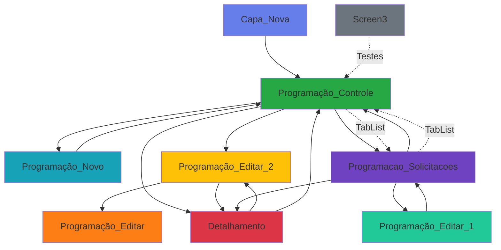

<div class="module-header">
  <h1>📊 Módulo: Programação Orçamentária</h1>
  <p class="module-description">
    Sistema completo de gestão da programação orçamentária com funcionalidades de visualização, edição, solicitações e detalhamento
  </p>
</div>

## 📋 Visão Geral do Módulo

<div class="info-box">
  <h3>ℹ️ Sobre este Módulo</h3>
  <ul>
    <li><strong>Função Principal:</strong> Gerenciar programação orçamentária completa</li>
    <li><strong>Telas:</strong> 8 telas</li>
    <li><strong>Funcionalidades:</strong> CRUD completo, aprovações, empenhos, histórico</li>
    <li><strong>Integrações:</strong> SharePoint, Office 365, Planner</li>
  </ul>
</div>

## 🗂️ Telas do Módulo

<div class="screens-grid">
  <div class="screen-card primary">
    <h4>📊 Programação_Controle</h4>
    <p>Tela principal de controle e visualização</p>
  </div>
  <div class="screen-card success">
    <h4>➕ Programação_Novo</h4>
    <p>Criação de nova programação</p>
  </div>
  <div class="screen-card warning">
    <h4>📝 Programacao_Solicitacoes</h4>
    <p>Gestão de solicitações</p>
  </div>
  <div class="screen-card secondary">
    <h4>🔍 Detalhamento</h4>
    <p>Detalhes e empenhos</p>
  </div>

</div>

---

## 📊 Tela: Programação_Controle

<div class="screen-header">
  <h3>Tela Principal - Controle de Programação</h3>
  <p><strong>Tipo:</strong> Tela de Controle e Gestão</p>
  <p><strong>Acesso:</strong> APMD e Gestores</p>
</div>

#### 📊 Estatísticas da Tela

<div class="stats-grid">
  <div class="stat-card">
    <div class="stat-number">100+</div>
    <div class="stat-label">Controles Totais</div>
  </div>
  <div class="stat-card">
    <div class="stat-number">4</div>
    <div class="stat-label">Módulos/Seções</div>
  </div>
  <div class="stat-card">
    <div class="stat-number">3</div>
    <div class="stat-label">Galleries Principais</div>
  </div>
  <div class="stat-card">
    <div class="stat-number">12+</div>
    <div class="stat-label">Filtros de Busca</div>
  </div>
</div>

#### ⚙️ Evento OnVisible
```javascript
// Inicializa sistema de navegação por abas
Set(varCurrentNav7, First(colNavMenu7));

// Reseta filtros de pesquisa
UpdateContext({
    searchIDValor: "",
    searchEIValor: "",
    searchFonteValor: "",
    searchGrupoValor: "",
    searchAcaoValor: "",
    searchClassificacaoValor: "",
    searchAcompanhamentoValor: "",
    searchProcedenciaValor: "",
    searchSiafiEntradaValor: "",
    searchUAValor: "",
    searchObjetoValor: ""
});
```

#### 📑 Sistema de Abas (TabList_Programacao)

<div class="tabs-container">
  <div class="tab-card active">
    <h4>📊 Geral</h4>
    <p><strong>Items:</strong> colNavMenu7</p>
    <p><strong>DefaultSelectedItems:</strong> varCurrentNav7</p>
    <p><strong>Tela:</strong> Programação_Controle (atual)</p>
  </div>
  
  <div class="tab-card">
    <h4>📝 Solicitações</h4>
    <p><strong>Navega para:</strong> Programacao_Solicitacoes</p>
    <p><strong>OnSelect:</strong></p>
    <pre><code>UpdateContext({varCurrentNav7: Self.Selected});
Navigate(Programacao_Solicitacoes)</code></pre>
  </div>
</div>

#### 🎯 Gallery Principal - Gallery4_Programacao_Controle

<div class="gallery-info">
  <h4>📋 Estrutura da Gallery</h4>
  <p><strong>Template:</strong> 6ba513df-e463-4273-a08b-32ee2c1e902e</p>
  <p><strong>Items:</strong> PlanejamentoGeral2025 (com filtros aplicados)</p>
  <p><strong>Layout:</strong> Vertical</p>
</div>

#### Colunas Exibidas

<div class="table-container">

| Controle | Campo | Descrição |
|----------|-------|-----------|
| Acao_Programacao | Ação | Ação orçamentária |
| Button_Acao | Ação (clicável) | Permite ordenação |
| Button_Cota_Aprovada | Cota Aprovada | Valor da cota aprovada |
| Button_Elemento_Item | E.I. | Elemento de Item |
| Button_GIFP | GIFP | Grupo/Item/Fonte/Procedência |
| Button_Objeto | Objeto | Descrição do objeto |
| Button_Replanejado | Replanejado | Valor replanejado |
| Button_Valor_Liquidado | Liquidado | Valor liquidado |
| CotaAprovada | Cota | Valor (botão) |
| ElementoItem | E.I. | Elemento (botão) |
| GIFP | GIFP | Identificador (botão) |
| Objeto_Programacao | Objeto | Nome/descrição (botão) |
| Replanejado | Replan. | Valor replanejado (botão) |
| Saldo | Saldo | Saldo disponível (botão) |
| ValorLiquidado | Liquidado | Valor liquidado (botão) |

</div>

#### Ações nos Itens da Gallery

<div class="actions-grid">
  
  <div class="action-card">
    <h4>📝 btn_Programacao (SVG_2)</h4>
    <p><strong>Função:</strong> Editar programação</p>
    <p><strong>OnSelect:</strong></p>
    <pre><code>Set(currObjeto, ThisItem);
Navigate(Programação_Editar_2, ScreenTransition.Fade)</code></pre>
  </div>

  <div class="action-card">
    <h4>🔍 btn_Detalhamento (SVG_3)</h4>
    <p><strong>Função:</strong> Ver detalhes e empenhos</p>
    <p><strong>OnSelect:</strong></p>
    <pre><code>Set(currObjeto, ThisItem);
Set(varSelecionarTodosEmpenhos, false);
Navigate(Detalhamento, ScreenTransition.Fade)</code></pre>
  </div>

  <div class="action-card">
    <h4>🔄 btn_Demanda (SVG_4)</h4>
    <p><strong>Função:</strong> Transformar em demanda</p>
    <p><strong>OnSelect:</strong></p>
    <pre><code>Set(currObjeto, ThisItem);
UpdateContext({visTransformarDemanda: true})</code></pre>
  </div>

</div>

#### 🔍 Sistema de Filtros - searchBar_Programacao_Certo_3

<div class="search-system">
  <h4>🎯 Filtros Disponíveis</h4>
  <p>Sistema de busca avançada com múltiplos critérios simultâneos</p>
</div>

<div class="table-container">

| Variável | Tipo | Campo Filtrado | Componente |
|----------|------|----------------|------------|
| searchIDValor | Text | ID do registro | TextInput |
| searchEIValor | Text | Elemento de Item | ComboBox |
| searchFonteValor | Text | Fonte de Recurso | ComboBox |
| searchGrupoValor | Text | Grupo de Despesa | ComboBox |
| searchAcaoValor | Text | Ação Orçamentária | ComboBox |
| searchClassificacaoValor | Text | Classificação | ComboBox |
| searchAcompanhamentoValor | Text | Tipo de Acompanhamento | ComboBox |
| searchProcedenciaValor | Text | Procedência do Recurso | ComboBox |
| searchSiafiEntradaValor | Text | SIAFI Entrada | TextInput |
| searchUAValor | Text | Unidade Administrativa | ComboBox |
| searchObjetoValor | Text | Nome do Objeto | TextInput |

</div>

<div class="info-box">
  <h4>💡 Padrão de Nomenclatura</h4>
  <p>Cada filtro possui duas variáveis associadas:</p>
  <ul>
    <li><code>search[Campo]Valor</code> → Valor digitado/selecionado pelo usuário</li>
    <li><code>search[Campo]Selecionado</code> → Registro completo do item selecionado</li>
  </ul>
  <p>Este padrão garante consistência e facilita manutenção futura.</p>
</div>

#### 💼 Container: Empenhos Pendentes

<div class="container-section">
  <h4>📦 Visibilidade</h4>
  <p><strong>Variável:</strong> visEmpenhosPendentes</p>
  <p><strong>Ativação:</strong> Button_Empenhos.OnSelect</p>
  <pre><code>UpdateContext({visEmpenhosPendentes: !visEmpenhosPendentes})</code></pre>
</div>

#### Gallery: galEmpenhosPendentes_1

<div class="gallery-section">
  <p><strong>Template:</strong> 0868d79b-77d4-4fae-87d1-6138e101a86d</p>
  <p><strong>Items:</strong> BaseEmpenhos2025 (filtrado)</p>
</div>

**Campos Exibidos:**

- **Acao_Empenhos:** Ação orçamentária do empenho
- **EI_Empenhos:** Elemento de Item
- **Empenhos_:** Número do empenho
- **Entrada_Empenho:** SIAFI Entrada
- **GIFP_Empenhos:** Identificador GIFP
- **Saida_Empenho:** SIAFI Saída
- **UE_Empenhos:** Unidade Executora

**Ação Principal:**
```javascript
// Button_galEmpenhosPendentes.OnSelect
Set(currObjeto, ThisItem);
Navigate(Detalhamento, ScreenTransition.Fade)
```

**Botões de Controle:**

- **ButtonCanvas37:** Atualizar base de dados
- **Button_AtualizarBase:** Forçar sincronização
```javascript
// ButtonCanvas37.OnSelect
Refresh(BaseEmpenhos2025);
Notify("Base de empenhos atualizada!", NotificationType.Success)
```

#### 📝 Container: Solicitações Pendentes (Empenhos_1)

<div class="container-section">
  <h4>📦 Visibilidade</h4>
  <p><strong>Variável:</strong> visSolicitacoes</p>
  <p><strong>Ativação:</strong> Button_Solicitacoes.OnSelect</p>
</div>

#### Gallery: galSolicitacoesPendentes

<div class="gallery-section">
  <p><strong>Template:</strong> 14057876-69a5-4fa0-bf4c-920cd91f5f1e</p>
  <p><strong>Items:</strong> BaseSolicitacoesPlanejamento</p>
</div>

**Campos Exibidos:**

- **TextCanvas_ObjetoSolicitacoes:** Nome do objeto
- **TextCanvas_Solicitacao:** Tipo de solicitação
- **TextCanvas25_21 a 25_25:** Informações adicionais

**Ação Principal:**
```javascript
// Button_galSolicitacoesPendentes.OnSelect
Set(currObjetoSolicitacao, ThisItem);
Navigate(Programação_Editar_1, ScreenTransition.Fade)
```

#### 🔄 Container: Transformar em Demanda (Transformar_DemandaOrcamentaria)

<div class="container-section">
  <h4>📦 Visibilidade</h4>
  <p><strong>Variável:</strong> visTransformarDemanda</p>
  <p><strong>Ativação:</strong> btn_Demanda (na gallery)</p>
</div>

#### Componentes do Modal

<div class="form-grid">
  
  <div class="form-field">
    <h5>📊 Objeto_</h5>
    <p><strong>Type:</strong> Button</p>
    <p><strong>Text:</strong></p>
    <pre><code>currObjeto.Objeto</code></pre>
  </div>

  <div class="form-field">
    <h5>📝 TextInput_OrigemdoRecurso</h5>
    <p><strong>Type:</strong> TextInputCanvas</p>
    <p><strong>Value:</strong></p>
    <pre><code>currObjeto.OrigemRecurso</code></pre>
  </div>

  <div class="form-field">
    <h5>📅 TextInput_PrevisaoExecucao</h5>
    <p><strong>Type:</strong> TextInputCanvas</p>
    <p><strong>Value:</strong></p>
    <pre><code>Text(currObjeto.PrevisaoExecucao, "mm/yyyy")</code></pre>
  </div>

  <div class="form-field">
    <h5>✅ Button_TransformarDemanda</h5>
    <p><strong>Type:</strong> ButtonCanvas</p>
    <p><strong>OnSelect:</strong></p>
    <pre><code>Patch(
    BaseDemandasOrcamentarias2025,
    Defaults(BaseDemandasOrcamentarias2025),
    {
        Título: currObjeto.Objeto,
        Ação: currObjeto.Ação,
        'U.A': currObjeto.'U.A',
        'E.I.': currObjeto.'E.I.',
        Fonte: currObjeto.Fonte,
        Grupo: currObjeto.Grupo,
        Procedência: currObjeto.Procedência,
        'Origem do recurso': TextInput_OrigemdoRecurso.Text,
        'Previsão de execução do recurso': TextInput_PrevisaoExecucao.Text,
        Status: "Ativo"
    }
);
UpdateContext({visTransformarDemanda: false});
Notify("Demanda criada com sucesso!", NotificationType.Success)</code></pre>
  </div>

  <div class="form-field">
    <h5>❌ Button_CancelarDemanda</h5>
    <p><strong>Type:</strong> ButtonCanvas</p>
    <p><strong>OnSelect:</strong></p>
    <pre><code>UpdateContext({visTransformarDemanda: false})</code></pre>
  </div>

</div>

#### 📜 Container: Histórico de Alterações (Alterações)

<div class="container-section">
  <h4>📦 Visibilidade</h4>
  <p><strong>Variável:</strong> visAlteracoes</p>
  <p><strong>Ativação:</strong> Button_Alteracoes.OnSelect</p>
</div>

#### Gallery: Gallery_Alteracoes

<div class="gallery-section">
  <p><strong>Template:</strong> 58e46e3f-c53f-448e-bb54-140841333f19</p>
  <p><strong>Items:</strong></p>
  <pre><code>Filter(
    BaseNotificacoesPlanejamento,
    'ID Programação' = currObjeto.ID
);</code></pre>
</div>

**Campos do Histórico:**

- **Text_Acao_Alteracoes:** Ação orçamentária
- **Text_ID_Alteracoes:** ID da programação
- **Text_Objeto_Alteracoes:** Objeto alterado
- **Text_U.A_Alteracoes:** Unidade Administrativa

**Botões:**
```javascript
// ButtonCanvas37_3.OnSelect - Aplicar filtros
Navigate(Programação_Controle, ScreenTransition.None);

// ButtonCanvas37_4.OnSelect - Exportar histórico
// (funcionalidade de exportação)

// Rectangle9_1.OnSelect - Fechar painel
UpdateContext({visAlteracoes: false})
```

#### 📊 Totalizadores (Container5_13)

<div class="totals-container">
  <div class="total-item">
    <h5>💰 Cota Aprovada Total</h5>
    <p><strong>Controle:</strong> TextCanvas_Cota_Aprovada</p>
    <pre><code>Text(
    Sum(
        Filter(
            PlanejamentoGeral2025,
            // filtros aplicados
        ),
        'Cota Aprovada'
    ),
    "R$ #,##0.00"
)</code></pre>
  </div>

  <div class="total-item">
    <h5>📈 Total Planejado</h5>
    <p><strong>Controle:</strong> TextCanvas_Total_Planejado</p>
    <pre><code>Text(
    Sum(
        Filter(
            PlanejamentoGeral2025,
            // filtros aplicados
        ),
        Replanejado
    ),
    "R$ #,##0.00"
)</code></pre>
  </div>
</div>

---

## ➕ Tela: Programação_Novo

<div class="screen-header">
  <h3>Nova Programação - Formulário de Criação</h3>
  <p><strong>Tipo:</strong> Formulário</p>
  <p><strong>Modo:</strong> New</p>
</div>

#### 📊 Estatísticas da Tela

<div class="stats-grid">
  <div class="stat-card">
    <div class="stat-number">50+</div>
    <div class="stat-label">Controles Totais</div>
  </div>
  <div class="stat-card">
    <div class="stat-number">18</div>
    <div class="stat-label">DataCards</div>
  </div>
  <div class="stat-card">
    <div class="stat-number">1</div>
    <div class="stat-label">Formulário</div>
  </div>
</div>

#### 📝 Form6 - Formulário Principal

<div class="form-info">
  <h4>⚙️ Configurações do Form</h4>
  <p><strong>DataSource:</strong> PlanejamentoGeral2025</p>
  <p><strong>Item:</strong> Defaults(PlanejamentoGeral2025)</p>
  <p><strong>Mode:</strong> FormMode.New</p>
</div>

#### DataCards Principais

<div class="table-container">

| DataCard | Campo | Tipo de Controle | Obrigatório |
|----------|-------|------------------|-------------|
| Ação_DataCard2 | Ação | ComboboxCanvas3 | ✅ Sim |
| Acompanhamento_DataCard1 | Acompanhamento | DropdownCanvas11 | ✅ Sim |
| Classificação_DataCard2 | Classificação | DropdownCanvas12 | ✅ Sim |
| U.A_DataCard2 | U.A | DropdownCanvas1 | ✅ Sim |
| E.I._DataCard1 | E.I. | DataCardValue72 (Number) | ✅ Sim |
| F_DataCard2 | F | DataCardValue74 (Number) | ✅ Sim |
| G_DataCard1 | G | DataCardValue75 (Number) | ✅ Sim |
| I_DataCard1 | I | DataCardValue76 (Number) | ✅ Sim |
| P_DataCard2 | P | DataCardValue77 (Number) | ✅ Sim |
| U.E_DataCard2 | U.E | DataCardValue80 (Number) | ✅ Sim |
| U.O_DataCard2 | U.O | DataCardValue81 (Number) | ✅ Sim |
| Objeto_DataCard1 | Objeto | DataCardValue5 (Text) | ✅ Sim |
| Processo SEI_DataCard1 | Processo SEI | DataCardValue78 (Text) | ❌ Não |
| SIAFI entrada_DataCard1 | SIAFI entrada | DataCardValue66 (Text) | ✅ Sim |
| SIAFI saida_DataCard1 | SIAFI saida | DataCardValue79 (Text) | ❌ Não |
| Observações_DataCard1 | Observações | DataCardValue29 (Text) | ❌ Não |

</div>

#### 🎬 Ação de Salvamento
```javascript
// ButtonCanvas16.OnSelect
If(
    Form6.Valid,
    // Mostra loading
    UpdateContext({visLoading: true});
    
    // Salva o formulário
    SubmitForm(Form6);
    
    // Aguarda conclusão
    If(
        Form6.Error = Blank(),
        // Sucesso
        UpdateContext({visLoading: false});
        Notify("Programação criada com sucesso!", NotificationType.Success);
        Back(),
        // Erro
        UpdateContext({visLoading: false});
        Notify("Erro ao salvar: " & Form6.Error, NotificationType.Error)
    ),
    // Formulário inválido
    Notify("Preencha todos os campos obrigatórios", NotificationType.Warning)
)
```

#### 🔙 Navegação
```javascript
// EmailPrevScreen_13.OnSelect
ResetForm(Form6);
Back()
```

---

## ✏️ Tela: Programação_Editar_2

<div class="screen-header">
  <h3>Editar Programação - Modo Detalhamento Completo</h3>
  <p><strong>Tipo:</strong> Edição Completa com DDOs e Observações</p>
  <p><strong>Objeto Atual:</strong> currObjeto</p>
</div>

#### 📊 Estatísticas da Tela

<div class="stats-grid">
  <div class="stat-card">
    <div class="stat-number">180+</div>
    <div class="stat-label">Controles Totais</div>
  </div>
  <div class="stat-card">
    <div class="stat-number">5</div>
    <div class="stat-label">Containers</div>
  </div>
  <div class="stat-card">
    <div class="stat-number">4</div>
    <div class="stat-label">Galleries</div>
  </div>
  <div class="stat-card">
    <div class="stat-number">36</div>
    <div class="stat-label">Campos Mensais</div>
  </div>
</div>

#### ⚙️ Evento OnVisible
```javascript
// Inicializa componentes
Set(varReset, false);
Set(mudanca, false);
Set(varChecks, false);

// Carrega tarefas relacionadas
Set(varTarefasAPMD, 
    CountRows(
        Filter(
            Planejamento2025Tarefas,
            'ID Programação' = currObjeto.ID
        )
    ) > 0
);

Set(varTarefasArea,
    CountRows(
        Filter(
            BaseSolicitacoesPlanejamento,
            'ID Programação' = currObjeto.ID,
            Status = "Pendente"
        )
    ) > 0
)
```

#### 📊 Container5_6 - Informações Gerais

<div class="info-container">
  <h4>📋 Labels de Informação</h4>
  <div class="info-labels">
    <ul>
      <li><strong>Label_Acao:</strong> currObjeto.Ação</li>
      <li><strong>Label_ElementoItem:</strong> currObjeto.'E.I.'</li>
      <li><strong>Label_GFP:</strong> currObjeto.Grupo & "/" & currObjeto.Fonte & "/" & currObjeto.Procedência</li>
      <li><strong>Label_UA:</strong> currObjeto.'U.A'</li>
      <li><strong>Label_SIAFI_Entrada:</strong> currObjeto.'SIAFI entrada'</li>
    </ul>
  </div>
</div>

#### Campos Financeiros Principais

<div class="financial-fields">
  
  <div class="field-item">
    <h5>💰 Label_cota_aprovada</h5>
    <p><strong>Text:</strong></p>
    <pre><code>Text(currObjeto.'Cota Aprovada', "[$-pt-BR]R$ #,##0.00")</code></pre>
  </div>

  <div class="field-item">
    <h5>💳 Label_credito_autorizado</h5>
    <p><strong>Text:</strong></p>
    <pre><code>Text(currObjeto.'Crédito Autorizado', "[$-pt-BR]R$ #,##0.00")</code></pre>
  </div>

  <div class="field-item">
    <h5>📊 Label_limite</h5>
    <p><strong>Text:</strong></p>
    <pre><code>Text(currObjeto.Limite, "[$-pt-BR]R$ #,##0.00")</code></pre>
  </div>

  <div class="field-item">
    <h5>📈 Label_replanejado</h5>
    <p><strong>Text:</strong></p>
    <pre><code>Text(currObjeto.Replanejado, "[$-pt-BR]R$ #,##0.00")</code></pre>
  </div>

  <div class="field-item">
    <h5>💵 Saldo_Liquidar</h5>
    <p><strong>Text:</strong></p>
    <pre><code>Text(
    currObjeto.Replanejado - currObjeto.'Valor Liquidado',
    "[$-pt-BR]R$ #,##0.00"
)</code></pre>
  </div>

</div>

#### 📅 Planejamento Mensal Detalhado

<div class="monthly-detailed">
  <h4>📊 galPlanejado1_3 - Gallery de Meses</h4>
  <p><strong>Template:</strong> 594498b4-f41f-4bfb-ac9d-7edae7f87336</p>
  <p><strong>Items:</strong> Collection com 12 registros (um por mês)</p>
</div>

**Estrutura da Collection:**
```javascript
[
    {Mês: "Janeiro", Planejado: pJan_1, Replanejado: rJan_5, 
     Liquidado: lJan_2, Empenhado: eJan_2},
    {Mês: "Fevereiro", Planejado: pFev_7, Replanejado: rFev_5, 
     Liquidado: lFev_2, Empenhado: eFev_2},
    // ... demais meses
]
```

**Campos Editáveis (sufixo _5):**

- **rJan_5, rFev_5, rMar_5, rAbr_5, rMai_5, rJun_5**
- **rJul_5, rAgo_5, rSet_5, rOut_5, rNov_5, rDez_5**

**OnChange de cada campo:**
```javascript
// rJan_5.OnChange (exemplo)
Set(mudanca, true)
```

#### 🎯 Container_Observacoes - Sistema de Observações

<div class="container-section">
  <h4>📝 Componente: _observacoes_1</h4>
  <p><strong>Type:</strong> Component (ReutilizÃ

¡vel)</p>
  <p><strong>Função:</strong> Adicionar e visualizar observações</p>
</div>

#### Gallery_Observacoes

<div class="gallery-section">
  <p><strong>Template:</strong> 266451de-d7af-48fd-b6f4-f10bbf7e02db</p>
  <p><strong>Items:</strong></p>
  <pre><code>SortByColumns(
    Filter(
        BaseObservacoesPlanejamento,
        'ID Programação' = currObjeto.ID
    ),
    "Created",
    Descending
)</code></pre>
</div>

**Componentes da Gallery:**
```javascript
// Label94_14 - Data/Hora
Text(ThisItem.Created, "dd/mm/yyyy hh:mm")

// Label94_15 - Autor
ThisItem.Author.DisplayName

// Label98_7 - Texto da observação
ThisItem.Observação

// Button_Excluir_Obs - Excluir
OnSelect:
    Set(currObservacao, ThisItem);
    UpdateContext({visExcluirObservacao: true})

// Image10_7 - Foto do autor
UsuáriosdoOffice365.UserPhotoV2(ThisItem.Author.Email)
```

**Adicionar Nova Observação:**
```javascript
// Button_Enviar.OnSelect
If(
    !IsBlank(TextInput_Mensagem.Text),
    
    // Adiciona observação
    Patch(
        BaseObservacoesPlanejamento,
        Defaults(BaseObservacoesPlanejamento),
        {
            'ID Programação': currObjeto.ID,
            Observação: TextInput_Mensagem.Text,
            Author: {
                '@odata.type': "#Microsoft.Azure.Connectors.SharePoint.SPListExpandedUser",
                Claims: "i:0#.f|membership|" & UsuáriosdoOffice365.MyProfileV2().mail,
                Department: "",
                DisplayName: UsuáriosdoOffice365.MyProfileV2().displayName,
                Email: UsuáriosdoOffice365.MyProfileV2().mail,
                JobTitle: "",
                Picture: ""
            }
        }
    );
    
    // Limpa campo
    Reset(TextInput_Mensagem);
    
    Notify("Observação adicionada!", NotificationType.Success),
    
    Notify("Digite uma observação", NotificationType.Warning)
)
```

**Excluir Observação (Modal):**
```javascript
// Component: _excluirObservacao_1
Visible: visExcluirObservacao

// Button_Excluir_Obs.OnSelect (dentro do modal)
Remove(
    BaseObservacoesPlanejamento,
    currObservacao
);

UpdateContext({visExcluirObservacao: false});
Notify("Observação excluída", NotificationType.Information)
```

#### 📋 Container_Tarefas/Solicitacoes - Sistema de Tarefas

<div class="container-section">
  <h4>✅ Gerenciamento de Tarefas do Planner</h4>
  <p><strong>Integração:</strong> Microsoft Planner</p>
  <p><strong>Visible:</strong> varTarefasAPMD || varTarefasArea</p>
</div>

#### Button_Tarefas - Criar Tarefa
```javascript
// Button_Tarefas.OnSelect
UpdateContext({visLoading: true});

// Cria tarefa no Planner
Set(taskId,
    Planner.CreateTask(
        "ID_DO_PLANO", // ID do plano no Planner
        {
            title: "Revisão: " & currObjeto.Objeto,
            assignments: {
                "ID_USUARIO": {
                    '@odata.type': "#microsoft.graph.plannerAssignment",
                    orderHint: " !"
                }
            },
            dueDateTime: DateAdd(Now(), 7, Days),
            bucketId: "ID_DO_BUCKET"
        }
    ).id
);

// Registra na base local
If(
    !IsBlank(taskId),
    Patch(
        Planejamento2025Tarefas,
        Defaults(Planejamento2025Tarefas),
        {
            'ID Programação': currObjeto.ID,
            'ID Tarefa Planner': taskId,
            Status: "Criada",
            'Data Criação': Now()
        }
    );
    
    Set(varTarefasAPMD, true);
    Notify("Tarefa criada no Planner!", NotificationType.Success),
    
    Notify("Erro ao criar tarefa", NotificationType.Error)
);

UpdateContext({visLoading: false})
```

**Visible:**
```javascript
Button_Tarefas.Visible: !varTarefasAPMD && _varPermissao = "APMD"
```

#### Gallery13_5 - Tarefas Relacionadas

<div class="gallery-section">
  <p><strong>Template:</strong> 32fda103-8204-4204-9a70-c2669c20d2f6</p>
  <p><strong>Items:</strong></p>
  <pre><code>Filter(
    Planejamento2025Tarefas,
    'ID Programação' = currObjeto.ID
)</code></pre>
  <p><strong>Visible:</strong> varTarefasAPMD</p>
</div>

**Componentes:**
```javascript
// CheckboxCanvas7_5 - Marcar como concluída
OnCheck:
    // Atualiza no Planner
    Planner.UpdateTask(
        ThisItem.'ID Tarefa Planner',
        "ID_DO_PLANO",
        {
            percentComplete: 100
        }
    );
    
    // Atualiza localmente
    Patch(
        Planejamento2025Tarefas,
        ThisItem,
        {
            Status: "Concluída",
            'Data Conclusão': Now()
        }
    )

// TextCanvas16_5 - Descrição da tarefa
ThisItem.Título & " - " & Text(ThisItem.'Data Criação', "dd/mm/yyyy")
```

#### Gallery_Solicitacoes - Solicitações da Área

<div class="gallery-section">
  <p><strong>Template:</strong> 3c9070ff-e79c-48a5-91ff-f9055b08ed60</p>
  <p><strong>Items:</strong></p>
  <pre><code>Filter(
    BaseSolicitacoesPlanejamento,
    'ID Programação' = currObjeto.ID,
    Status = "Pendente"
)</code></pre>
  <p><strong>Visible:</strong> varTarefasArea</p>
</div>

**Ação:**
```javascript
// CheckboxCanvas7_4.OnCheck
// Similar ao sistema de tarefas, mas para solicitações
```

#### 📊 Container6_2 - DDOs Vinculados

<div class="container-section">
  <h4>📋 Gallery_DDOs</h4>
  <p><strong>Template:</strong> 67998a71-df83-4d17-93cc-07e93f75dce6</p>
  <p><strong>Items:</strong></p>
  <pre><code>Filter(
    BaseControleDDO_PorObjeto,
    'ID Programação' = currObjeto.ID
)</code></pre>
</div>

**Campos Exibidos:**

<div class="table-container">

| Controle | Campo | Descrição |
|----------|-------|-----------|
| Label_SEI | SEI | Número do processo SEI |
| Label_Valor | Valor | Valor do DDO |
| Label_Valor_Futuro | Valor Futuro | Projeção futura |
| Label_Total | Total | Soma de valores |
| TextCanvas7_7 | Objeto | Nome do objeto |
| TextCanvas7_8 | Status | Status do DDO |

</div>

**Ação:**
```javascript
// ButtonCanvas28_5.OnSelect
// Navegar para detalhes do DDO ou abrir documento
```

#### 🎬 Ações Principais da Tela

<div class="actions-grid">
  
  <div class="action-card">
    <h4>💾 Button_Salvar_Detalhamento</h4>
    <p><strong>OnSelect:</strong></p>
    <pre><code>// Similar ao Programação_Editar, mas com mais campos
UpdateContext({visLoading: true});

// Prepara imagem de loading
Set(varImagem, First(Shuffle(colImagensLoading)).Imagem);

// Salva alterações
Patch(
    PlanejamentoGeral2025,
    currObjeto,
    {
        // Valores mensais
        r_Janeiro: Value(rJan_5.Text),
        r_Fevereiro: Value(rFev_5.Text),
        r_Março: Value(rMar_5.Text),
        r_Abril: Value(rAbr_5.Text),
        r_Maio: Value(rMai_5.Text),
        r_Junho: Value(rJun_5.Text),
        r_Julho: Value(rJul_5.Text),
        r_Agosto: Value(rAgo_5.Text),
        r_Setembro: Value(rSet_5.Text),
        r_Outubro: Value(rOut_5.Text),
        r_Novembro: Value(rNov_5.Text),
        r_Dezembro: Value(rDez_5.Text),
        
        // Recalcula total
        Replanejado: Sum([
            Value(rJan_5.Text), Value(rFev_5.Text),
            Value(rMar_5.Text), Value(rAbr_5.Text),
            Value(rMai_5.Text), Value(rJun_5.Text),
            Value(rJul_5.Text), Value(rAgo_5.Text),
            Value(rSet_5.Text), Value(rOut_5.Text),
            Value(rNov_5.Text), Value(rDez_5.Text)
        ])
    }
);

// Registra alteração no histórico
Patch(
    BaseNotificacoesPlanejamento,
    Defaults(BaseNotificacoesPlanejamento),
    {
        'ID Programação': currObjeto.ID,
        Descrição: "Planejamento atualizado por " & 
                   UsuáriosdoOffice365.MyProfileV2().displayName,
        Tipo: "Edição",
        Author: {
            '@odata.type': "#Microsoft.Azure.Connectors.SharePoint.SPListExpandedUser",
            Claims: "i:0#.f|membership|" & UsuáriosdoOffice365.MyProfileV2().mail,
            DisplayName: UsuáriosdoOffice365.MyProfileV2().displayName,
            Email: UsuáriosdoOffice365.MyProfileV2().mail
        }
    }
);

Set(mudanca, false);
UpdateContext({visLoading: false});
Notify("Alterações salvas com sucesso!", NotificationType.Success)</code></pre>
  </div>

  <div class="action-card">
    <h4>🔄 Button_Reset</h4>
    <p><strong>OnSelect:</strong></p>
    <pre><code>Set(varReset, true);

// Reseta todos os campos mensais (sufixo _5 e _6)
Reset(rJan_5); Reset(rFev_5); Reset(rMar_5); Reset(rAbr_5);
Reset(rMai_5); Reset(rJun_5); Reset(rJul_5); Reset(rAgo_5);
Reset(rSet_5); Reset(rOut_5); Reset(rNov_5); Reset(rDez_5);

Reset(rJan_6); Reset(rFev_6); Reset(rMar_6); Reset(rAbr_6);
Reset(rMai_6); Reset(rJun_6); Reset(rJul_6); Reset(rAgo_6);
Reset(rSet_6); Reset(rOut_6); Reset(rNov_6); Reset(rDez_6);

Set(mudanca, false);
Notify("Valores restaurados!", NotificationType.Information)</code></pre>
  </div>

  <div class="action-card">
    <h4>📊 Button_Alteracoes_Detalhamento</h4>
    <p><strong>OnSelect:</strong></p>
    <pre><code>UpdateContext({visSolicitacoes: !visSolicitacoes})</code></pre>
    <p><strong>DisplayMode:</strong></p>
    <pre><code>If(
    CountRows(
        Filter(
            BaseSolicitacoesPlanejamento,
            'ID Programação' = currObjeto.ID,
            Status = "Pendente"
        )
    ) > 0,
    DisplayMode.Edit,
    DisplayMode.Disabled
)</code></pre>
  </div>

  <div class="action-card">
    <h4>🏠 Button_Detalhamento</h4>
    <p><strong>OnSelect:</strong></p>
    <pre><code>Navigate(Programação_Controle, ScreenTransition.Fade)</code></pre>
  </div>

  <div class="action-card">
    <h4>🎯 SVG_50 - Ação Especial</h4>
    <p><strong>OnSelect:</strong></p>
    <pre><code>// Dependendo do contexto (varOpcaoRemanejamento)
Switch(
    varOpcaoRemanejamento,
    "Programação",
        // Lógica para remanejamento de programação
        Set(currItemRemanejamento, currObjeto);
        Navigate(Remanejamento_Novo_Programação),
    "Demanda",
        // Lógica para remanejamento de demanda
        Set(currItemRemanejamento, currObjeto);
        Navigate(Remanejamento_Novo_Demandas),
    // Default
    Notify("Selecione um tipo de remanejamento", NotificationType.Warning)
)</code></pre>
  </div>

  <div class="action-card">
    <h4>✅ ButtonCanvas8 - Concluir DDOs Selecionados</h4>
    <p><strong>OnSelect:</strong></p>
    <pre><code>// Atualiza DDOs marcados
ForAll(
    Filter(Gallery13_5, CheckboxCanvas7_5.Value = true),
    Patch(
        BaseControleDDO,
        LookUp(BaseControleDDO, ID = ThisRecord.ID),
        {
            Status: "Concluído",
            'Data Conclusão': Now()
        }
    )
);

Set(varChecks, false);
Notify("DDOs concluídos!", NotificationType.Success);
Refresh(BaseControleDDO)</code></pre>
    <p><strong>Visible:</strong></p>
    <pre><code>varChecks && CountRows(
    Filter(Gallery13_5, CheckboxCanvas7_5.Value = true)
) > 0</code></pre>
  </div>

  <div class="action-card">
    <h4>📋 ButtonCanvas23_4 - Tarefas/Solicitações</h4>
    <p><strong>OnSelect:</strong></p>
    <pre><code>// Alterna visibilidade do painel
Set(varTarefasAPMD, !varTarefasAPMD);
Set(varTarefasArea, !varTarefasArea)</code></pre>
  </div>

</div>

#### ⏱️ Timers
```javascript
// Timer2_2 - Feedback visual de salvamento
Duration: 2000
OnTimerEnd:
    UpdateContext({visCarregando: false})

// Timer4_2 - Sincronização periódica
Duration: 5000
Repeat: true
AutoStart: varTeste

OnTimerEnd:
    If(
        varTeste,
        // Atualiza dados
        Refresh(BaseObservacoesPlanejamento);
        Refresh(BaseControleDDO);
        Refresh(Planejamento2025Tarefas);
        
        Set(varCarregandoErro, false);
        Set(varTeste, false)
    )
```

---

## 📝 Tela: Programacao_Solicitacoes

<div class="screen-header">
  <h3>Gestão de Solicitações de Programação</h3>
  <p><strong>Tipo:</strong> Listagem e Aprovação</p>
  <p><strong>Acesso:</strong> Via TabList de Programação_Controle</p>
</div>

#### 📊 Estatísticas da Tela

<div class="stats-grid">
  <div class="stat-card">
    <div class="stat-number">80+</div>
    <div class="stat-label">Controles Totais</div>
  </div>
  <div class="stat-card">
    <div class="stat-number">3</div>
    <div class="stat-label">Seções Principais</div>
  </div>
  <div class="stat-card">
    <div class="stat-number">2</div>
    <div class="stat-label">Galleries</div>
  </div>
</div>

#### ⚙️ Evento OnVisible
```javascript
// Inicializa navegação
Set(varCurrentNav7, 
    LookUp(colNavMenu7, Label = "Solicitações")
)
```

#### 📑 TabList1_19 - Sistema de Abas

<div class="tabs-container">
  <div class="tab-card">
    <h4>📊 Geral</h4>
    <p><strong>Navega para:</strong> Programação_Controle</p>
  </div>
  
  <div class="tab-card active">
    <h4>📝 Solicitações</h4>
    <p><strong>Tela Atual</strong></p>
  </div>
</div>

#### 🎯 Gallery_Programacao_Solicitacoes

<div class="gallery-info">
  <h4>📋 Gallery Principal</h4>
  <p><strong>Template:</strong> 6ba513df-e463-4273-a08b-32ee2c1e902e_2</p>
  <p><strong>Items:</strong></p>
  <pre><code>Filter(
    PlanejamentoGeral2025,
    Status = "Solicitado",
    // Aplicar filtros de busca
    If(!IsBlank(searchAcaoValor), Ação = searchAcaoValor, true),
    If(!IsBlank(searchEIValor), 'E.I.' = searchEIValor, true),
    If(!IsBlank(searchFonteValor), Fonte = searchFonteValor, true)
    // ... demais filtros
)</code></pre>
</div>

**Colunas Exibidas:**

<div class="table-container">

| Controle | Campo | Tipo |
|----------|-------|------|
| Acao_Solicitacoes | Ação | Button |
| Button_Elemento_Item_Solicitacoes | E.I. | Button |
| ElementoItem_Solicitacoes | E.I. | Button |
| GIFP_Solicitacoes | GIFP | Button |
| Objeto_Solicitacoes | Objeto | Button |
| Valor_Solicitacoes | Valor | Button |
| Text_Acao_Solicitacoes | Ação | TextCanvas |
| Text_GIFP_Solicitacoes | GIFP | TextCanvas |
| Text_Objeto_Solicitacoes | Objeto | TextCanvas |
| Text_Valor_Solicitacoes | Valor | TextCanvas |

</div>

**Ações nos Itens:**

<div class="actions-grid">
  
  <div class="action-card">
    <h4>📝 btn_Programacao_Solicitacoes (SVG_36)</h4>
    <p><strong>OnSelect:</strong></p>
    <pre><code>Set(currObjetoSolicitacao, ThisItem);
Navigate(Programação_Editar_1, ScreenTransition.Fade)</code></pre>
  </div>

  <div class="action-card">
    <h4>🔍 btn_Detalhamento_Solicitacoes (SVG_37)</h4>
    <p><strong>OnSelect:</strong></p>
    <pre><code>Set(currObjeto, ThisItem);
Set(varSelecionarTodosEmpenhos, false);
Navigate(Detalhamento, ScreenTransition.Fade)</code></pre>
  </div>

</div>

#### 💼 Container: Empenhos_7 - Empenhos de Solicitações

<div class="container-section">
  <h4>📦 Visibilidade</h4>
  <p><strong>Variável:</strong> visEmpenhosPendentes</p>
  <p><strong>Ativação:</strong> Button_Empenhos_Solicitacoes.OnSelect</p>
</div>

#### galEmpenhosPendentes_4

<div class="gallery-section">
  <p><strong>Template:</strong> 0868d79b-77d4-4fae-87d1-6138e101a86d_1</p>
  <p><strong>Items:</strong></p>
  <pre><code>Filter(
    BaseEmpenhos2025,
    Status = "Pendente",
    // Filtros adicionais
)</code></pre>
</div>

**Ação:**
```javascript
// ButtonCanvas37_13.OnSelect
Set(currObjeto, ThisItem);
Navigate(Detalhamento, ScreenTransition.Fade)
```

**Botões de Controle:**
```javascript
// ButtonCanvas37_11 - Atualizar
Refresh(BaseEmpenhos2025);
Notify("Base atualizada!", NotificationType.Success)

// ButtonCanvas37_12 - Exportar
UpdateContext({visLoading: true});
Set(varImagem, First(Shuffle(colImagensLoading)).Imagem);
Export(galEmpenhosPendentes_4, "Empenhos_Solicitacoes_" & 
       Text(Now(), "yyyymmdd"));
UpdateContext({visLoading: false})
```

#### 📜 Container: Alterações_1 - Histórico

<div class="container-section">
  <h4>📦 Visibilidade</h4>
  <p><strong>Variável:</strong> visAlteracoes</p>
  <p><strong>Ativação:</strong> Button_Alteracoes_Solicitacoes.OnSelect</p>
</div>

#### Gallery1_5

<div class="gallery-section">
  <p><strong>Template:</strong> 58e46e3f-c53f-448e-bb54-140841333f19_1</p>
  <p><strong>Items:</strong></p>
  <pre><code>Filter(
    BaseNotificacoesPlanejamento,
    Status = "Solicitado"
)
SortByColumns(Filter(...), "Created", Descending)</code></pre>
</div>

**Ações:**
```javascript
// ButtonCanvas37_8.OnSelect - Aplicar Filtros
// (lógica de filtros)

// ButtonCanvas37_6.OnSelect - Exportar Histórico
// (lógica de exportação)

// Rectangle9_9.OnSelect - Fechar
UpdateContext({visAlteracoes: false})
```

#### 📊 Totalizadores

<div class="totals-container">
  <div class="total-item">
    <h5>💰 TextCanvas19_7</h5>
    <p><strong>Text:</strong></p>
    <pre><code>Text(
    Sum(
        Filter(Gallery_Programacao_Solicitacoes, ...),
        'Cota Aprovada'
    ),
    "R$ #,##0.00"
)</code></pre>
  </div>

  <div class="total-item">
    <h5>📈 TextCanvas19_8</h5>
    <p><strong>Text:</strong></p>
    <pre><code>Text(
    Sum(
        Filter(Gallery_Programacao_Solicitacoes, ...),
        Replanejado
    ),
    "R$ #,##0.00"
)</code></pre>
  </div>
</div>

---

## 🔍 Tela: Detalhamento

<div class="screen-header">
  <h3>Detalhamento e Empenhos</h3>
  <p><strong>Tipo:</strong> Visualização Detalhada + Gestão de Empenhos</p>
  <p><strong>Objeto Atual:</strong> currObjeto</p>
</div>

#### 📊 Estatísticas da Tela

<div class="stats-grid">
  <div class="stat-card">
    <div class="stat-number">70+</div>
    <div class="stat-label">Controles Totais</div>
  </div>
  <div class="stat-card">
    <div class="stat-number">22</div>
    <div class="stat-label">Campos de Detalhes</div>
  </div>
  <div class="stat-card">
    <div class="stat-number">1</div>
    <div class="stat-label">Gallery de Empenhos</div>
  </div>
</div>

#### 📋 Container_Detalhamento - Campos Principais

<div class="form-grid">
  
  <div class="form-field">
    <h5>🎯 DropdownAcao</h5>
    <p><strong>Type:</strong> DropdownCanvas</p>
    <p><strong>Items:</strong> Distinct(BaseProgramasAcoes, Ação)</p>
    <p><strong>Default:</strong> currObjeto.Ação</p>
  </div>

  <div class="form-field">
    <h5>📊 Dropdown_Acompanhamento</h5>
    <p><strong>Type:</strong> DropdownCanvas</p>
    <p><strong>Items:</strong> AcompanhamentoClassificacao.Acompanhamento</p>
    <p><strong>Default:</strong> currObjeto.Acompanhamento</p>
  </div>

  <div class="form-field">
    <h5>📋 Dropdown_Classificacao</h5>
    <p><strong>Type:</strong> DropdownCanvas</p>
    <p><strong>Items:</strong> AcompanhamentoClassificacao.Classificação</p>
    <p><strong>Default:</strong> currObjeto.Classificação</p>
  </div>

  <div class="form-field">
    <h5>🏢 Dropdown_UA</h5>
    <p><strong>Type:</strong> DropdownCanvas</p>
    <p><strong>Items:</strong> Distinct(BaseOrdenadores, 'U.A')</p>
    <p><strong>Default:</strong> currObjeto.'U.A'</p>
  </div>

</div>

#### Campos Numéricos

<div class="table-container">

| Controle | Campo | Default |
|----------|-------|---------|
| TextInput_E.I | E.I. | `currObjeto.'E.I.'` |
| TextInput_Empenho | Empenho | `currObjeto.Empenho` |
| TextInput_F | F | `currObjeto.F` |
| TextInput_G | G | `currObjeto.G` |
| TextInput_I | I | `currObjeto.I` |
| TextInput_P | P | `currObjeto.P` |
| TextInput_U.E | U.E | `currObjeto.'U.E'` |
| TextInput_U.O | U.O | `currObjeto.'U.O'` |
| TextInput_Cota_Aprovada | Cota Aprovada | `currObjeto.'Cota Aprovada'` |
| TextInput_Credito | Crédito Autorizado | `currObjeto.'Crédito Autorizado'` |
| TextInput_Limite | Limite | `currObjeto.Limite` |
| TextInput_Valor_LOA | Valor LOA | `currObjeto.'Valor LOA'` |

</div>

#### Campos de Texto

<div class="table-container">

| Controle | Campo | Default |
|----------|-------|---------|
| TextInput_Objeto | Objeto | `currObjeto.Objeto` |
| TextInput_ProgramadeTrabalho | Programa de Trabalho | `currObjeto.'Programa de Trabalho'` |
| TextInput_SEI_Instrucao | SEI Instrução | `currObjeto.'SEI Instrução'` |
| TextInput_SEI_Execucao | SEI Execução | `currObjeto.'SEI Execução'` |
| TextInput_Setor_Referencia | Setor de Referência | `currObjeto.'Setor de Referência'` |
| TextInput_Siafi_Entrada | SIAFI Entrada | `currObjeto.'SIAFI entrada'` |
| TextInput_SIAFI_Saida | SIAFI Saída | `currObjeto.'SIAFI saida'` |

</div>

#### 💼 Container1 - Gestão de Empenhos

<div class="container-section">
  <h4>📦 Visibilidade</h4>
  <p><strong>Variável:</strong> visEmpenhos</p>
  <p><strong>Ativação:</strong> ButtonEmpenhos.OnSelect</p>
</div>

#### galEmpenhos_3 - Gallery de Empenhos

<div class="gallery-section">
  <p><strong>Template:</strong> e67bec84-a206-4739-9f7c-4369da1dbb97</p>
  <p><strong>Items:</strong></p>
  <pre><code>If(
    varSelecionarTodosEmpenhos,
    // Mostra todos os empenhos da programação
    Filter(
        BaseEmpenhos2025,
        'ID Programação' = currObjeto.ID
    ),
    // Mostra apenas empenhos selecionados
    Filter(
        BaseEmpenhos2025,
        'ID Programação' = currObjeto.ID,
        Checkbox1_2.Value = true
    )
)</code></pre>
</div>

**Componentes:**
```javascript
// Checkbox1_2 - Seleção do empenho
Default: varSelecionarTodosEmpenhos

OnCheck:
    ClearCollect(
        colEmpenhos,
        If(
            IsEmpty(colEmpenhos),
            Table(ThisItem),
            Collect(colEmpenhos, ThisItem)
        )
    )

OnUncheck:
    Remove(
        colEmpenhos,
        LookUp(colEmpenhos, ID = ThisItem.ID)
    )

DisplayMode:
    If(
        !IsBlank(ThisItem.'Número Empenho'),
        DisplayMode.Edit,
        DisplayMode.Disabled
    )

// TextCanvas10_3 - Informações do empenho
ThisItem.'Número Empenho' & " - R$ " & 
Text(ThisItem.'Valor Empenhado', "#,##0.00")
```

**Botões de Controle:**

<div class="actions-grid">
  
  <div class="action-card">
    <h4>☑️ ButtonCanvas38 - Selecionar Todos</h4>
    <p><strong>OnSelect:</strong></p>
    <pre><code>Set(varSelecionarTodosEmpenhos, 
    !varSelecionarTodosEmpenhos
);</code></pre>
  </div>

  <div class="action-card">
    <h4>🔗 ButtonCanvas26_8 - Vincular Empenhos</h4>
    <p><strong>OnSelect:</strong></p>
    <pre><code>// Vincula empenhos selecionados à programação
ForAll(
    colEmpenhos,
    Patch(
        BaseEmpenhos2025,
        LookUp(BaseEmpenhos2025, ID = ThisRecord.ID),
        {
            'ID Programação': currObjeto.ID,
            Status: "Vinculado"
        }
    )
);

Clear(colEmpenhos);
Set(varSelecionarTodosEmpenhos, false);
Notify("Empenhos vinculados!", NotificationType.Success);
Refresh(BaseEmpenhos2025)</code></pre>
  </div>

  <div class="action-card">
    <h4>🔓 ButtonCanvas26_9 - Desvincular Empenhos</h4>
    <p><strong>OnSelect:</strong></p>
    <pre><code>// Mostra loading
UpdateContext({visLoading: true});
Set(varImagem, First(Shuffle(colImagensLoading)).Imagem);

// Desvincula empenhos selecionados
ForAll(
    Filter(galEmpenhos_3, Checkbox1_2.Value = true),
    Patch(
        BaseEmpenhos2025,
        ThisRecord,
        {
            'ID Programação': Blank(),
            Status: "Disponível"
        }
    )
);

// Registra no histórico
Collect(
    colEmpenhos,
    Filter(galEmpenhos_3, Checkbox1_2.Value = true)
);

Clear(colEmpenhos);
Set(varSelecionarTodosEmpenhos, false);
UpdateContext({visLoading: false});
Notify("Empenhos desvinculados!", NotificationType.Information);
Refresh(BaseEmpenhos2025)</code></pre>
  </div>

</div>

#### 🎬 Ações Principais da Tela

<div class="actions-grid">
  
  <div class="action-card">
    <h4>💾 Button_Salvar</h4>
    <p><strong>OnSelect:</strong></p>
    <pre><code>// Valida campos obrigatórios
If(
    !IsBlank(TextInput_Objeto.Text) &&
    !IsBlank(Dropdown_UA.Selected.Result),
    
    // Salva alterações
    Patch(
        PlanejamentoGeral2025,
        currObjeto,
        {
            Ação: DropdownAcao.Selected.Result,
            Acompanhamento: Dropdown_Acompanhamento.Selected.Result,
            Classificação: Dropdown_Classificacao.Selected.Result,
            'U.A': Dropdown_UA.Selected.Result,
            'E.I.': Value(TextInput_E.I.Text),
            Empenho: TextInput_Empenho.Text,
            F: Value(TextInput_F.Text),
            G: Value(TextInput_G.Text),
            I: Value(TextInput_I.Text),
            P: Value(TextInput_P.Text),
            'U.E': Value(TextInput_U.E.Text),
            'U.O': Value(TextInput_U.O.Text),
            Objeto: TextInput_Objeto.Text,
            'Programa de Trabalho': TextInput_ProgramadeTrabalho.Text,
            'SEI Instrução': TextInput_SEI_Instrucao.Text,
            'SEI Execução': TextInput_SEI_Execucao.Text,
            'Setor de Referência': TextInput_Setor_Referencia.Text,
            'SIAFI entrada': TextInput_Siafi_Entrada.Text,
            'SIAFI saida': TextInput_SIAFI_Saida.Text,
            'Cota Aprovada': Value(TextInput_Cota_Aprovada.Text),
            'Crédito Autorizado': Value(TextInput_Credito.Text),
            Limite: Value(TextInput_Limite.Text),
            'Valor LOA': Value(TextInput_Valor_LOA.Text)
        }
    );
    
    Notify("Detalhamento salvo!", NotificationType.Success);
    Back(),
    
    // Campos obrigatórios faltando
    Notify("Preencha todos os campos obrigatórios", NotificationType.Warning)
)</code></pre>
  </div>

  <div class="action-card error">
    <h4>❌ Button_Excluir</h4>
    <p><strong>OnSelect:</strong></p>
    <pre><code>Set(varExcluir, true);
UpdateContext({visExcluirProgramacao: true})</code></pre>
  </div>

  <div class="action-card">
    <h4>📜 Button_Historico</h4>
    <p><strong>OnSelect:</strong></p>
    <pre><code>Set(currObjeto, currObjeto);
Navigate(Programação_Editar, ScreenTransition.Fade)</code></pre>
  </div>

  <div class="action-card">
    <h4>📝 ButtonEmpenhos</h4>
    <p><strong>OnSelect:</strong></p>
    <pre><code>UpdateContext({visEmpenhos: !visEmpenhos})</code></pre>
  </div>

  <div class="action-card">
    <h4>🏠 Button_Programacao</h4>
    <p><strong>OnSelect:</strong></p>
    <pre><code>Navigate(Programação_Controle, ScreenTransition.Fade)</code></pre>
  </div>

</div>

#### ⚠️ Confirmacao_1 - Modal de Exclusão

<div class="modal-section">
  <h4>📦 Component de Confirmação</h4>
  <p><strong>Visible:</strong> visExcluirProgramacao</p>
  <p><strong>Type:</strong> Component ReutilizÃ

¡vel</p>
</div>

**Ação de Confirmar Exclusão:**
```javascript
// Dentro do componente Confirmacao_1
// Button Confirmar.OnSelect
If(
    varExcluir,
    
    // Remove programação
    Remove(
        PlanejamentoGeral2025,
        currObjeto
    );
    
    // Remove dados relacionados
    RemoveIf(
        BaseEmpenhos2025,
        'ID Programação' = currObjeto.ID
    );
    
    RemoveIf(
        BaseControleDDO,
        'ID Programação' = currObjeto.ID
    );
    
    RemoveIf(
        BaseObservacoesPlanejamento,
        'ID Programação' = currObjeto.ID
    );
    
    Set(varExcluir, false);
    UpdateContext({visExcluirProgramacao: false});
    Notify("Programação excluída!", NotificationType.Warning);
    Navigate(Programação_Controle, ScreenTransition.Fade)
)
```

---

## 🧪 Tela: Screen3

<div class="screen-header">
  <h3>Tela de Testes e Desenvolvimento</h3>
  <p><strong>Tipo:</strong> Ambiente de Testes</p>
  <p><strong>Uso:</strong> Desenvolvimento e debug</p>
</div>

#### 📊 Estatísticas da Tela

<div class="stats-grid">
  <div class="stat-card">
    <div class="stat-number">40+</div>
    <div class="stat-label">Controles de Teste</div>
  </div>
  <div class="stat-card">
    <div class="stat-number">10+</div>
    <div class="stat-label">ComboBox de Filtros</div>
  </div>
</div>

<div class="warning-box">
  <h4>⚠️ Atenção - Tela de Desenvolvimento</h4>
  <p>Esta tela é utilizada para:</p>
  <ul>
    <li>Testar novos componentes antes de implementar</li>
    <li>Validar fórmulas complexas</li>
    <li>Debug de problemas</li>
    <li>Prototipar novas funcionalidades</li>
  </ul>
  <p><strong>Não deve ser acessível em produção!</strong></p>
</div>

#### 🛠️ Componentes Principais
```javascript
// navBar_1 - Barra de navegação de teste
// ButtonCanvas18 - Botão de ação 1
// ButtonCanvas32 - Botão de ação 2 (carrega imagens)
OnSelect:
    ClearCollect(
        collectionImagens,
        {ID: 1, Imagem: 'teste1'},
        {ID: 2, Imagem: 'teste2'})

// ButtonCanvas36 - Botão de ação 3
// Image9 - Preview de imagem
Image: First(collectionImagens).Imagem

// Diversos ComboBox de filtros (scEI, scFonte, scGrupo, etc.)
// Usados para testar lógica de filtros antes de implementar nas telas principais
```

## 📊 Variáveis Globais do Módulo

<div class="table-container">

| Variável | Tipo | Escopo | Função |
|-----------|-------|---------|---------|
| currObjeto | Record | Global | Item de programação selecionado |
| currObjetoSolicitacao | Record | Global | Item de solicitação selecionado |
| varCurrentNav7 | Record | Global | Aba ativa do TabList (Geral/Solicitações) |
| varSelecionarTodosEmpenhos | Boolean | Global | Seleção em massa de empenhos |
| mudanca | Boolean | Global | Indica alterações não salvas |
| varReset | Boolean | Global | Flag de reset de formulários |
| varSalvar | Boolean | Global | Flag de salvamento bem-sucedido |
| varCarregandoErro | Boolean | Global | Controla spinner de loading |
| varTeste | Boolean | Global | Controla timer de sincronização |
| varChecks | Boolean | Global | Seleção em massa de DDOs |
| varTarefasAPMD | Boolean | Global | Indica existência de tarefas APMD |
| varTarefasArea | Boolean | Global | Indica existência de solicitações da área |
| varExcluir | Boolean | Global | Flag para confirmação de exclusão |
| varImagem | Text | Global | Imagem de loading selecionada |
| taskId | Text | Global | ID da tarefa criada no Planner |
| varOpcaoRemanejamento | Text | Global | Tipo de remanejamento (Programação/Demanda) |

</div>

## 🧭 Variáveis de Contexto (por tela)

<div class="table-container">

| Variável | Tipo | Tela | Função |
|-----------|-------|-------|---------|
| visEmpenhosPendentes | Boolean | Programação_Controle | Mostra/oculta empenhos |
| visSolicitacoes | Boolean | Programação_Controle, Editar_2 | Mostra/oculta solicitações |
| visTransformarDemanda | Boolean | Programação_Controle | Mostra/oculta modal de transformação |
| visAlteracoes | Boolean | Programação_Controle, Solicitacoes | Mostra/oculta histórico |
| visObservacoes | Boolean | Programação_Editar | Mostra/oculta observações |
| visMovimentacoes | Boolean | Programação_Editar | Mostra/oculta movimentações |
| visDetalhar | Boolean | Programação_Editar | Mostra/oculta campos detalhados |
| visDetalhar2 | Boolean | Programação_Editar_1 | Mostra/oculta campos detalhados |
| visEmpenhos | Boolean | Detalhamento | Mostra/oculta gallery de empenhos |
| visExcluirProgramacao | Boolean | Detalhamento | Mostra/oculta modal de exclusão |
| visExcluirObservacao | Boolean | Programação_Editar_2 | Mostra/oculta modal de exclusão de observação |
| visLoading | Boolean | Todas | Mostra/oculta tela de loading |
| visCarregando | Boolean | Programação_Editar | Mostra/oculta spinner inline |
| currObservacao | Record | Programação_Editar_2 | Observação a ser excluída |

</div>

## Variáveis de Filtro (searchBar)

<div class="info-box">
  <h4>🔍 Padrão de Filtros</h4>
  <p>Todas as variáveis de filtro seguem o mesmo padrão em todas as telas do módulo:</p>
  <ul>
    <li><code>search[Campo]Valor</code> - Valor digitado/selecionado</li>
    <li><code>search[Campo]Selecionado</code> - Registro completo</li>
  </ul>
</div>

## 📊 Collections do Módulo
<div class="table-container">
CollectionCriada emFunçãocolNavMenu7OnStart (App)Navegação entre Geral e SolicitaçõescolEmpenhosDetalhamentoArmazena empenhos selecionados temporariamentecolImagensLoadingOnStart (App)Imagens para telas de loadingcollectionImagensScreen3Testes de imagens
</div>

## 📚 Fontes de Dados Utilizadas

<div class="table-container">

| Fonte de Dados | Tipo | Função no Módulo |
|----------------|------|------------------|
| PlanejamentoGeral2025 | SharePoint List | Dados principais da programação |
| BaseEmpenhos2025 | SharePoint List | Empenhos vinculados |
| BaseSolicitacoesPlanejamento | SharePoint List | Solicitações de alteração |
| BaseNotificacoesPlanejamento | SharePoint List | Histórico de alterações |
| BaseObservacoesPlanejamento | SharePoint List | Observações dos usuários |
| BaseControleDDO | SharePoint List | DDOs vinculados à programação |
| BaseControleDDO_PorObjeto | SharePoint List | Vista de DDOs por objeto |
| Planejamento2025Tarefas | SharePoint List | Tarefas do Planner vinculadas |
| BaseOrdenadores | SharePoint List | Lista de ordenadores e UAs |
| BaseProgramasAcoes | SharePoint List | Ações orçamentárias disponíveis |
| AcompanhamentoClassificacao | SharePoint List | Tipos de acompanhamento e classificação |
| ElementosItem | SharePoint List | Elementos de Item disponíveis |
| PermissoesSistemaAPMD | SharePoint List | Controle de permissões |
| UsuáriosdoOffice365 | Office 365 Connector | Informações do usuário logado |
| Planner | Microsoft Planner | Criação e gestão de tarefas |

</div>

🔗 Fluxo de Navegação do Módulo

```mermaid
graph TD
    A[Capa_Nova] --> B[Programação_Controle]
    
    B --> C[Programação_Novo]
    B --> D[Programação_Editar_2]
    B --> E[Detalhamento]
    B --> F[Programacao_Solicitacoes]
    
    C --> B
    
    D --> G[Programação_Editar]
    D --> E
    
    E --> D
    E --> B
    
    F --> H[Programação_Editar_1]
    F --> E
    F --> B
    
    H --> F
    
    B -.TabList.-> F
    F -.TabList.-> B
    
    I[Screen3] -.Testes.-> B
    
    style A fill:#667eea
    style B fill:#28a745
    style C fill:#17a2b8
    style D fill:#ffc107
    style E fill:#dc3545
    style F fill:#6f42c1
    style G fill:#fd7e14
    style H fill:#20c997
    style I fill:#6c757d
```

---
    💡 Dicas de Uso do Módulo
<div class="tips-grid">
  <div class="tip-card">
    <h4>📊 Hierarquia de Edição</h4>
    <p>Existem 3 níveis de edição:</p>
    <ul>
      <li><strong>Programação_Editar:</strong> Visualização + planejamento mensal</li>
      <li><strong>Programação_Editar_1:</strong> Aprovação de solicitações</li>
      <li><strong>Programação_Editar_2:</strong> Edição completa + DDOs + Observações</li>
    </ul>
  </div>
  <div class="tip-card">
    <h4>🔄 Sincronização de Dados</h4>
    <p>Os timers automáticos (Timer4) atualizam dados a cada 5 segundos quando ativos. Isso garante que múltiplos usuários vejam as mesmas informações.</p>
  </div>
  <div class="tip-card">
    <h4>💾 Salvamento Inteligente</h4>
    <p>A variável <code>mudanca</code> controla quando o botão salvar está ativo. Só é possível salvar quando há alterações detectadas.</p>
  </div>
  <div class="tip-card">
    <h4>🖼️ Experiência de Loading</h4>
    <p>As imagens de loading são escolhidas aleatoriamente da <code>colImagensLoading</code> para tornar a espera mais agradável.</p>
  </div>
  <div class="tip-card">
    <h4>📝 Observações e Histórico</h4>
    <p>Todas as alterações são registradas automaticamente em <code>BaseNotificacoesPlanejamento</code> com timestamp e autor.</p>
  </div>
  <div class="tip-card">
    <h4>✅ Integração com Planner</h4>
    <p>Tarefas criadas no app são sincronizadas com Microsoft Planner, permitindo acompanhamento em múltiplas plataformas.</p>
  </div>
  <div class="tip-card">
    <h4>🔗 Vínculos de Empenhos</h4>
    <p>Empenhos podem ser vinculados e desvinculados livremente na tela de Detalhamento, com histórico completo das mudanças.</p>
  </div>
  <div class="tip-card">
    <h4>🎯 Transformação em Demanda</h4>
    <p>Ao transformar programação em demanda, todos os dados principais são copiados automaticamente, economizando tempo de digitação.</p>
  </div>
</div>

⚠️ Considerações Importantes
<div class="warning-section">
  <div class="warning-item">
    <h4>🔐 Permissões Diferenciadas</h4>
    <p>Algumas funcionalidades (como criar tarefas no Planner) só aparecem para usuários com perfil APMD (<code>_varPermissao = "APMD"</code>).</p>
  </div>
  <div class="warning-item">
    <h4>💾 Salvamento Manual</h4>
    <p>As alterações em valores mensais NÃO são salvas automaticamente. O usuário deve clicar em Salvar explicitamente.</p>
  </div>
  <div class="warning-item">
    <h4>🔄 Navegação com Mudanças</h4>
    <p>O sistema avisa antes de sair de telas com alterações não salvas (<code>if mudanca = true</code>), evitando perda de dados.</p>
  </div>
  <div class="warning-item">
    <h4>📊 Performance com Filtros</h4>
    <p>Aplicar múltiplos filtros simultaneamente pode impactar a performance. Use apenas os filtros necessários.</p>
  </div>
  <div class="warning-item">
    <h4>🔗 Dependências de Dados</h4>
    <p>Excluir uma programação remove automaticamente todos os dados relacionados (empenhos, DDOs, observações). Esta ação é irreversível!</p>
  </div>
  <div class="warning-item">
    <h4>⏱️ Timers e Sincronização</h4>
    <p>Os timers de sincronização (Timer4) consomem recursos. Eles são automaticamente desativados quando a variável <code>varTeste</code> é false.</p>
  </div>
  <div class="warning-item">
    <h4>📱 Layout Desktop</h4>
    <p>Este módulo foi projetado para <strong>desktop/tablet</strong> (1366x768). Não é otimizado para mobile.</p>
  </div>
</div>

🎨 Componentes Reutilizáveis
<div class="components-grid">
  <div class="component-card">
    <h4>🔍 searchBar_Programacao_Certo_*</h4>
    <p><strong>Usado em:</strong> Todas as telas do módulo</p>
    <p><strong>Função:</strong> Sistema de filtros padronizado</p>
    <p><strong>Props:</strong> Variáveis search* (11 filtros)</p>
  </div>
  <div class="component-card">
    <h4>🧭 navBar_*</h4>
    <p><strong>Usado em:</strong> Todas as telas</p>
    <p><strong>Função:</strong> Barra de navegação superior</p>
    <p><strong>Recursos:</strong> Menu, notificações, perfil, configurações</p>
  </div>
  <div class="component-card">
    <h4>⏳ loading_*</h4>
    <p><strong>Usado em:</strong> Operações demoradas</p>
    <p><strong>Função:</strong> Tela de loading com imagem aleatória</p>
    <p><strong>Controle:</strong> visLoading (boolean)</p>
  </div>
  <div class="component-card">
    <h4>❌ Confirmacao_1</h4>
    <p><strong>Usado em:</strong> Detalhamento</p>
    <p><strong>Função:</strong> Modal de confirmação de exclusão</p>
    <p><strong>Controle:</strong> visExcluirProgramacao</p>
  </div>
  <div class="component-card">
    <h4>📝 _observacoes_1</h4>
    <p><strong>Usado em:</strong> Programação_Editar_2</p>
    <p><strong>Função:</strong> Sistema de observações completo</p>
    <p><strong>Recursos:</strong> Adicionar, listar, excluir</p>
  </div>
  <div class="component-card">
    <h4>🗑️ _excluirObservacao_1</h4>
    <p><strong>Usado em:</strong> Programação_Editar_2</p>
    <p><strong>Função:</strong> Modal de confirmação de exclusão de observação</p>
    <p><strong>Controle:</strong> visExcluirObservacao</p>
  </div>
</div>

📈 Métricas e KPIs
<div class="metrics-grid">
  <div class="metric-card">
    <h4>📊 Total Cota Aprovada</h4>
    <p><strong>Cálculo:</strong></p>
    <pre><code>Sum(
    Filter(PlanejamentoGeral2025, [filtros]),
    'Cota Aprovada'
)</code></pre>
    <p><strong>Localização:</strong> Container5_13 (Programação_Controle)</p>
  </div>
  <div class="metric-card">
    <h4>📈 Total Replanejado</h4>
    <p><strong>Cálculo:</strong></p>
    <pre><code>Sum(
    Filter(PlanejamentoGeral2025, [filtros]),
    Replanejado
)</code></pre>
    <p><strong>Atualizado:</strong> Automaticamente ao salvar valores mensais</p>
  </div>
  <div class="metric-card">
    <h4>💰 Saldo a Liquidar</h4>
    <p><strong>Cálculo:</strong></p>
    <pre><code>currObjeto.Replanejado - 
currObjeto.'Valor Liquidado'</code></pre>
    <p><strong>Localização:</strong> Programação_Editar_2</p>
  </div>
  <div class="metric-card">
    <h4>📋 Solicitações Pendentes</h4>
    <p><strong>Cálculo:</strong></p>
    <pre><code>CountRows(
    Filter(
        BaseSolicitacoesPlanejamento,
        Status = "Pendente"
    )
)</code></pre>
    <p><strong>Indicador:</strong> Badge na aba Solicitações</p>
  </div>
</div>

🔧 Manutenção e Troubleshooting
<div class="troubleshooting-section">
  <div class="trouble-item">
    <h4>❓ Problema: Dados não aparecem na gallery</h4>
    <p><strong>Possíveis Causas:</strong></p>
    <ul>
      <li>Filtros muito restritivos</li>
      <li>Permissões no SharePoint</li>
      <li>Connection offline</li>
    </ul>
    <p><strong>Solução:</strong></p>
    <pre><code>// Limpar todos os filtros
UpdateContext({
    searchIDValor: "",
    searchEIValor: "",
    // ... demais filtros
});
// Forçar refresh
Refresh(PlanejamentoGeral2025)</code></pre>
  </div>
  <div class="trouble-item">
    <h4>❓ Problema: Salvamento não funciona</h4>
    <p><strong>Verificar:</strong></p>
    <ul>
      <li>Variável <code>mudanca = true</code>?</li>
      <li>Campos obrigatórios preenchidos?</li>
      <li>Permissão de edição na lista SharePoint?</li>
    </ul>
    <p><strong>Debug:</strong></p>
    <pre><code>// Adicionar label temporário
Label.Text: 
"Mudança: " & Text(mudanca) & 
" | Válido: " & Text(!IsBlank(currObjeto))</code></pre>
  </div>
  <div class="trouble-item">
    <h4>❓ Problema: Timer não para</h4>
    <p><strong>Causa:</strong> Variável <code>varTeste</code> permanece true</p>
    <p><strong>Solução:</strong></p>
    <pre><code>// Forçar parada
Set(varTeste, false);
Set(Timer4.Start, false)</code></pre>
  </div>
  <div class="trouble-item">
    <h4>❓ Problema: Integração Planner falha</h4>
    <p><strong>Verificar:</strong></p>
    <ul>
      <li>Conexão Planner está ativa?</li>
      <li>IDs do Plano e Bucket estão corretos?</li>
      <li>Usuário tem permissão no Planner?</li>
    </ul>
    <p><strong>Logs:</strong></p>
    <pre><code>// Adicionar tratamento de erro
Set(taskId,
    IfError(
        Planner.CreateTask(...).id,
        Notify(
            "Erro: " & FirstError.Message,
            NotificationType.Error
        );
        Blank()
    )
)</code></pre>
  </div>
</div>

📝 Checklist de Implementação
<div class="checklist">
  <h4>✅ Antes de Usar o Módulo</h4>
  <ul>
    <li>☐ Todas as listas SharePoint estão criadas?</li>
    <li>☐ Permissões configuradas corretamente?</li>
    <li>☐ Conexões (Office 365, Planner) estão ativas?</li>
    <li>☐ IDs do Planner (Plano, Bucket) estão configurados?</li>
    <li>☐ Collections globais (colNavMenu7, colImagensLoading) foram criadas?</li>
    <li>☐ Usuários cadastrados em PermissoesSistemaAPMD?</li>
    <li>☐ Imagens de loading foram carregadas como Resources?</li>
    <li>☐ Teste de navegação entre todas as telas?</li>
    <li>☐ Teste de salvamento em cada tela de edição?</li>
    <li>☐ Teste de filtros funcionando corretamente?</li>
  </ul>
</div>

<div class="navigation-links">
  <a href="../navegacao/" class="prev-link">← Módulo anterior: Navegação Principal</a>
  <a href="../demandas/" class="next-link">Próximo Módulo: Demandas Orçamentárias →</a>
</div>
<style>
/* Reaproveitando estilos do módulo anterior + novos específicos */
/* Screens Grid */
.screens-grid {
  display: grid;
  grid-template-columns: repeat(auto-fit, minmax(200px, 1fr));
  gap: 15px;
  margin: 30px 0;
}
.screen-card {
  padding: 20px;
  border-radius: 10px;
  color: white;
  text-align: center;
  box-shadow: 0 3px 10px rgba(0,0,0,0.2);
  transition: transform 0.3s;
}
.screen-card:hover {
  transform: translateY(-5px);
}
.screen-card.primary {
  background: linear-gradient(135deg, #667eea 0%, #764ba2 100%);
}
.screen-card.success {
  background: linear-gradient(135deg, #56ab2f 0%, #a8e063 100%);
}
.screen-card.info {
  background: linear-gradient(135deg, #2196F3 0%, #21CBF3 100%);
}
.screen-card.warning {
  background: linear-gradient(135deg, #f093fb 0%, #f5576c 100%);
}
.screen-card.secondary {
  background: linear-gradient(135deg, #fc4a1a 0%, #f7b733 100%);
}
.screen-card.error {
  background: linear-gradient(135deg, #dc3545 0%, #c82333 100%);
}
.screen-card h4 {
  margin: 0 0 10px 0;
  font-size: 1.1em;
}
.screen-card p {
  margin: 0;
  font-size: 0.9em;
  opacity: 0.95;
}
/* Monthly Planning */
.monthly-planning, .monthly-detailed {
  background: linear-gradient(135deg, #f8f9fa 0%, #e9ecef 100%);
  border-left: 5px solid #28a745;
  padding: 25px;
  margin: 30px 0;
  border-radius: 10px;
}
.monthly-planning h4, .monthly-detailed h4 {
  margin-top: 0;
  color: #28a745;
}
.monthly-fields {
  background: #f0f7ff;
  padding: 20px;
  border-radius: 10px;
  margin: 20px 0;
}
.monthly-fields h4 {
  margin-top: 0;
  color: #2196F3;
}
/* Month Example */
.month-example {
  display: grid;
  grid-template-columns: repeat(auto-fit, minmax(220px, 1fr));
  gap: 15px;
  margin: 25px 0;
}
.field-group {
  background: white;
  border: 2px solid #e0e0e0;
  border-radius: 8px;
  padding: 15px;
}
.field-group h5 {
  margin-top: 0;
  color: #667eea;
  font-size: 1em;
}
.field-group pre {
  margin: 8px 0 0 0;
}
/* Container Section */
.container-section {
  background: linear-gradient(135deg, #e7f3ff 0%, #cfe7ff 100%);
  border-left: 5px solid #2196F3;
  padding: 20px;
  margin: 25px 0;
  border-radius: 8px;
}
.container-section h4 {
  margin-top: 0;
  color: #1976d2;
}
.container-section pre {
  margin: 10px 0 0 0;
}
/* Financial Fields */
.financial-fields {
  display: grid;
  grid-template-columns: repeat(auto-fit, minmax(250px, 1fr));
  gap: 20px;
  margin: 25px 0;
}
.field-item {
  background: white;
  border: 2px solid #e0e0e0;
  border-radius: 8px;
  padding: 15px;
  transition: all 0.3s;
}
.field-item:hover {
  border-color: #28a745;
  box-shadow: 0 3px 10px rgba(40, 181, 69, 0.2);
}
.field-item h5 {
  margin-top: 0;
  color: #28a745;
}
.field-item pre {
  margin: 8px 0 0 0;
}
/* Indicators Grid */
.indicators-grid {
  display: grid;
  grid-template-columns: repeat(auto-fit, minmax(280px, 1fr));
  gap: 20px;
  margin: 25px 0;
}
.indicator-card {
  background: linear-gradient(135deg, #fff3cd 0%, #ffe9a6 100%);
  border-left: 4px solid #ffc107;
  padding: 20px;
  border-radius: 8px;
}
.indicator-card h5 {
  margin-top: 0;
  color: #f57c00;
}
/* Form Grid */
.form-grid {
  display: grid;
  grid-template-columns: repeat(auto-fit, minmax(280px, 1fr));
  gap: 20px;
  margin: 25px 0;
}
.form-field {
  background: white;
  border: 2px solid #e0e0e0;
  border-radius: 10px;
  padding: 20px;
  transition: all 0.3s;
}
.form-field:hover {
  border-color: #667eea;
  box-shadow: 0 3px 10px rgba(102, 126, 234, 0.15);
}
.form-field h5 {
  margin-top: 0;
  color: #667eea;
  font-size: 1.1em;
}
.form-field pre {
  margin: 10px 0 0 0;
}
/* Info Container */
.info-container {
  background: #f8f9fa;
  border-radius: 10px;
  padding: 25px;
  margin: 25px 0;
}
.info-container h4 {
  margin-top: 0;
  color: #495057;
}
.info-labels ul {
  list-style: none;
  padding: 0;
  margin: 15px 0 0 0;
}
.info-labels li {
  background: white;
  padding: 12px;
  margin: 8px 0;
  border-radius: 6px;
  border-left: 3px solid #667eea;
}
/* Totals Container */
.totals-container {
  display: grid;
  grid-template-columns: repeat(auto-fit, minmax(250px, 1fr));
  gap: 20px;
  margin: 30px 0;
}
.total-item {
  background: linear-gradient(135deg, #d4edda 0%, #c3e6cb 100%);
  border-left: 5px solid #28a745;
  padding: 20px;
  border-radius: 10px;
}
.total-item h5 {
  margin-top: 0;
  color: #155724;
}
.total-item pre {
  margin: 10px 0 0 0;
}
/* Modal Section */
.modal-section {
  background: linear-gradient(135deg, #ffe7e7 0%, #ffcfcf 100%);
  border-left: 5px solid #dc3545;
  padding: 25px;
  margin: 30px 0;
  border-radius: 10px;
}
.modal-section h4 {
  margin-top: 0;
  color: #c82333;
}
/* Metrics Grid */
.metrics-grid {
  display: grid;
  grid-template-columns: repeat(auto-fit, minmax(250px, 1fr));
  gap: 20px;
  margin: 30px 0;
}
.metric-card {
  background: white;
  border: 2px solid #e0e0e0;
  border-radius: 12px;
  padding: 25px;
  box-shadow: 0 3px 10px rgba(0,0,0,0.08);
  transition: all 0.3s;
}
.metric-card:hover {
  border-color: #28a745;
  transform: translateY(-3px);
  box-shadow: 0 5px 15px rgba(40, 181, 69, 0.2);
}
.metric-card h4 {
  margin-top: 0;
  color: #28a745;
}
.metric-card pre {
  margin: 10px 0;
}
/* Troubleshooting Section */
.troubleshooting-section {
  margin: 30px 0;
}
.trouble-item {
  background: white;
  border-left: 5px solid #ffc107;
  padding: 25px;
  margin: 20px 0;
  border-radius: 10px;
  box-shadow: 0 3px 10px rgba(0,0,0,0.08);
}
.trouble-item h4 {
  margin-top: 0;
  color: #f57c00;
}
.trouble-item ul {
  margin: 10px 0;
  padding-left: 20px;
}
.trouble-item pre {
  margin: 10px 0 0 0;
}
/* Checklist */
.checklist {
  background: linear-gradient(135deg, #d4edda 0%, #c3e6cb 100%);
  border-left: 5px solid #28a745;
  padding: 30px;
  margin: 30px 0;
  border-radius: 12px;
  box-shadow: 0 5px 15px rgba(40, 181, 69, 0.15);
}
.checklist h4 {
  margin-top: 0;
  color: #155724;
  font-size: 1.3em;
}
.checklist ul {
  list-style: none;
  padding: 0;
  margin: 15px 0 0 0;
}
.checklist li {
  padding: 12px 15px;
  margin: 8px 0;
  background: white;
  border-radius: 6px;
  border-left: 3px solid #28a745;
  font-size: 1.05em;
  transition: all 0.3s;
}
.checklist li:hover {
  transform: translateX(5px);
  box-shadow: 0 2px 8px rgba(40, 181, 69, 0.15);
}
/* Components Grid */
.components-grid {
  display: grid;
  grid-template-columns: repeat(auto-fit, minmax(280px, 1fr));
  gap: 25px;
  margin: 30px 0;
}
.component-card {
  background: white;
  border: 2px solid #e0e0e0;
  border-radius: 12px;
  padding: 25px;
  transition: all 0.3s ease;
  box-shadow: 0 3px 10px rgba(0,0,0,0.08);
}
.component-card:hover {
  border-color: #667eea;
  transform: translateY(-5px);
  box-shadow: 0 8px 20px rgba(102, 126, 234, 0.2);
}
.component-card h4 {
  margin-top: 0;
  color: #667eea;
  font-size: 1.2em;
}
/* Reaproveitando estilos do módulo anterior */
.module-header {
  background: linear-gradient(135deg, #667eea 0%, #764ba2 100%);
  color: white;
  padding: 40px;
  border-radius: 15px;
  margin-bottom: 40px;
  box-shadow: 0 10px 30px rgba(102, 126, 234, 0.3);
}
.module-header h1 {
  margin: 0 0 15px 0;
  font-size: 2.5em;
}
.module-description {
  font-size: 1.2em;
  opacity: 0.95;
  margin: 0;
}
.screen-header {
  background: linear-gradient(135deg, #e7f3ff 0%, #cfe7ff 100%);
  border-left: 5px solid #2196F3;
  padding: 25px;
  margin: 30px 0;
  border-radius: 10px;
  box-shadow: 0 3px 12px rgba(33, 150, 243, 0.15);
}
.screen-header h3 {
  margin: 0 0 10px 0;
  color: #1976d2;
  font-size: 1.8em;
}
.info-box {
  background: linear-gradient(135deg, #e7f3ff 0%, #cfe7ff 100%);
  border-left: 5px solid #2196F3;
  padding: 25px;
  margin: 30px 0;
  border-radius: 10px;
  box-shadow: 0 3px 12px rgba(33, 150, 243, 0.15);
}
.info-box h3, .info-box h4 {
  margin-top: 0;
  color: #1976d2;
}
.info-box ul {
  margin: 15px 0 0 0;
  padding-left: 20px;
}
.stats-grid {
  display: grid;
  grid-template-columns: repeat(auto-fit, minmax(150px, 1fr));
  gap: 20px;
  margin: 30px 0;
}
.stat-card {
  background: linear-gradient(135deg, #667eea 0%, #764ba2 100%);
  color: white;
  padding: 30px;
  border-radius: 12px;
  text-align: center;
  box-shadow: 0 5px 15px rgba(102, 126, 234, 0.3);
  transition: transform 0.3s;
}
.stat-card:hover {
  transform: scale(1.05);
}
.stat-number {
  font-size: 3em;
  font-weight: bold;
  line-height: 1;
}
.stat-label {
  font-size: 0.95em;
  margin-top: 10px;
  opacity: 0.95;
}
.gallery-info, .gallery-section {
  background: #f8f9fa;
  border-left: 4px solid #287086;
  padding: 20px;
  margin: 20px 0;
  border-radius: 8px;
}
.gallery-info h4, .gallery-section h4, .gallery-section p {
  margin-top: 0;
  color: #287086;
}
.actions-grid {
  display: grid;
  grid-template-columns: repeat(auto-fit, minmax(280px, 1fr));
  gap: 20px;
  margin: 25px 0;
}
.action-card {
  background: white;
  border: 2px solid #e0e0e0;
  border-radius: 10px;
  padding: 20px;
  transition: all 0.3s;
  box-shadow: 0 2px 8px rgba(0,0,0,0.08);
}
.action-card:hover {
  border-color: #287086;
  box-shadow: 0 5px 15px rgba(40, 112, 134, 0.2);
  transform: translateY(-3px);
}
.action-card.success {
  border-color: #28a745;
}
.action-card.success:hover {
  box-shadow: 0 5px 15px rgba(40, 167, 69, 0.3);
}
.action-card.error {
  border-color: #dc3545;
}
.action-card.error:hover {
  box-shadow: 0 5px 15px rgba(220, 53, 69, 0.3);
}
.action-card h4 {
  margin-top: 0;
  color: #287086;
}
.action-card.success h4 {
  color: #28a745;
}
.action-card.error h4 {
  color: #dc3545;
}
.action-card pre {
  margin: 10px 0 0 0;
}
.search-system {
  background: linear-gradient(135deg, #fff3cd 0%, #ffe9a6 100%);
  border-left: 5px solid #ffc107;
  padding: 25px;
  margin: 30px 0;
  border-radius: 10px;
}
.search-system h4 {
  margin-top: 0;
  color: #f57c00;
}
.table-container {
  overflow-x: auto;
  margin: 25px 0;
  border-radius: 10px;
  box-shadow: 0 3px 10px rgba(0,0,0,0.1);
}
table {
  width: 100%;
  border-collapse: collapse;
  background: white;
}
th {
  background: #667eea;
  color: white;
  padding: 15px;
  text-align: left;
  font-weight: 600;
  text-transform: uppercase;
  font-size: 0.9em;
}
td {
  padding: 15px;
  border-bottom: 1px solid #e9ecef;
}
tr:hover {
  background: #f8f9fa;
}
.tabs-container {
  display: flex;
  gap: 20px;
  margin: 25px 0;
}
.tab-card {
  flex: 1;
  background: white;
  border: 2px solid #e0e0e0;
  border-radius: 10px;
  padding: 20px;
  transition: all 0.3s;
}
.tab-card.active {
  border-color: #667eea;
  background: linear-gradient(135deg, #f8f9fa 0%, #e9ecef 100%);
  box-shadow: 0 5px 15px rgba(102, 126, 234, 0.2);
}
.tab-card h4 {
  margin-top: 0;
  color: #667eea;
}
.tab-card pre {
  margin: 10px 0 0 0;
}
.tips-grid {
  display: grid;
  grid-template-columns: repeat(auto-fit, minmax(280px, 1fr));
  gap: 25px;
  margin: 30px 0;
}
.tip-card {
  background: #f0f7ff;
  border-radius: 12px;
  padding: 25px;
  box-shadow: 0 3px 15px rgba(0,0,0,0.08);
  border: 2px solid #e6f0ff;
  transition: all 0.3s;
}
.tip-card:hover {
  box-shadow: 0 5px 20px rgba(0,0,0,0.12);
  transform: translateY(-5px);
  border-color: #667eea;
}
.tip-card h4 {
  margin-top: 0;
  color: #667eea;
  font-size: 1.1em;
}
.tip-card ul {
  margin: 10px 0 0 0;
  padding-left: 20px;
}
.warning-section {
  margin: 30px 0;
}
.warning-box, .warning-section {
  background: linear-gradient(135deg, #fff3cd 0%, #ffe9a6 100%);
  border-left: 5px solid #ffc107;
  padding: 25px;
  margin: 30px 0;
  border-radius: 10px;
  box-shadow: 0 3px 12px rgba(255, 193, 7, 0.15);
}
.warning-box h4, .warning-section h3 {
  margin-top: 0;
  color: #f57c00;
}
.warning-item {
  background: white;
  padding: 20px;
  margin: 15px 0;
  border-radius: 8px;
  border-left: 3px solid #ffc107;
}
.warning-item h4 {
  margin-top: 0;
  color: #f57c00;
}
.form-info {
  background: linear-gradient(135deg, #d4edda 0%, #c3e6cb 100%);
  border-left: 5px solid #28a745;
  padding: 20px;
  margin: 25px 0;
  border-radius: 8px;
}
.form-info h4 {
  margin-top: 0;
  color: #155724;
}
code {
  background: #f4f4f4;
  padding: 3px 8px;
  border-radius: 4px;
  font-family: 'Courier New', Consolas, monospace;
  color: #d63384;
  font-size: 0.9em;
}
pre {
  background: #282c34;
  color: #abb2bf;
  padding: 20px;
  border-radius: 8px;
  overflow-x: auto;
  margin: 20px 0;
}
pre code {
  background: none;
  color: inherit;
  padding: 0;
}
.navigation-links {
  display: flex;
  justify-content: space-between;
  margin-top: 50px;
  padding-top: 25px;
  border-top: 2px solid #eaeaea;
  gap: 20px;
}
.navigation-links a {
  text-decoration: none;
  color: #667eea;
  padding: 12px 25px;
  border-radius: 8px;
  background: linear-gradient(135deg, #f0f7ff 0%, #e6f0ff 100%);
  transition: all 0.3s ease;
  font-weight: 600;
  flex: 1;
  text-align: center;
}
.navigation-links a:hover {
  background: linear-gradient(135deg, #667eea 0%, #764ba2 100%);
  color: white;
  transform: translateY(-3px);
  box-shadow: 0 5px 15px rgba(102, 126, 234, 0.3);
}
/* Responsividade */
@media (max-width: 768px) {
  .module-header {
    padding: 25px;
  }  
  .module-header h1 {
    font-size: 1.8em;
  }  
  .screens-grid,
  .navigation-grid,
  .stats-grid,
  .actions-grid,
  .tabs-container,
  .tips-grid,
  .form-grid,
  .financial-fields,
  .indicators-grid,
  .month-example,
  .totals-container,
  .metrics-grid,
  .components-grid {
    grid-template-columns: 1fr;
  }  
  .tabs-container {
    flex-direction: column;
  }  
  .navigation-links {
    flex-direction: column;
  }  
  .stat-number {
    font-size: 2.5em;
  }
}
/* Impressão */
@media print {
  .navigation-links,
  .tip-card,
  .tips-grid {
    display: none;
  }  
  .module-header,
  .screen-header,
  .info-box,
  .warning-box,
  .action-card {
    break-inside: avoid;
  }
}
</style>
