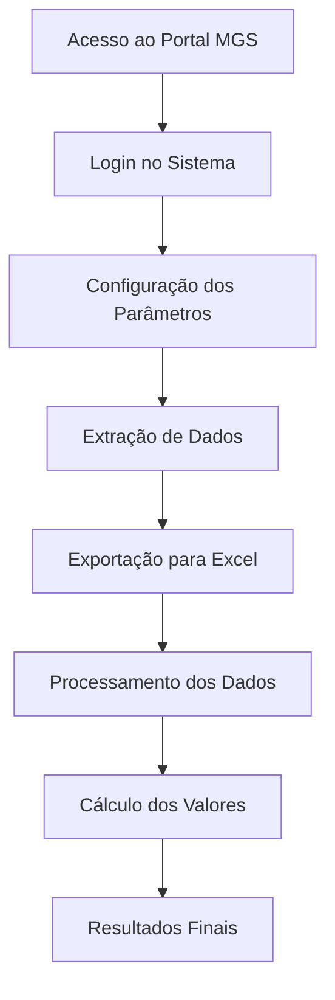

## 📋 Informações do Projeto

| **Informação** | **Detalhes** |
|:---------------|:-------------|
| **👨‍💻 Desenvolvedor** | Luigi Caetano da Silva |
| **📧 E-mail** | luigi.silva@social.mg.gov.br |
| **🤖 Ferramenta** | Power Automate Desktop |
| **📑 Requisito Excel** | 2016 ou superior |
| **🔄 Última atualização** | 05/05/2025 |

---

## 🎯 Visão Geral

### Objetivo
> Automatizar e documentar o processo de execução orçamentária mensal referente às despesas da MGS, simplificando o fluxo de trabalho e garantindo precisão nos resultados.

### Escopo
Este fluxo abrange todo o processo desde o acesso ao portal da MGS, extração de dados de **24 centros de custo**, até o tratamento de dados no Excel com foco em três categorias específicas de despesa:

- **Postos de Serviço**
- **Gratificação de Função**
- **Vale Alimentação**

---

## 💾 Copiar Código para a Área de Transferência



---

## 🔄 Fluxo do Processo

---

## 💻 1. Processo: Portal MGS

### 1.1 Acesso ao Portal Cliente

1. Abra o navegador Chrome e acesse o Portal Cliente MGS

   

   
   
   
   

2. Na tela de login, insira suas credenciais de acesso

   

   
   
   
   

### 1.2 Navegação até Relatórios de Faturamento

1. Após autenticação, navegue até a página de Relatórios de Faturamento
2. Configure os parâmetros iniciais:
   - Selecione o Tipo de Contrato: `00502021`
   - Selecione o Tipo de Acesso: `Gestor`
   - Clique em "Carregar Unidades"

   

   
   
   
   

### 1.3 Extração de Dados dos Centros de Custo

1. A automação cria uma tabela de dados (DataTable) contendo informações dos 24 Centros de Custo

   

   
   
   
   

2. Para cada Centro de Custo na tabela:
   - O sistema filtra automaticamente o item na barra de pesquisa
   - Aguarda o carregamento das informações correspondentes

   

   
   
   
   

3. Para cada resultado filtrado:
   - Selecione "Detalhamento de Custo"
   - Clique em "Exportar para Excel"

   

   
   
   
   

4. Os arquivos exportados são renomeados automaticamente para facilitar a identificação

   

   
   
   
   

---

## 📊 2. Processo: Tratamento de Dados no Excel

### 2.1 Inicialização do Excel

1. A automação inicia duas instâncias do Excel:
   - Uma planilha em branco para processamento
   - Outra para anexar o documento de detalhamento (ex: "03.2025_Detalhamento_SUBBPG")

   

   
   
   
   

### 2.2 Processamento dos Postos de Serviço

#### Etapa 1: Inicialização
1. Inicialização da variável "ValorPosto" com valor 0

   

   
   
   
   

#### Etapa 2: Filtragem
2. Filtragem dos dados na coluna B utilizando o critério "Eq 134 POSTOS DE SERVIÇOS"

   

   
   
   
   

#### Etapa 3: Seleção
3. Seleção dos dados relevantes na coluna F (a partir da linha 2)
   - Utiliza-se `FirstFreeRowOnColumn - 1` para excluir o cabeçalho da tabela

   

   
   
   
   

#### Etapa 4: Processamento
4. Processamento dos valores financeiros:
   - Seleção da coluna P (Valor) a partir da linha 2
   - Cópia dos valores para a planilha de processamento

   

   
   
   
   

#### Etapa 5: Agregação
5. Agregação dos valores:
   - Leitura dos valores da coluna A
   - Incremento da variável "ValorPosto" com cada valor lido
   - Identificação da primeira linha livre na coluna A para inserção de novos dados
   - Gravação dos valores específicos nas colunas A e B

     
   
   

#### Etapa 6: Organização
6. Organização e Estruturação dos Dados

   
   
   
   

#### Etapa 7: ValorGratificação
7. Repetir o processo para a variável "ValorGraticifcação":

   
   
   
   

   
   
   
   

#### Etapa 8: ValorAlimentação
8. Repetir o processo para a variável "ValorAlimentação":

   
   

#### Etapa 9: Viagem 
9. Repetir o mesmo processo dos demais para a variável "ValorViagem"

   
   

   
   

  

### 2.3 Processamento de Outras Categorias

#### 🏆 Gratificações

1. Filtro aplicado: "Eq 140 GRATIFICACAO DE FUNCAO"
2. Variável utilizada: "ValorGratificacao"
3. Mesmo processo de extração e agregação

#### 🍽️ Vale Alimentação

1. Filtro aplicado: "Eq 23 VALE ALIMENTAÇÃO"
2. Variável utilizada: "ValorAlimentacao"
3. Mesmo processo de extração e agregação

---

## 📈 3. Resultados e Saídas

Ao final do processamento, a planilha Excel conterá:

Postos de Serviço

Valor total consolidado para todos os centros de custo

Gratificações

Valor total consolidado para todos os centros de custo

Vale Alimentação

Valor total consolidado para todos os centros de custo

Os dados são organizados de forma estruturada para análise orçamentária mensal, permitindo:
- Comparativos entre períodos
- Análises por centro de custo
- Projeções orçamentárias

---

## ⚠️ 4. Solução de Problemas Comuns

| **Problema** | **Possível Causa** | **Solução** |
|:-------------|:-------------------|:------------|
| 🔒 **Falha no login do Portal** | Credenciais inválidas ou expiradas | Verificar credenciais ou solicitar renovação |
| 📊 **Erro na extração dos dados** | Mudança na estrutura do portal | Atualizar os seletores de elementos na automação |
| 📑 **Erro no Excel** | Versão incompatível | Verificar se está usando Excel 2016 ou superior |
| 🔍 **Dados não filtrados corretamente** | Alteração nas descrições dos itens | Verificar e atualizar os critérios de filtro |
| ⏱️ **Timeout durante o processo** | Conexão lenta ou sobrecarga do servidor | Ajustar os tempos de espera na automação |

---

## 📞 5. Contato para Suporte

Em caso de dúvidas ou problemas com a automação, entre em contato com:

| | |
|:--:|:--|
| 👨‍💻 | **Luigi Caetano da Silva** |
| 📧 | **luigi.silva@social.mg.gov.br** |
| 🕙 | **Horário de atendimento:** Segunda a Sexta, 08:00 às 17:00 |

---

Documentação gerada em 05/05/2025 | MGS - Execução Orçamentária

