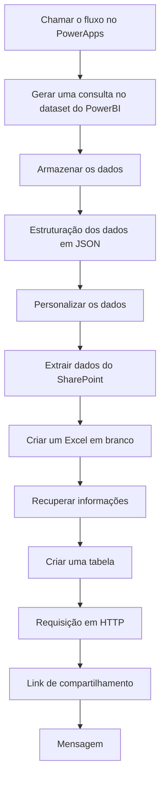

## 🏠 Tela Inicial


### Principais Elementos

| Elemento | Descrição |
|---------|-----------|
| ✨ **Tutorial Interativo** | Guia dinâmico que ensina o usuário a utilizar o aplicativo passo a passo |
| 📋 **Fluxo de Registro de Informação** | Redireciona para documento no SharePoint em nova aba, mantendo o aplicativo aberto |
| ▶️ **Iniciar Preenchimento** | Direciona o usuário para a tela de iniciativas |

## 📋 Tela de Iniciativas


### 🎛️ Controles de Seleção


#### 🔄Seletor de Programa

Funcionalidade: Filtro baseado no perfil do usuário

```powerapps
If( 

    varGestor; 

    Distinct( 

        PlanejamentoIntegrado_ProgramasAcoes; 

        Programa 

    ); 

    Distinct( 

        Filter( 

            PlanejamentoIntegrado_ProgramasAcoes; 

            Programa in programasPermitidos 

        ); 

        Programa 

    ) 
```
> Essa função verifica se a variável varGestor está ativada. Se estiver, ela retorna todos os programas distintos registrados na fonte de dados PlanejamentoIntegrado_ProgramasAcoes, sem nenhuma restrição. Caso contrário, ela filtra essa fonte para retornar apenas os programas que estão na lista de programasPermitidos e, então, retorna os programas distintos dessa seleção. Assim, dependendo do valor de varGestor, o usuário verá ou todos os programas disponíveis ou apenas um subconjunto filtrado de programas autorizados, garantindo controle de acesso ou visibilidade conforme o perfil do usuário. 

#### 🔄 Seletor de Ação

Funcionalidade: Filtragem de ações baseada no programa selecionado

```powerapps
If(
    varGestor;
    Distinct(
        Filter(
            BaseProgramasAcoes;
            Programa = ComboboxCanvas1.Selected.Value
        );
        Acao
    );
    Distinct(
        Filter(
            BaseProgramasAcoes;
            Programa = ComboboxCanvas1.Selected.Value;
            Acao in acoesPermitidas
        );
        Acao
    )
)
```

> Essa função é igual a anterior, porém filtra as Ações

#### ➕ Adicionar Nova Iniciativa


Funcionalidade: Criação de nova iniciativa com dados básicos

```powerapps
Patch(
    PlanejamentoIntegrado_Iniciativas;
    Defaults(PlanejamentoIntegrado_Iniciativas);
    {
        Título: UsuáriosdoOffice365.MyProfileV2().mail;
        Programa: ComboboxCanvas1_2.Selected.Value;
        Acao: ComboboxCanvas1_3.Selected.Value
    }
);;
Refresh(PlanejamentoIntegrado_Iniciativas)
```
> Essa função cria um novo registro na fonte de dados chamada PlanejamentoIntegrado_Iniciativas. Para isso, ela usa a função Patch com o parâmetro Defaults(PlanejamentoIntegrado_Iniciativas), que indica que será criado um novo registro com valores padrão.  
No novo registro criado, são atribuídos três campos: Título, Programa e Ação. 
Depois de criar esse novo registro, a função executa um Refresh na fonte de dados PlanejamentoIntegrado_Iniciativas para garantir que os dados locais no aplicativo estejam atualizados e sincronizados com o banco ou serviço externo onde a fonte está armazenada. 

#### Botão Propor Programa


```powerapps
 Patch( 

PlanejamentoIntegrado_ProgramasAcoes; 

    Defaults(PlanejamentoIntegrado_ProgramasAcoes); 

    { 

        Título: LookUp( 

            PlanejamentoIntegrado_ProgramasAcoes; 

            Acao = Left( 

                acoesPermitidas; 

                4 

            ); 

            Título 

        ); 

        Programa: TextInputCanvas1.Value 

    } 
);; 
UpdateContext({visPropor1: false}) 
```
> Esse código faz o seguinte: ele cria um novo registro na fonte de dados “PlanejamentoIntegrado_ProgramasAcoes” usando a função Patch com Defaults, ou seja, um registro em branco para preenchimento. Nesse novo registro, ele define o campo Título buscando “(LookUp)” um registro existente na mesma fonte onde o campo Ação é igual aos primeiros 4 caracteres da variável ou texto “acoesPermitidas”. O valor do campo Título desse registro encontrado é usado para preencher o novo registro. Além disso, ele define o campo Programa com o valor que o usuário digitou no componente de texto “TextInputCanvas1”. Por fim, ele atualiza o contexto para definir “visPropor1” como falso, provavelmente para ocultar alguma parte da interface após a operação. 

#### Botão Propor Ação


```powerapps
If( 

    Toggle1.Checked; 

    Patch( 

        PlanejamentoIntegrado_ProgramasAcoes; 

        Defaults(PlanejamentoIntegrado_ProgramasAcoes); 

        { 

            Título: LookUp( 

                PlanejamentoIntegrado_ProgramasAcoes; 

                Acao = Left( 

                    acoesPermitidas; 

                    4 

                ); 

                Título 

            ); 

            Programa: ComboboxCanvas1_10.Selected.Value; 

            Acao: TextInputCanvas1_6.Value 

        } 

    ); 

    Patch( 

        PlanejamentoIntegrado_ProgramasAcoes; 

        Defaults(PlanejamentoIntegrado_ProgramasAcoes); 

        { 

            Título: LookUp( 

                PlanejamentoIntegrado_ProgramasAcoes; 

                Acao = Left( 

                    acoesPermitidas; 

                    4 

                ); 

                Título 

            ); 

            Programa: "Proposta " & CountRows( 

                Filter( 

                    PlanejamentoIntegrado_ProgramasAcoes; 

                    "Proposta" in Programa 

                ) 

            ) + 1; 

            Acao: TextInputCanvas1_6.Value 

        } 

    ) 
);; 
UpdateContext({visPropor2:false}) 
```
> Esse código verifica se o controle “Toggle1” está marcado (Checked). Se estiver, ele cria um novo registro na fonte “PlanejamentoIntegrado_ProgramasAcoes” usando “Patch” com os seguintes dados: o campo Título é preenchido com o valor encontrado ao buscar (LookUp) um registro onde o campo Ação é igual aos primeiros 4 caracteres da variável “acoesPermitidas”; o campo Programa recebe o valor selecionado pelo usuário no componente “ComboboxCanvas1_10”; e o campo Ação é definido com o valor do componente de texto “TextInputCanvas1_6" 
Se o toggle não estiver marcado, ele também cria um novo registro similar, mas define o campo Programa como uma string que começa com "Proposta " seguida do número de registros existentes em “PlanejamentoIntegrado_ProgramasAcoes “que já tenham a palavra "Proposta" no campo Programa, somado de 1 (ou seja, criando uma numeração sequencial para propostas). O campo Ação é definido da mesma forma, com o valor do texto do componente “TextInputCanvas1_6”. 


#### 📊 Botão Detalhar Resultados


```powerapps
Set( 

    currIniciativa; 

    ThisItem 
);; 
UpdateContext({visDetalhar: true}) 
```
> Essa função realiza duas ações consecutivas: primeiro, ela define a variável global “currIniciativa” para o registro atual representado por “ThisItem”,ou seja, ela armazena o item selecionado ou em foco para uso posterior no aplicativo. Em seguida, ela atualiza uma variável de contexto local chamada “visDetalhar”, definindo seu valor como “true”, o que provavelmente serve para controlar a visibilidade de uma tela, painel ou componente que exibe detalhes dessa iniciativa selecionada.  

 
#### 💰 Botão Itens de Custo


```powerapps
Set(currIniciativa;ThisItem);; 
Navigate( 

    Screen_ItensDeCusto; 

    ScreenTransition.UnCover 

) 
UpdateContext({visVisaoGeral: true});; 
UpdateContext({visLoading:false}) 
```

> Esse código executa duas ações principais: primeiro, define a variável global “currIniciativa” com o registro atual representado por “ThisItem”, armazenando assim o item selecionado para ser usado em outras partes do aplicativo. Em seguida, a função “Navigate” é chamada para direcionar o usuário para a tela chamada “Screen_ItensDeCusto”, utilizando a transição visual do tipo “UnCover”, que faz a nova tela deslizar para cima ou aparecer cobrindo a anterior.  

#### 🔄 Botão Cenários


```powerapps
Set( 

    currIniciativa; 

    ThisItem 
);; 
Navigate( 

    Screen_Cenarios; 

    ScreenTransition.UnCover 
) 
```

> Esse código faz duas coisas: primeiro, ele define a variável global “currIniciativa” com o registro atual selecionado (ThisItem), armazenando essa informação para uso posterior no app. Em seguida, ele navega para a tela chamada “Screen_Cenarios” usando a transição visual “UnCover”, que faz a nova tela aparecer deslizando ou cobrindo a tela anterior. Ou seja, ele salva o item selecionado e direciona o usuário para a tela de cenários com uma animação suave. 

#### 🗑️ Excluir Iniciativa
```powerapps
Set(visConfirmacao;true);;
Set(currIniciativa;ThisItem);;
Set(varNotificacao;"ExcluirIniciativa")
```

> Ele não apaga a iniciativa imediatamente, mas ativa um aviso de confirmação ao definir a variável “visConfirmacao” como verdadeira e registra que a ação pretendida é a exclusão, por meio da variável “varNotificacao” com o valor "ExcluirIniciativa". Isso prepara a interface para exibir uma mensagem de confirmação antes de realizar a exclusão de fato. 

## 💰 Tela Itens de Custo


### Elementos de Interface

#### ➕ Adicionar Novo Item de Custo
```powerapps
Patch(
    PlanejamentoIntegrado_ItensDeCusto;
    Defaults(PlanejamentoIntegrado_ItensDeCusto);
    {ID_Iniciativa: currIniciativa.ID}
);;
Refresh(PlanejamentoIntegrado_ItensDeCusto)
```
> Essa função cria um novo registro na fonte de dados chamada “PlanejamentoIntegrado_ItensDeCusto”, usando os valores padrão dessa fonte, e atribui ao campo “ID_Iniciativa” o valor contido em “currIniciativa.ID”, que provavelmente representa o identificador de uma iniciativa atual selecionada ou em contexto. Após criar esse novo registro, a função executa um comando para atualizar “(refresh)” a fonte de dados, garantindo que a aplicação tenha a versão mais recente dos dados, refletindo imediatamente a inclusão do novo item. Dessa forma, a função adiciona um novo item vinculado a uma iniciativa específica e mantém os dados sincronizados no aplicativo para que qualquer controle ou galeria que utilize essa fonte mostre as informações atualizadas. 

#### 🔄 Detalhar Resultados (Itens de Custo)
```powerapps
UpdateContext({visSalvando: true});;
IfError(Patch(
    PlanejamentoIntegrado_ItensDeCusto;
    ThisItem;
    {Título: TextInputCanvas1_2.Value}
);"");;
UpdateContext({visSalvando: false});;
Set(
    currItemDeCusto;
    ThisItem
);;
UpdateContext({visDetalhar: true});;
Reset(DropdownCanvas1);;
Reset(DropdownCanvas1_1);;
Reset(DropdownCanvas1_3);;
Reset(ComboboxCanvas1);;
Reset(DropdownCanvas1_6);;
```

#### Gerar Relatório
```powerapps
UpdateContext({visLoading: true});;
Set(
    varLink;
    Gerar_Relatorio_OBZ_Relatorio.Run(
        """" & Concat(
            Filter(
                PlanejamentoIntegrado_ProgramasAcoes;
                Left(Acao;4) in acoesPermitidas
            );
            Left(
                Acao;
                4
            );
            ""","""
        ) & """";
        userMail
    )
);;
Launch(varLink.filelink);;
UpdateContext({visLoading: false});;
Notify(
    "O seu relatório também foi enviado no seu Teams!";
    NotificationType.Success;
    5000
)
```
> 

#### 📊 Botão Visão Geral Cenários
```powerapps
UpdateContext({visLoading:true});;
Clear(colVisaoGeral);;
ForAll(
    SortByColumns(
        Filter(
            PlanejamentoIntegrado_Cenarios;
            ID_Iniciativa in Filter(
                PlanejamentoIntegrado_Iniciativas;
                Acao = ComboboxCanvas1_3.Selected.Value
            ).ID
        );
        "Title"
    );
    Collect(
        colVisaoGeral;
        {
            ID1: Max(
                colVisaoGeral;
                ID1
            ) + 1;
            ID_Iniciativa: ThisRecord.ID_Iniciativa;
            Descricao: ThisRecord.Descricao;
            TipoCenario: ThisRecord.Título;
            Cenario: ThisRecord.NumeroCenario;
            ID: ThisRecord.ID
        }
    )
);;
UpdateContext({visVisaoGeral: true});;
UpdateContext({visLoading:false})
```

> Esse trecho de código do PowerApps realiza uma sequência de ações para carregar e exibir dados relacionados a cenários de planejamento integrados. Primeiramente, ele ativa um indicador visual de carregamento, atualizando o contexto com visLoading: true. Em seguida, limpa a coleção local colVisaoGeral, removendo qualquer dado anterior. Depois disso, ele percorre todos os registros da fonte de dados PlanejamentoIntegrado_Cenarios que estejam relacionados à iniciativa selecionada pelo usuário (por meio do valor escolhido no componente ComboboxCanvas1_3). Esses registros são filtrados para incluir apenas aqueles cujo ID_Iniciativa corresponde ao de iniciativas com a ação selecionada, e são ordenados pelo campo "Title". Para cada item resultante, é adicionada uma nova entrada à coleção colVisaoGeral, com um identificador incremental (ID1), além de outros campos como Descricao, TipoCenario, Cenario e o próprio ID_Iniciativa. Após esse processamento, a função torna visível a seção ou componente de "Visão Geral" (visVisaoGeral: true) e, por fim, desativa o indicador de carregamento (visLoading: false), sinalizando o fim da operação.

## 📊 Tela Cenarios

 

### Elementos de Interface

#### 👁️ Ver Itens de Custo
```powerapps
Navigate(
    Screen_ItensDeCusto;
    ScreenTransition.UnCover
)
```

> Volta para a tela de Itens de Custo

#### ➕ Adicionar Cenário
```powerapps
Patch(
    PlanejamentoIntegrado_Cenarios;
    Defaults(PlanejamentoIntegrado_Cenarios);
    {
        ID_Iniciativa: currIniciativa.ID;
        NumeroCenario: Max(
            Filter(
                PlanejamentoIntegrado_Cenarios;
                ID_Iniciativa = currIniciativa.ID
            );
            NumeroCenario
        ) + 1
    }
);;
Refresh(PlanejamentoIntegrado_Cenarios)
```

> Esse código cria um novo registro na fonte de dados "PlanejamentoIntegrado_Cenarios" vinculando-o à iniciativa atualmente selecionada "(currIniciativa.ID)". Para o campo "NumeroCenario", ele calcula o maior número de cenário já existente para essa mesma iniciativa e adiciona 1, garantindo que o novo cenário tenha um número sequencial único. Depois de criar esse registro, ele atualiza a fonte de dados para que as mudanças sejam refletidas imediatamente no aplicativo.

## 🔄 Fluxo Power Automate

🌟 Visão Geral do Fluxo
O fluxo de automação do Planejamento Integrado 2026 foi desenvolvido para automatizar a geração de relatórios analíticos a partir dos dados cadastrados no aplicativo PowerApps. Este fluxo integra múltiplas tecnologias Microsoft (PowerApps, Power BI, SharePoint e Teams) para entregar relatórios personalizados com base nas ações selecionadas pelo usuário.


💡 Objetivo Principal: Automatizar a extração, processamento e distribuição de relatórios analíticos com dados atualizados das iniciativas de planejamento.



---

O fluxo Power Automate integrado ao aplicativo segue as seguintes etapas:

## 📋 Detalhamento das Etapas
    
1️⃣ Acionamento do Fluxo
O fluxo é acionado a partir do PowerApps quando o usuário clica no botão "Gerar Relatório OBZ".

Configuração do Gatilho:
Origem: Botão PowerApps

Parâmetros de Entrada:
Ações: Código(s) das ações selecionadas para o relatório
Usuário: E-mail do usuário solicitante

 

2️⃣ Consulta ao Power BI
O fluxo executa uma consulta DAX no conjunto de dados "TesteOBZ" do Power BI para extrair as informações filtradas.

Detalhes da Configuração:
Dataset: TesteOBZ
Tipo de Consulta: DAX (Direct Query)
Filtros Aplicados: Com base no parâmetro Ações recebido do PowerApps
 
 
    
3️⃣ Extração e Processamento dos Dados
Após a execução da consulta, o fluxo extrai as linhas de resultado e as processa para uso posterior.

Configuração:
Run_a_query_against_a_dataset')['body']['results'][0]['tables'][0]['rows']
Esta etapa é fundamental para extrair apenas os dados relevantes do resultado da consulta, preparando-os para o próximo passo.

     

4️⃣ Estruturação via Parse JSON
Os dados são estruturados através da ação Parse JSON, que converte o formato bruto em uma estrutura de dados organizada.

Configuração do Parse JSON:
Conteúdo: Resultado da etapa anterior
Esquema: Definição estruturada dos campos esperados

 

5️⃣ Personalização dos Dados
Esta etapa reformata os dados extraídos para uma estrutura mais adequada ao relatório final.

Campos Mapeados:
Identificadores de ações
Descrições
Valores orçamentários
Métricas de desempenho
Informações temporais

 

6️⃣ Criação do Arquivo Excel

O fluxo cria um novo arquivo Excel no SharePoint com um nome padronizado que inclui data e hora.

Configuração:
Localização: /SEDESE
Nome do Arquivo: Relatorio_Planejamento_Integrado_[DATA]_[HORA].xlsx
Formato de Data: formatDateTime(utcNow(), 'dd-MM-yyyy HH:mm:ss')

 

7️⃣ Recuperação de Metadados

O fluxo obtém os metadados do arquivo recém-criado para uso nas etapas seguintes.

Informações Coletadas:
ID do arquivo
URI do arquivo
Permissões
Última modificação


8️⃣ Criação da Tabela Excel

Esta etapa cria uma tabela estruturada no arquivo Excel, com cabeçalhos predefinidos.

Configuração:
Nome da Tabela: "Relatorio"
Extração do ID: split(outputs('Get_file_metadata')?['body/Id'],'.')?[0]


9️⃣ Inserção de Dados

O fluxo insere os dados processados na tabela Excel através de uma requisição HTTP.

Configuração da Requisição:
Método: POST
URI: Construída com base no ID extraído do arquivo
Corpo da Requisição: Dados estruturados no formato esperado pela API do Excel


🔗 Criação de Link de Compartilhamento
O fluxo cria um link de compartilhamento para o arquivo Excel criado.

Parâmetros de Configuração:
Tipo de Link: Visualização
Escopo: Organização
Expiração: Não definida


📱 Envio de Notificação no Teams
A última etapa envia uma notificação ao usuário no Microsoft Teams, incluindo o link para o relatório.

Configuração:
Destinatário: Usuário que solicitou o relatório (parâmetro Usuário)
Conteúdo: Mensagem informativa + Link do relatório
Formatação: Cartão adaptativo com botão de acesso


## 📝 Considerações de Uso

<div class="tips">
  <div class="tip">
    <h3>🎯 Objetivo</h3>
    <p>O aplicativo foi desenvolvido para simplificar o processo de planejamento integrado</p>
  </div>
  <div class="tip">
    <h3>👤 Perfis</h3>
    <p>As permissões são controladas por perfil de usuário (gestor/não gestor)</p>
  </div>
  <div class="tip">
    <h3>💾 Armazenamento</h3>
    <p>Os dados são integrados com SharePoint para persistência</p>
  </div>
  <div class="tip">
    <h3>📊 Relatórios</h3>
    <p>O sistema oferece funcionalidades de relatórios automatizados</p>
  </div>
</div>

<style>
.flow-steps {
  display: flex;
  flex-direction: column;
  gap: 10px;
  margin: 20px 0;
}

.step {
  background-color: #f8f9fa;
  border-left: 4px solid #0078d4;
  padding: 10px 15px;
  border-radius: 0 5px 5px 0;
}

.step h3 {
  margin-top: 0;
  color: #0078d4;
}

.tips {
  display: grid;
  grid-template-columns: repeat(auto-fit, minmax(250px, 1fr));
  gap: 20px;
  margin: 20px 0;
}

.tip {
  background-color: #f0f7ff;
  border-radius: 8px;
  padding: 15px;
  box-shadow: 0 2px 5px rgba(0,0,0,0.1);
}

.tip h3 {
  margin-top: 0;
  color: #0078d4;
}

/* Mermaid diagrams */
.mermaid {
  background-color: white;
  padding: 1em;
  border-radius: 8px;
  box-shadow: 0 2px 4px rgba(0, 0, 0, 0.05);
  margin: 1.5em 0;
  text-align: center;
}

@media (max-width: 768px) {
  .tips {
    grid-template-columns: 1fr;
  }
}
</style>