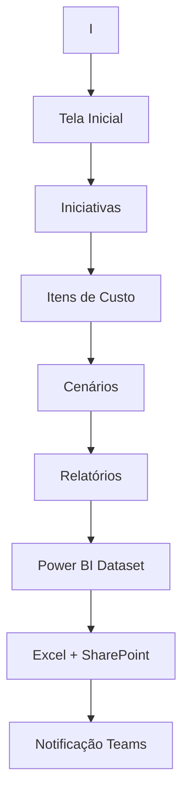

# 📋 Tutorial Completo - Aplicativo de Planejamento Integrado

Este guia completo apresenta todas as funcionalidades do aplicativo de planejamento integrado, incluindo fluxos de uso, funcionalidades principais e detalhamento dos planejamentos. Siga este tutorial para dominar completamente o sistema.

## O Que Você Vai Aprender

- Como navegar pela tela inicial e suas funcionalidades
- Como gerenciar iniciativas e seus componentes
- Como trabalhar com itens de custo e cenários
- Como utilizar os relatórios automatizados
- Como funciona a integração com Power Automate
- Como gerenciar permissões de usuários

## Visão Geral do Sistema

O Aplicativo de Planejamento Integrado é uma solução completa que conecta PowerApps, SharePoint, Power BI e Teams para oferecer um ambiente integrado de planejamento organizacional. Este sistema permite desde o cadastro de iniciativas até a geração automatizada de relatórios analíticos.

## 🏠 Tela Inicial

  <h3>📱 Visão Geral da Interface Principal</h3>
  
A tela inicial é o ponto de partida do seu trabalho. Aqui você encontra todos os recursos necessários para começar.

### Principais Elementos da Tela Inicial

  

    <h4>✨ Tutorial Interativo</h4>
    
Guia dinâmico que ensina você a utilizar o aplicativo passo a passo, ideal para novos usuários. Oferece orientação contextual e exemplos práticos para facilitar o aprendizado.

  

  
  

    <h4>📋 Fluxo de Registro de Informação</h4>
    
Redireciona para documento no SharePoint em nova aba, mantendo o aplicativo aberto para consulta. Permite acesso rápido à documentação oficial sem perder o contexto de trabalho.

  

  
  

    <h4>▶️ Iniciar Preenchimento</h4>
    
Direciona você diretamente para a tela de iniciativas onde o trabalho efetivo começa. Este é o caminho mais rápido para usuários experientes iniciarem suas atividades.

  

---

## 📋 Tela de Iniciativas

  <h3>🎯 Centro de Controle das Suas Iniciativas</h3>
  
Esta é a tela mais importante do sistema, onde você gerencia todas as suas iniciativas de planejamento.

### 🎛️ Controles de Seleção Inteligentes

  

    <h4>🔄 Seletor de Programa</h4>
    
<strong>Funcionalidade:</strong> Filtro baseado no perfil do usuário

    

      
<strong>💡 Como funciona:</strong>

      
O sistema verifica automaticamente se você é um gestor. Se for, você vê todos os programas disponíveis. Caso contrário, apenas os programas autorizados para seu perfil são exibidos, garantindo segurança e organização.

    

  

  

    <h4>🔄 Seletor de Ação</h4>
    
<strong>Funcionalidade:</strong> Filtragem de ações baseada no programa selecionado

    

      
<strong>💡 Como funciona:</strong>

      
Após selecionar um programa, o sistema filtra automaticamente as ações disponíveis, mostrando apenas aquelas relacionadas ao programa escolhido. Isso mantém a interface limpa e focada.

    

  

### ⚡ Ações Principais

  

    <h4>➕ Adicionar Nova Iniciativa</h4>
    
<strong>O que faz:</strong> Cria uma nova iniciativa vinculada ao programa e ação selecionados

    

      
<strong>🔧 Processo:</strong>

      <ul>
        <li>Registra automaticamente seu e-mail como responsável</li>
        <li>Vincula ao programa e ação selecionados</li>
        <li>Atualiza a lista de iniciativas instantaneamente</li>
      </ul>
    

  

  

    <h4>📊 Propor Programa</h4>
    
<strong>O que faz:</strong> Permite sugerir novos programas quando não encontra o que precisa

    

      
<strong>🔧 Processo:</strong>

      <ul>
        <li>Cria uma proposta baseada em suas permissões</li>
        <li>Registra a sugestão para análise posterior</li>
        <li>Mantém histórico de propostas</li>
      </ul>
    

  

  

    <h4>📝 Propor Ação</h4>
    
<strong>O que faz:</strong> Sugere novas ações para programas existentes ou cria propostas completas

    

      
<strong>🔧 Processo:</strong>

      <ul>
        <li>Verifica se deve vincular a programa existente ou criar proposta</li>
        <li>Numera automaticamente as propostas</li>
        <li>Organiza sugestões para aprovação</li>
      </ul>
    

  

### 🛠️ Ferramentas de Gestão por Iniciativa

  

    <h4>📊 Detalhar Resultados</h4>
    
Abre uma visão detalhada da iniciativa selecionada com todas as informações relevantes, incluindo métricas de desempenho e status atual.

  

  

    <h4>💰 Itens de Custo</h4>
    
Navega para a tela especializada em gerenciamento de custos da iniciativa, onde você pode detalhar todos os aspectos financeiros.

  

  

    <h4>🔄 Cenários</h4>
    
Acessa o módulo de criação e comparação de diferentes cenários, permitindo análise estratégica e tomada de decisões informadas.

  

  

    <h4>🗑️ Excluir Iniciativa</h4>
    
Remove a iniciativa após confirmação, com sistema de segurança integrado para evitar exclusões acidentais.

  

---

## 💰 Tela Itens de Custo

  <h3>💼 Gestão Financeira Detalhada</h3>
  
Aqui você controla todos os aspectos financeiros da sua iniciativa, desde custos unitários até premissas de cálculo.

### 🎯 Funcionalidades Principais

  

    <h4>➕ Adicionar Novo Item de Custo</h4>
    

      
<strong>Processo automático:</strong>

      <ul>
        <li>Cria novo item vinculado à iniciativa atual</li>
        <li>Atualiza dados em tempo real</li>
        <li>Mantém histórico de alterações</li>
      </ul>
    

  

  

    <h4>📝 Detalhamento Completo</h4>
    

      
<strong>Campos gerenciados:</strong>

      <ul>
        <li>Forma de contratação e quantitativo</li>
        <li>Valores unitários e frequência</li>
        <li>Códigos de elementos e grupos</li>
        <li>Premissas de volume e preço</li>
        <li>Fontes de financiamento e instrumentos</li>
      </ul>
    

  

### 🧮 Sistema de Cálculo Automático

  <h4>📊 Cálculo do Valor Total</h4>
  
O sistema calcula automaticamente o valor total usando a fórmula:

  

    <strong>Valor Total = Valor Unitário × Quantitativo × Frequência</strong>
  

  
O resultado é arredondado para 2 casas decimais e salvo automaticamente.

---

## 📊 Tela Cenários

  <h3>🎭 Planejamento com Múltiplas Perspectivas</h3>
  
Esta tela permite criar e comparar diferentes cenários para sua iniciativa, facilitando a tomada de decisões estratégicas.

### 🔧 Ferramentas de Cenário

  

    <h4>👁️ Ver Itens de Custo</h4>
    
Retorna rapidamente à tela de custos para consultas ou ajustes, mantendo o contexto da iniciativa atual.

  

  

    <h4>➕ Adicionar Cenário</h4>
    

      
<strong>Sistema inteligente de numeração:</strong>

      <ul>
        <li>Identifica o maior número de cenário existente</li>
        <li>Adiciona automaticamente o próximo número na sequência</li>
        <li>Vincula o cenário à iniciativa atual</li>
      </ul>
    

  

---

## 🔄 Fluxo Power Automate

  <h3>🌟 Automação Inteligente de Relatórios</h3>
  
O sistema inclui um fluxo automatizado que gera relatórios personalizados integrando PowerApps, Power BI, SharePoint e Teams.

### 🎯 Objetivo Principal

  
Automatizar completamente o processo de extração, processamento e distribuição de relatórios analíticos com dados sempre atualizados das iniciativas de planejamento.

### 📋 Fluxo Detalhado de Automação

  

    <h4>1️⃣ Acionamento do Fluxo</h4>
    
O processo inicia quando você clica no botão "Gerar Relatório OBZ" no PowerApps. O sistema captura automaticamente suas ações selecionadas e seu e-mail para personalização.

  

  

    <h4>2️⃣ Consulta ao Power BI</h4>
    
Uma consulta DAX é executada no dataset "TesteOBZ" do Power BI, filtrando os dados conforme suas seleções e extraindo apenas informações relevantes.

  

  

    <h4>3️⃣ Processamento Inteligente</h4>
    
Os dados brutos são extraídos e processados, convertendo-os em formato estruturado através de Parse JSON para garantir organização e consistência.

    

      
        // Código utilizado no "Inputs" da ação:
        outputs('Gerar_uma_consulta_no_dataset_do_PowerBI')?['body']?['results']?[0]?['tables']?[0]?['rows']
      
    

  

  

    <h4>4️⃣ Personalização dos Dados</h4>
    
As informações são reformatadas especificamente para seu relatório, incluindo identificadores, descrições, valores orçamentários e métricas de desempenho.

  

  

    <h4>5️⃣ Criação do Excel</h4>
    
Um arquivo Excel é criado automaticamente no SharePoint com nome padronizado incluindo data e hora.

    

      
        // Código utilizado no "File Name" da ação, para garantir um nome único para cada arquivo:
        formatDateTime(utcNow(), 'dd-MM-yyyy HH:mm:ss')
      
    

  

  

    <h4>6️⃣ Estruturação da Tabela</h4>
    
Uma tabela estruturada é criada no Excel com cabeçalhos predefinidos e os dados processados são inseridos através de requisição HTTP otimizada.

    

      
        // Para acessarmos a biblioteca de cada usuário, é necessário passar o identificador obtido na etapa anterior:
        split(outputs('Recuperar_informações')?['body/Id'],'.')?[0]
      
    

  

  

    <h4>7️⃣ Compartilhamento Automático</h4>
    
O sistema cria um link de compartilhamento do arquivo e envia uma notificação personalizada via Teams diretamente para você, incluindo acesso direto ao relatório.

  

---

## 🔐 Gerenciamento de Permissões de Usuários

  <h3>👥 Controle de Acesso Inteligente</h3>
  
Sistema completo para gerenciar permissões e controlar o acesso dos usuários às diferentes funcionalidades do aplicativo.

### 📋 Tela Principal de Permissões

  

    <h4>🆕 Nova Permissão</h4>
    
<strong>Função:</strong> Navigate(Screen_Permissoes_Adicionar)

    
Direciona o usuário para a tela onde poderá adicionar uma nova permissão ao sistema, configurando um novo usuário com seus respectivos acessos.

  

  

    <h4>✏️ Editar Permissão</h4>
    

      
      Select(Parent);
      Set(currUsuario; ThisItem);
      Navigate(Screen_Permissoes_Editar)
      
    

    
Este botão executa três ações em sequência para garantir a edição correta das permissões do usuário selecionado.

  

  

    <h4>🚫 Desativar Usuário</h4>
    
<strong>Função:</strong> Remove(PlanejamentoIntegrado_Usuarios; ThisItem)

    
Remove permanentemente o usuário selecionado da base de dados, desativando completamente seu acesso ao sistema.

  

### 💾 Sistema de Salvamento de Permissões

  

    <h4>🔧 Como Funciona o Salvamento</h4>
    

      
      If(Checkbox3_1.Value;
        // Se for gestor
        Patch(PlanejamentoIntegrado_Usuarios; currUsuario; {
          Título: "Sim";
          Gestor: true;
          Programas: Blank();
          Acoes: Blank()
        });
        // Se não for gestor  
        Patch(PlanejamentoIntegrado_Usuarios; currUsuario; {
          Título: "Sim";
          Usuario: ComboBox1_2.Selected;
          Programas: Concat(Distinct(Filter(Gallery1_1.AllItems; Checkbox1_1.Value = true); Programa); Value; "; ");
          Acoes: Concat(Filter(Gallery1_1.AllItems; Checkbox1_1.Value = true); Left(Acao; 4); "; ")
        })
      );
      Navigate(Screen_Permissoes_Gestao)
      
    

  

  

    <h4>🎯 Processo de Verificação</h4>
    

      
<strong>Sistema inteligente que:</strong>

      <ul>
        <li>Verifica se o usuário será gestor ou comum</li>
        <li>Para gestores: define acesso total (Programas e Ações em branco)</li>
        <li>Para usuários comuns: coleta permissões específicas marcadas</li>
        <li>Utiliza Distinct() para remover duplicatas</li>
        <li>Usa Left(Acao; 4) para otimizar armazenamento</li>
      </ul>
    

  

---

## 💡 Dicas e Boas Práticas

  

    <h4>🎯 Planejamento Eficiente</h4>
    <ul>
      <li>Sempre defina claramente programa e ação antes de criar iniciativas</li>
      <li>Use nomes descritivos para suas iniciativas</li>
      <li>Mantenha informações atualizadas regularmente</li>
    </ul>
  

  

    <h4>💰 Gestão de Custos</h4>
    <ul>
      <li>Preencha todas as premissas de cálculo</li>
      <li>Verifique regularmente os valores totais calculados</li>
      <li>Documente fontes de informação para auditoria</li>
    </ul>
  

  

    <h4>📊 Cenários Estratégicos</h4>
    <ul>
      <li>Crie cenários realistas e fundamentados</li>
      <li>Compare regularmente diferentes alternativas</li>
      <li>Documente premissas de cada cenário</li>
    </ul>
  

  

    <h4>🔄 Automação e Relatórios</h4>
    <ul>
      <li>Gere relatórios periodicamente para acompanhamento</li>
      <li>Verifique dados antes de gerar relatórios finais</li>
      <li>Mantenha histórico de versões importantes</li>
    </ul>
  

  

    <h4>👥 Gerenciamento de Usuários</h4>
    <ul>
      <li>Revise permissões regularmente</li>
      <li>Gestores têm acesso total automaticamente</li>
      <li>Cuidado ao desativar usuários - ação irreversível</li>
    </ul>
  

  

    <h4>🔒 Segurança do Sistema</h4>
    <ul>
      <li>Verifique permissões antes de compartilhar dados</li>
      <li>Mantenha backup regular das configurações</li>
      <li>Monitore acessos e atividades dos usuários</li>
    </ul>
  

---

## ⚙️ Considerações Técnicas

  

    <h4>👤 Sistema de Permissões</h4>
    
O aplicativo controla automaticamente o acesso baseado no seu perfil (gestor/não gestor), garantindo que você veja apenas as informações apropriadas ao seu nível de acesso.

  

  

    <h4>💾 Integração de Dados</h4>
    
Todos os dados são integrados com SharePoint para garantir persistência, backup automático e acesso controlado às informações do seu planejamento.

  

  

    <h4>📈 Relatórios Dinâmicos</h4>
    
O sistema de relatórios se conecta ao Power BI em tempo real, garantindo que você sempre trabalhe com as informações mais atualizadas disponíveis.

  

  

    <h4>🔔 Notificações Inteligentes</h4>
    
As notificações via Teams são enviadas automaticamente, mantendo você informado sobre o status dos seus relatórios e processos em andamento.

  

---

## 🚀 Fluxo de Trabalho Recomendado

  

    <h4>1️⃣ Configuração Inicial</h4>
    
Configure permissões de usuários e defina programas e ações disponíveis no sistema.

  

  

    <h4>2️⃣ Criação de Iniciativas</h4>
    
Utilize os controles inteligentes para criar iniciativas vinculadas aos programas apropriados.

  

  

    <h4>3️⃣ Detalhamento Financeiro</h4>
    
Acesse a tela de itens de custo para detalhar todos os aspectos financeiros da iniciativa.

  

  

    <h4>4️⃣ Análise de Cenários</h4>
    
Crie diferentes cenários para análise comparativa e tomada de decisões estratégicas.

  

  

    <h4>5️⃣ Geração de Relatórios</h4>
    
Utilize o fluxo automatizado para gerar relatórios personalizados e compartilhá-los via Teams.

  

  

    <h4>6️⃣ Monitoramento</h4>
    
Acompanhe regularmente o progresso através dos relatórios e ajuste as iniciativas conforme necessário.

  

## Resumo das Funcionalidades

| Tela | Funcionalidade Principal | Descrição |
|---|---|---|
| **Inicial** | Portal de entrada | Acesso a tutoriais, documentação e início do trabalho |
| **Iniciativas** | Gestão central | Criação, edição e organização de todas as iniciativas |
| **Itens de Custo** | Controle financeiro | Detalhamento completo de custos com cálculos automáticos |
| **Cenários** | Análise estratégica | Criação e comparação de diferentes cenários de planejamento |
| **Permissões** | Controle de acesso | Gerenciamento completo de usuários e suas permissões |
| **Automação** | Relatórios inteligentes | Geração e distribuição automatizada de relatórios via Teams |

## 🚀 Próximos Passos

Agora que você domina todas as funcionalidades do aplicativo, está pronto para:

1. **Criar suas primeiras iniciativas** usando os controles inteligentes
2. **Gerenciar custos detalhadamente** com cálculos automáticos
3. **Desenvolver cenários estratégicos** para melhor tomada de decisão
4. **Gerar relatórios automatizados** para acompanhamento e análise

## 🎉 Conclusão

  <h3>🎉 Parabéns!</h3>
  
Você agora possui conhecimento completo para utilizar eficientemente o Aplicativo de Planejamento Integrado. Use este tutorial como referência sempre que precisar relembrar alguma funcionalidade.

