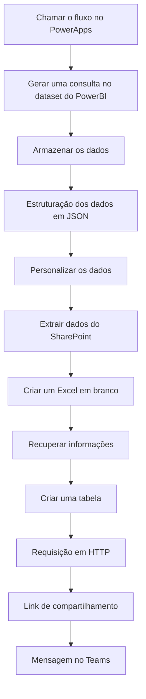

# 🔄 Criando Fluxos no Power Automate

Neste guia, você aprenderá como configurar um fluxo de automação no Power Automate que conecta seu aplicativo PowerApps com relatórios do Power BI e envia os resultados diretamente para o Microsoft Teams. Este processo automatizado economiza tempo e garante que todos recebam informações atualizadas.

## O Que Você Vai Aprender

- Como criar um fluxo acionado pelo PowerApps
- Como consultar dados do Power BI através do fluxo
- Como processar dados e criar relatórios em Excel
- Como compartilhar automaticamente os resultados no Teams

## Visão Geral do Fluxo

O fluxo de automação do Planejamento Integrado 2026 foi desenvolvido para gerar relatórios analíticos a partir dos dados cadastrados no PowerApps. Este fluxo integra múltiplas tecnologias Microsoft para entregar relatórios personalizados com base nas ações selecionadas pelo usuário.

## Passo a Passo

  

    <h3>📌 Passo 1: Acionando o fluxo pelo PowerApps</h3>
    
O fluxo é iniciado quando o usuário clica no botão "Gerar Relatório OBZ" no aplicativo PowerApps. Este botão envia dois parâmetros importantes: os códigos das ações selecionadas e o e-mail do usuário solicitante.

    
  

  

    <h3>📌 Passo 2: Consultando dados no Power BI</h3>
    
O fluxo executa uma consulta DAX no conjunto de dados "PlanejamentoIntegrado2026" do Power BI. Esta consulta filtra as informações com base nas ações selecionadas pelo usuário no PowerApps. Para personalizar o relatório, veja a sessão <a href="../funcionalidades/RelatoriosExcel/" class="prev-link">Relatórios excel a partir do Power BI e Power Automate</a>.

    
  

  

    <h3>📌 Passo 3: Extraindo e processando dados</h3>
    
Após a consulta, o sistema extrai apenas as linhas de resultado relevantes e as processa para uso nas próximas etapas. Esta etapa transforma dados brutos em informações utilizáveis.

    

      
        // Código utilizado no "Inputs" da ação:
        outputs('Gerar_uma_consulta_no_dataset_do_PowerBI')?['body']?['results']?[0]?['tables']?[0]?['rows']
      
    

    
  

  

    <h3>📌 Passo 4: Estruturando dados com Parse JSON</h3>
    
Os dados são organizados através da ação Parse JSON, que converte o formato bruto em uma estrutura de dados bem definida e fácil de manipular nas etapas seguintes.

    
É importante lembrar que o esquema JSON configurado no nosso arquivo é para a forma como nós estruturamos o nosso relatório. Caso queiram personalizar, terão que alterar os nomes de cada campo no "Schema".
    
  

  

    <h3>📌 Passo 5: Personalizando o formato dos dados</h3>
    
Esta etapa reformata os dados extraídos para uma estrutura mais adequada ao relatório final, mapeando campos como identificadores de ações, descrições, valores orçamentários e métricas de desempenho.

    
  

  

    <h3>📌 Passo 6: Criando o arquivo Excel</h3>
    
O fluxo cria um novo arquivo Excel no SharePoint com um nome padronizado que inclui data e hora atual, facilitando a organização e busca dos relatórios gerados.

    

      
        // Código utilizado no "File Name" da ação, para garantir um nome único para cada arquivo:
        formatDateTime(utcNow(), 'dd-MM-yyyy HH:mm:ss')
      
    

    
  

  

    <h3>📌 Passo 7: Recuperando metadados do arquivo</h3>
    
O sistema obtém os metadados do arquivo recém-criado para uso nas etapas seguintes.

    
  

  

    <h3>📌 Passo 8: Criando a tabela no Excel</h3>
    
Esta etapa cria uma tabela estruturada no arquivo Excel, com cabeçalhos predefinidos que facilitam a leitura e análise dos dados do relatório.

    

      
        // Para acessarmos a biblioteca de cada usuário, é necessário passar o identificador obtido na etapa anterior:
        split(outputs('Recuperar_informações')?['body/Id'],'.')?[0]
      
    

    
  

  

    <h3>📌 Passo 9: Inserindo dados na tabela</h3>
    
O fluxo insere os dados processados na tabela Excel através de uma requisição HTTP, utilizando o ID extraído do arquivo para garantir que os dados sejam inseridos no local correto.

    

      
        // Fique atento as "/", a função está entre duas:
        split(outputs('Recuperar_informações')?['body/Id'],'.')?[1]
      
    

    
  

  

    <h3>📌 Passo 10: Gerando link de compartilhamento</h3>
    
O sistema cria um link de compartilhamento para o arquivo Excel, permitindo que o usuário acesse o relatório diretamente sem precisar navegar pelo SharePoint.

    
  

  

    <h3>📌 Passo 11: Enviando notificação no Teams</h3>
    
A etapa final envia uma notificação ao usuário no Microsoft Teams, incluindo uma mensagem informativa e o link para acessar o relatório com apenas um clique.

    
  

    <h3>📌 Passo 12: Conexões usadas</h3>
    
 Essa etapa integra diferentes serviços da Microsoft (Power BI, SharePoint, Teams, Excel, Office 365 e OneDrive). Algumas conexões já estão prontas e são compartilhadas pelo dono do fluxo (Power BI, SharePoint e Teams).Outras conexões exigem que o usuário que for executar o fluxo insira suas próprias credenciais (Excel, Office 365 e OneDrive).

    
  

## 💡 Dicas Úteis

  

    <h3>🎯 Objetivo do fluxo</h3>
    
Lembre-se que o principal objetivo é automatizar a geração e distribuição de relatórios, economizando tempo e garantindo consistência nas informações.

  

  
  

    <h3>🔄 Testando seu fluxo</h3>
    
Antes de implementar em produção, teste o fluxo com um conjunto pequeno de dados para verificar se todas as etapas estão funcionando corretamente.

  

  
  

    <h3>👤 Permissões necessárias</h3>
    
Certifique-se que os usuários têm as permissões corretas no SharePoint, Power BI e Teams para que o fluxo funcione sem interrupções.

  

  
  

    <h3>📊 Personalização de relatórios</h3>
    
Você pode personalizar os campos e formato do relatório Excel modificando as etapas de estruturação e criação da tabela conforme suas necessidades específicas.

  

## O Que Vem a Seguir?

Agora que você configurou com sucesso o fluxo de automação no Power Automate, está pronto para implementar soluções completas de relatórios automatizados! No próximo tutorial, você aprenderá como personalizar ainda mais os relatórios e adicionar visualizações avançadas.

  <a href="../permissoes/" class="prev-link">← Passo anterior: Configurando as permissões</a>
  <a href="../doc_planejamento_integrado/" class="next-link">Próximo passo: Tutorial Completo →</a>

