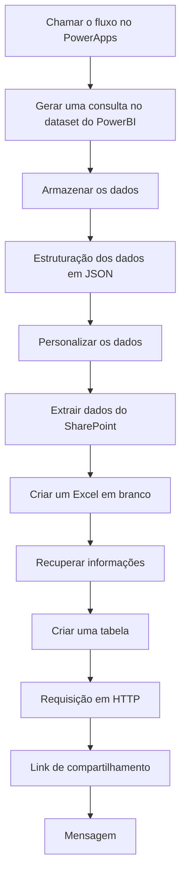

## 🔄 Fluxo Power Automate

🌟 Visão Geral do Fluxo
O fluxo de automação do Planejamento Integrado 2026 foi desenvolvido para automatizar a geração de relatórios analíticos a partir dos dados cadastrados no aplicativo PowerApps. Este fluxo integra múltiplas tecnologias Microsoft (PowerApps, Power BI, SharePoint e Teams) para entregar relatórios personalizados com base nas ações selecionadas pelo usuário.

💡 Objetivo Principal: Automatizar a extração, processamento e distribuição de relatórios analíticos com dados atualizados das iniciativas de planejamento.

---

O fluxo Power Automate integrado ao aplicativo segue as seguintes etapas:

## 📋 Detalhamento das Etapas
    
1️⃣ Acionamento do Fluxo
O fluxo é acionado a partir do PowerApps quando o usuário clica no botão "Gerar Relatório OBZ".

Configuração do Gatilho:
Origem: Botão PowerApps

Parâmetros de Entrada:
Ações: Código(s) das ações selecionadas para o relatório
Usuário: E-mail do usuário solicitante

 

2️⃣ Consulta ao Power BI
O fluxo executa uma consulta DAX no conjunto de dados "TesteOBZ" do Power BI para extrair as informações filtradas.

Detalhes da Configuração:
Dataset: TesteOBZ
Tipo de Consulta: DAX (Direct Query)
Filtros Aplicados: Com base no parâmetro Ações recebido do PowerApps
 
 
    
3️⃣ Extração e Processamento dos Dados
Após a execução da consulta, o fluxo extrai as linhas de resultado e as processa para uso posterior.

Configuração:
Run_a_query_against_a_dataset')['body']['results'][0]['tables'][0]['rows']
Esta etapa é fundamental para extrair apenas os dados relevantes do resultado da consulta, preparando-os para o próximo passo.

     

4️⃣ Estruturação via Parse JSON
Os dados são estruturados através da ação Parse JSON, que converte o formato bruto em uma estrutura de dados organizada.

Configuração do Parse JSON:
Conteúdo: Resultado da etapa anterior
Esquema: Definição estruturada dos campos esperados

 

5️⃣ Personalização dos Dados
Esta etapa reformata os dados extraídos para uma estrutura mais adequada ao relatório final.

Campos Mapeados:
Identificadores de ações
Descrições
Valores orçamentários
Métricas de desempenho
Informações temporais

 

6️⃣ Criação do Arquivo Excel

O fluxo cria um novo arquivo Excel no SharePoint com um nome padronizado que inclui data e hora.

Configuração:
Localização: /SEDESE
Nome do Arquivo: Relatorio_Planejamento_Integrado_[DATA]_[HORA].xlsx
Formato de Data: formatDateTime(utcNow(), 'dd-MM-yyyy HH:mm:ss')

 

7️⃣ Recuperação de Metadados

O fluxo obtém os metadados do arquivo recém-criado para uso nas etapas seguintes.

Informações Coletadas:
ID do arquivo
URI do arquivo
Permissões
Última modificação

8️⃣ Criação da Tabela Excel

Esta etapa cria uma tabela estruturada no arquivo Excel, com cabeçalhos predefinidos.

Configuração:
Nome da Tabela: "Relatorio"
Extração do ID: split(outputs('Get_file_metadata')?['body/Id'],'.')?[0]

9️⃣ Inserção de Dados

O fluxo insere os dados processados na tabela Excel através de uma requisição HTTP.

Configuração da Requisição:
Método: POST
URI: Construída com base no ID extraído do arquivo
Corpo da Requisição: Dados estruturados no formato esperado pela API do Excel

🔗 Criação de Link de Compartilhamento
O fluxo cria um link de compartilhamento para o arquivo Excel criado.

Parâmetros de Configuração:
Tipo de Link: Visualização
Escopo: Organização
Expiração: Não definida

📱 Envio de Notificação no Teams
A última etapa envia uma notificação ao usuário no Microsoft Teams, incluindo o link para o relatório.

Configuração:
Destinatário: Usuário que solicitou o relatório (parâmetro Usuário)
Conteúdo: Mensagem informativa + Link do relatório
Formatação: Cartão adaptativo com botão de acesso

## 📝 Considerações de Uso

  

    <h3>🎯 Objetivo</h3>
    
O aplicativo foi desenvolvido para simplificar o processo de planejamento integrado

  

  

    <h3>👤 Perfis</h3>
    
As permissões são controladas por perfil de usuário (gestor/não gestor)

  

  

    <h3>💾 Armazenamento</h3>
    
Os dados são integrados com SharePoint para persistência

  

  

    <h3>📊 Relatórios</h3>
    
O sistema oferece funcionalidades de relatórios automatizados

  

