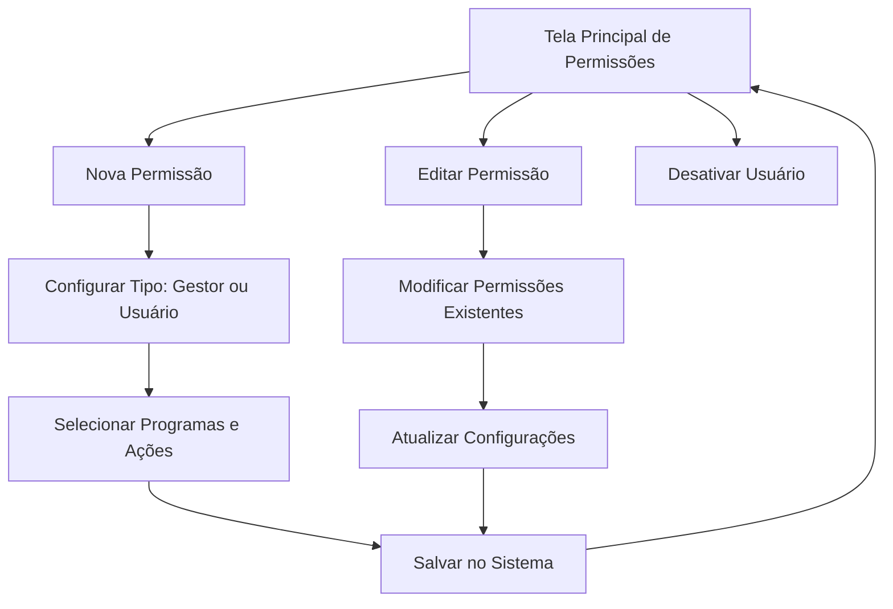

# 🔐 Configurando e Gerenciando Permissões de Usuários

Neste guia, você aprenderá como configurar e gerenciar as permissões de usuários no seu sistema de Planejamento Integrado. Com essas funcionalidades, você poderá controlar quem tem acesso a cada parte do sistema e definir diferentes níveis de permissão para otimizar a segurança e organização do seu ambiente.

## O Que Você Vai Aprender

- Como navegar pela tela principal de permissões
- Como adicionar novas permissões para usuários
- Como editar permissões existentes de forma segura
- Como desativar usuários do sistema quando necessário
- Como configurar usuários como gestores com acesso total
- Melhores práticas para gerenciamento de permissões

## Visão Geral do Sistema de Permissões

O sistema de permissões do Planejamento Integrado 2026 oferece controle granular sobre o acesso dos usuários, permitindo que você defina exatamente quais programas e ações cada pessoa pode visualizar e modificar. Esta funcionalidade garante que informações sensíveis permaneçam protegidas enquanto facilita a colaboração entre equipes.

## Passo a Passo

  

    <h3>📋 Passo 1: Tela Principal de Permissões</h3>
    
Esta é a tela central onde você visualiza todos os usuários e suas respectivas permissões. A partir daqui, você pode realizar todas as operações de gerenciamento de forma centralizada e organizada.

    
<strong>🆕 Nova Permissão</strong>

    
<code>Navigate(Screen_Permissoes_Adicionar)</code>

    
Direciona o usuário para a tela onde poderá adicionar uma nova permissão ao sistema, configurando um novo usuário com seus respectivos acessos.

  

  

    <h3>✏️ Passo 2: Editando Permissões Existentes</h3>
    
Para modificar as permissões de um usuário já cadastrado, utilize o botão "Editar" que executa uma sequência de ações para garantir a integridade dos dados.

    

      
      Select(Parent);
      Set(currUsuario; ThisItem);
      Navigate(Screen_Permissoes_Editar)
      
    

    
<strong>Este código executa três ações em sequência:</strong>

    <ul>
      <li><code>Select(Parent)</code> - Seleciona o item pai da galeria para garantir o foco correto</li>
      <li><code>Set(currUsuario; ThisItem)</code> - Define o usuário atual como variável global para uso na tela de edição</li>
      <li><code>Navigate(Screen_Permissoes_Editar)</code> - Navega para a tela de edição de permissões</li>
    </ul>
    
  

  

    <h3>🚫 Passo 3: Desativando Usuários</h3>
    
Quando necessário remover completamente o acesso de um usuário ao sistema, utilize a função de desativação com cuidado, pois esta ação é permanente.

    

      
      Remove(PlanejamentoIntegrado_Usuarios; ThisItem)
      
    

    
<strong>⚠️ Atenção:</strong> Esta função remove permanentemente o usuário da base de dados, desativando completamente seu acesso ao sistema. Esta ação não pode ser facilmente desfeita.

  

  

    <h3>🔍 Passo 4: Localizando Usuários no Sistema</h3>
    
O sistema oferece uma funcionalidade de busca que permite localizar usuários existentes na base de dados através de um ComboBox inteligente.

    

      
      // Código usado no ComboBox para listar usuários
      PlanejamentoIntegrado_Usuarios.Usuario
      
    

    
Este código lista todas as opções do campo Usuario da fonte de dados, permitindo selecionar um usuário válido existente para edição.

  

  

    <h3>💾 Passo 5: Salvando Configurações de Permissões</h3>
    
O sistema de salvamento é inteligente e diferencia automaticamente entre gestores e usuários comuns, aplicando as configurações apropriadas para cada tipo.

    

      
      If(Checkbox3_1.Value;
        // Se for gestor
        Patch(PlanejamentoIntegrado_Usuarios; currUsuario; {
          Título: "Sim";
          Gestor: true;
          Programas: Blank();
          Acoes: Blank()
        });
        // Se não for gestor  
        Patch(PlanejamentoIntegrado_Usuarios; currUsuario; {
          Título: "Sim";
          Usuario: ComboBox1_2.Selected;
          Programas: Concat(Distinct(Filter(Gallery1_1.AllItems; Checkbox1_1.Value = true); Programa); Value; "; ");
          Acoes: Concat(Filter(Gallery1_1.AllItems; Checkbox1_1.Value = true); Left(Acao; 4); "; ")
        })
      );
      Navigate(Screen_Permissoes_Gestao)
      
    

  

  

    <h3>🎯 Passo 6: Como o Sistema Funciona Internamente</h3>
    
O processo de salvamento segue uma lógica estruturada que garante a integridade e consistência dos dados.

    
<strong>1. Verificação de Tipo de Usuário</strong>

    
O sistema verifica se o Checkbox3_1 está marcado para determinar se o usuário será um gestor ou usuário comum.

    
<strong>2. Configuração para Gestores 👑</strong>

    
Se for um gestor, o sistema define:

    <ul>
      <li><strong>Título:</strong> "Sim" (usuário ativo)</li>
      <li><strong>Gestor:</strong> true (permissão de gestor)</li>
      <li><strong>Programas e Ações:</strong> Blank() (gestores têm acesso total)</li>
    </ul>
    
<strong>3. Configuração para Usuários Comuns 👤</strong>

    
Para usuários comuns, o sistema:

    <ul>
      <li>Define o usuário selecionado no ComboBox</li>
      <li>Coleta os Programas marcados na galeria, removendo duplicatas com Distinct()</li>
      <li>Coleta as Ações marcadas, usando apenas os 4 primeiros caracteres</li>
      <li>Separa os itens com ponto e vírgula usando Concat()</li>
    </ul>
  

  

    <h3>🔧 Passo 7: Detalhamento das Funções Utilizadas</h3>
    
Compreenda as funções principais que tornam o sistema de permissões robusto e confiável:

    
<strong>Concat()</strong> - Concatena (junta) valores em uma string separada por delimitador

    
<strong>Distinct()</strong> - Remove valores duplicados de uma lista

    
<strong>Filter()</strong> - Filtra itens com base em uma condição (checkbox marcado)

    
<strong>Left(Acao; 4)</strong> - Extrai apenas os 4 primeiros caracteres do campo Acao

    
<strong>Gallery1_1.AllItems</strong> - Referência a todos os itens da galeria

    
<strong>Checkbox1_1.Value = true</strong> - Condição para filtrar apenas itens marcados

  

  

    <h3>➕ Passo 8: Adicionando Novas Permissões</h3>
    
A tela de adição oferece uma interface limpa e intuitiva para cadastrar novos usuários no sistema e definir suas permissões iniciais.

    
    
Esta interface utiliza a mesma lógica de salvamento explicada anteriormente, mas para criação de novos registros ao invés de edição de existentes.

  

  

    <h3>🔄 Passo 9: Finalização e Navegação</h3>
    
Após salvar as configurações, o sistema retorna automaticamente para a tela principal de gestão de permissões, permitindo verificar imediatamente se as alterações foram aplicadas corretamente.

    

      
      Navigate(Screen_Permissoes_Gestao)
      
    

  

## 💡 Dicas e Melhores Práticas

  

    <h3>⚠️ Cuidado com Remoções</h3>
    
A função "Desativar" remove permanentemente o usuário da base de dados. Sempre confirme se realmente deseja fazer essa ação, pois ela não pode ser desfeita facilmente. Considere criar um processo de backup antes de remoções em massa.

  

  
  

    <h3>👑 Gestores vs Usuários Comuns</h3>
    
Gestores têm acesso total ao sistema e não precisam de permissões específicas. Usuários comuns têm acesso limitado apenas aos programas e ações selecionados. Use essa diferenciação para manter a segurança do sistema.

  

  
  

    <h3>🔄 Edição de Permissões</h3>
    
Ao editar um usuário, suas permissões atuais são substituídas pelas novas configurações. Sempre verifique cuidadosamente as seleções antes de salvar as alterações para evitar perda de acesso não intencional.

  

  
  

    <h3>📝 Códigos de Ação</h3>
    
O sistema salva apenas os 4 primeiros caracteres das ações para otimizar o armazenamento. Certifique-se de que esses caracteres sejam únicos para cada ação para evitar conflitos de permissão.

  

  
  

    <h3>🚀 Fluxo de Trabalho Recomendado</h3>
    
Siga sempre a sequência: Planejamento → Adição → Verificação → Manutenção. Isso garante que as permissões sejam configuradas de forma consistente e eficiente.

  

## 📊 Resumo das Funcionalidades

| Funcionalidade | Tela | Descrição |
|---|---|---|
| **Nova Permissão** | Principal | Adiciona novo usuário ao sistema com permissões personalizadas |
| **Editar** | Principal → Edição | Modifica permissões de usuário existente mantendo histórico |
| **Desativar** | Principal | Remove usuário permanentemente do sistema |
| **Localizar** | Edição | Busca usuários na base de dados para edição |
| **Salvar** | Edição/Adição | Confirma alterações nas permissões com validação |

## O Que Vem a Seguir?

Com o sistema de permissões configurado corretamente, você possui controle total sobre o acesso dos usuários às diferentes funcionalidades do sistema. Esta base sólida de segurança permite que você expanda o sistema com confiança, sabendo que as informações estão protegidas adequadamente.

  <a href="../funcionalidadesdoAPP/" class="prev-link">← Passo anterior: Funcionalidades do aplicativo</a>
  <a href="../fluxoPowerAutomate/" class="next-link">Próximo passo: Criar fluxos no Power Automate →</a>

